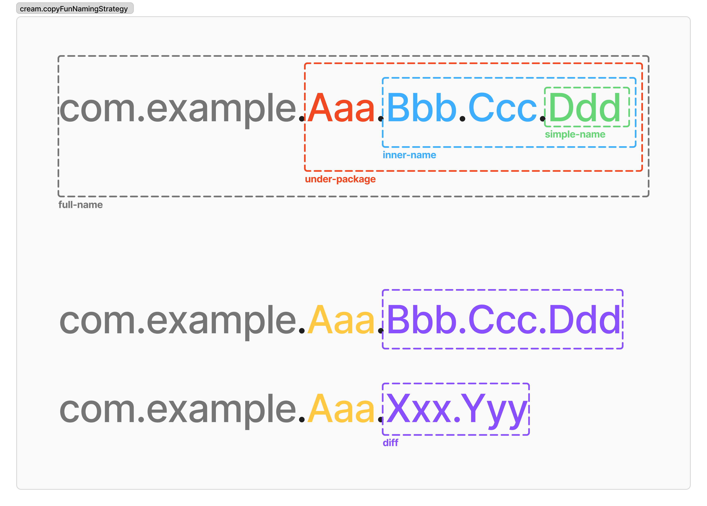

# cream.kt


<a href="https://github.com/TBSten/cream/blob/main/README.md">English</a> |
日本語 |
<a href="https://deepwiki.com/TBSten/cream">DeepWiki</a>

cream.kt は **クラスを跨いだ copy** をしやすくする KSP Plugin です。

あるオブジェクトをほぼ同じクラスの別インスタンスへコピーする Mapper を自動生成します。

## ⭐️ 0. 要点

**クラスを跨いだ copy を自動生成する KSP Plugin**

- **Before**: 手動でプロパティを一つずつコピー
- **After**: `prevState.toNextState(data = newData)` で変換。自明なデータの引き継ぎを省略できるため、可読性が向上します。

```kt
// 従来の書き方
// ❌ 具体的のどのデータが追加・変更されたかがパッと分かりずらい
MyUiState.Success(
    userName = prevState.userName,    // 手動コピー
    password = prevState.password,    // 手動コピー
    data = newData
)

// cream.kt を使った書き方
// (toSuccess が自動生成される)
// ✅ data が追加されたことがパッとわかる
prevState.toSuccess(data = newData)  // 自動コピー
```

## 🤔 1. モチベーション

あなたのプロジェクトに以下のような UiState があったとします。

```kt
sealed interface MyUiState {
    val userName: String
    val password: String

    data class Loading(
        override val userName: String,
        override val password: String,
    ) : MyUiState

    data class Stable(
        override val userName: String,
        override val password: String,
        val loadedData: List<String>,
    ) : MyUiState
}
```

MyUiState が Loading から Stable に遷移するとします。
その場合

```kt
val prevState: MyUiState.Loading = TODO()
val loadedData: List<String> = TODO()

MyUiState.Stable(
    // ⚠️ See here !
    userName = prevState.userName,
    password = prevState.password,
    loadedData = loadedData,
)
```

「⚠️ See here !」の下の 2 行に注目してください。
prevState からデータを引き継いで Stable state をインスタンス化していますが、これでは MyUiState
の変更 (ex. プロパティの追加, 削除) に 子クラスである MyUiState.Stable が影響を受けてしまいます。
MyUiState のプロパティが増えるたびにこのコピーのコードも増やす必要が出てきてしまいます。

cream.kt を使用することで先ほどのコードは以下のように簡略化できます。

```kt
val prevState: MyUiState.Loading = TODO()
val loadedData: List<String> = TODO()

prevState.toStable(
    loadedData = loadedData,
)
```

`userName = prevState.userName, password = prevState.password,` の部分がなくなりスッキリしました。

特に理由がなければ以前の値（上の例では prevState: MyUiState.Loading ）を引き継ぐという動作は **data
class の copy メソッド** に似ています。
copy と違い、**cream.kt では クラスを跨いだ状態遷移** も可能にします(上記の例では .Loading -> .Stable
へクラスを跨いで状態をコピーしています)。

## ⚙️ 2. セットアップ

|                   |                                                                         |
|-------------------|-------------------------------------------------------------------------|
| `<cream-version>` |  |
| `<ksp-version>`   |    |

```kts
// module/build.gradle.kts
plugins {
    id("com.google.devtools.ksp") version "<ksp-version>"
}

dependencies {
    implementation("me.tbsten.cream:cream-runtime:<cream-version>")
    ksp("me.tbsten.cream:cream-ksp:<cream-version>")
}
```

<details>

<summary> Kotlin Multiplatform プロジェクト </summary>

現在 KSP は Kotlin Multiplatform の commonMain
のような中間ソースセットにコードを生成することをサポートしていません。 ([参照](https://github.com/google/ksp/issues/567))
この制限により現在 cream.kt では commonMain などのクラスからコピー関数を生成することはできません。

</details>

## ❇️ 3. 利用方法

### CopyTo

`@CopyTo` を付与したクラスから指定した遷移先のクラスへ遷移する copy 関数を生成します。

```kt
@CopyTo(UiState.Success::class)
class UiState {
    data class Success(
        val data: Data,
    )
}

// auto generate
fun UiState.copyToUiStateSuccess(
    data: Data,
): UiState.Success = /* ... */

// usage
val uiState: UiState = /* ... */
val nextUiState: UiState.Success = uiState.copyToUiStateSuccess(
    data = /* ... */,
)
```

copy 関数は遷移先クラスのコンストラクタごとに生成されます。
遷移元クラスのプロパティ名と一致するコンストラクタの引数はデフォルト値が設定されます。

```kt
@CopyTo(UiState.Success::class)
class ItemDetailUiState(
    val itemId: String
) {
    data class Success(
        override val itemId: String,
        val data: Data,
    )
}

// auto generate
fun UiState.copyToUiStateSuccess(
    itemId: String = this.itemId,
    data: Data,
): UiState.Success = /* ... */

// usage
val uiState: UiState = /* ... */
val nextUiState: UiState.Success = uiState.copyToUiStateSuccess(
    data = /* ... */,
)
```

### CopyFrom

`@CopyTo` と似ていますが、引数に **遷移元** のクラスを指定する点が違います。

```kt
data class DataLayerModel(
    val data: Data,
)

@CopyFrom(DataLayerModel::class)
data class DomainLayerModel(
    val data: Data,
)

// auto generate
fun DataLayerModel.toDomainLayerModel(
    data: Data,
): DomainLayerModel = /* ... */
```

### CopyToChildren

sealed class/interface に付与することで、その sealed class/interface -> 継承するすべてのクラス
へコピーするコピー関数を自動生成します。

```kt
@CopyToChildren
sealed interface UiState {
    data object Loading : UiState

    sealed interface Success : UiState {
        val data: Data

        data class Done(
            override val data: Data,
        ) : Success

        data class Refreshing(
            override val data: Data,
        ) : Success
    }
}

// auto generate
fun UiState.copyToUiStateSuccessDone(
    data: Data,
): UiState.Success.Done = /* ... */

fun UiState.copyToUiStateSuccessRefreshing(
    data: Data,
): UiState.Success.Refreshing = /* ... */
```

これは各 sealed class/interface に @CopyTo を都度指定するよりも圧倒的に楽です。

### MutableCopyTo

ソースオブジェクトのプロパティを既存のmutableなターゲットオブジェクトに明示的なパラメータ値でコピーするmutableなコピー関数を生成します。名前と型が一致するプロパティはソースの値をデフォルト値として使用します。

これは特に、既存のmutableなオブジェクトを更新する必要があるComposeのModifier.Node実装時に有用です。

```kt
@MutableCopyTo(MutableTarget::class)
data class Source(
    val prop1: String,
    val prop2: Int,
    val sharedProp: String,
)

data class MutableTarget(
    var prop1: String,
    var prop2: Int,
    var sharedProp: String,
    var targetOnlyProp: String,
)

// auto generate
fun Source.copyToMutableTarget(
    mutableTarget: MutableTarget,
    prop1: String = this.prop1,
    prop2: Int = this.prop2,
    sharedProp: String = this.sharedProp,
    targetOnlyProp: String,
): MutableTarget {
    mutableTarget.prop1 = prop1
    mutableTarget.prop2 = prop2
    mutableTarget.sharedProp = sharedProp
    mutableTarget.targetOnlyProp = targetOnlyProp
    return mutableTarget
}

// usage
val source = Source("test1", 42, "shared")
val target = MutableTarget("old1", 0, "old_shared", "target_only")

val result = source.copyToMutableTarget(
    mutableTarget = target,
    targetOnlyProp = "customized_target"
)

// result.prop1 == "test1" (ソースのデフォルト値)
// result.prop2 == 42 (ソースのデフォルト値)
// result.sharedProp == "shared" (ソースのデフォルト値)
// result.targetOnlyProp == "customized_target" (明示的に設定)
// result === target (同じインスタンス)
```

#### オプションサポート

MutableCopyToは`copyFunNamePrefix`パラメータを通じてカスタム関数名をサポートします：

```kt
@MutableCopyTo(Target::class, copyFunNamePrefix = "updateWith")
data class Source(val prop: String)

data class Target(var prop: String, var extra: String)

// 生成される関数: source.updateWithTarget(mutableTarget = target, extra = "value")
```

### CopyTo.Map, CopyFrom.Map

`@CopyTo.Map` および `@CopyFrom.Map` を使用してプロパティごとに対応するプロパティを指定できます。
これはコピー元とコピー先でプロパティ名が違う時にマッピングするのに便利です。

```kt
@CopyTo(DataModel::class)
data class DomainModel(
    @CopyTo.Map("dataId")
    val domainId: String,
)

data class DataModel(
    val dataId: String,
)

// auto genarate
fun DomainModel.copyToDataModel(
    dataId: String = this.domainId, // domainId と dataId がマッピングされます
): DataModel = ...
```

```kt
@CopyFrom(DataModel::class)
data class DomainModel(
    @CopyFrom.Map("dataId")
    val domainId: String,
)

data class DataModel(
    val dataId: String,
)

// auto generate
fun DataModel.copyToDomainModel(
    domainId: String = this.dataId, // dataId と domainId がマッピングされます
)
```

## 💻 4. 利用例

主に想定されている cream.kt のユースケースを以下に示します。
それぞれのユースケース向けの [Context7](https://context7.com/) を利用すると あなたの生成 AI に cream.kt
の情報を即座に適用できるため便利でしょう。

- ViewModel などでの sealed interface/class を使った状態管理における、状態遷移のコードを改善する。
    - [Context7 ドキュメント](https://context7.com/tbsten/cream?topic=Improve+ViewModel+state+management&tokens=2000)
- Data <-> Domain などのレイヤーを跨ぐ際にデータモデルを変換する必要がある際に、データモデルのコピーを改善する。
    - [Context7 ドキュメント](https://context7.com/tbsten/cream?topic=Cross-Layer+Data+Model+Copy&tokens=2000)

(利用例は一例であり、cream.kt の利用範囲を制限するものではありません。他のユースケースで不都合がある場合は issue
で作成してください。)

## 🔨 5. オプション

生成される copy 関数の名前をカスタマイズするためのいくつかのオプションが用意されています。
すべてのオプションの設定は任意です。必要に応じて設定してください。

各オプションの動作を確認するためには [Option Builder](http://tbsten.github.io/cream/option-builder) が便利です。

各オプション設定時の生成されるコピー関数名の詳細な例は、
[@CopyFunctionNameTest.kt](./cream-ksp/src/test/kotlin/me/tbsten/cream/ksp/transform/CopyFunctionNameTest.kt)
のテストケースも参考にしてください。

```kts
// module/build.gradle.kts

ksp {
    arg("cream.copyFunNamePrefix", "copyTo")
    arg("cream.copyFunNamingStrategy", "under-package")
    arg("cream.escapeDot", "replace-to-underscore")
    arg("cream.notCopyToObject", "false")
}
```

### オプションの一覧

| オプション名                            | 説明                                                          | 設定例                                                                      | デフォルト              |
|-----------------------------------|-------------------------------------------------------------|--------------------------------------------------------------------------|--------------------|
| **`cream.copyFunNamePrefix`**     | 生成されるコピー関数の先頭につく文字列                                         | `copyTo`, `transitionTo`, `to`, `mapTo`                                  | `copyTo`           |
| **`cream.copyFunNamingStrategy`** | コピー関数の命名方法。                                                 | `under-package`, `diff-parent`, `simple-name`, `full-name`, `inner-name` | `under-package`    |
| **`cream.escapeDot`**             | `cream.copyFunNamingStrategy` で命名された名前に含まれる `.` をエスケープする方法。 | `replace-to-underscore`, `pascal-case`, `backquote`                      | `lower-camel-case` |
| **`cream.notCopyToObject`**       | `true` の場合 @CopyToChildren で object へのコピー関数を生成しないようにします。    | `true` , `false`                                                         | `false`            |

### オプション 1. `cream.copyFunNamePrefix`

| デフォルト    | 設定可能な値 |
|----------|--------|
| `copyTo` | 任意の文字列 |

生成されるコピー関数名の先頭につく クラス名を設定します。
`copyTo` や `to` などのコピーや状態の遷移を表す端的な文字列を設定してください。

### オプション 2. `cream.copyFunNamingStrategy`

| デフォルト           | 設定可能な値                                                                          |
|-----------------|---------------------------------------------------------------------------------|
| `under-package` | `under-package`, `diff-parent`, `simple-name`, `full-name`, `inner-name`　のいずれか。 |

コピー関数の prefix 以降のクラス名文字列の設定方法です。以下の表に示す設定方法をサポートします。
これら以外の命名方法が欲しい場合は [issue](https://github.com/TBSten/cream/issues?q=sort%3Aupdated-desc+is%3Aissue+is%3Aopen)
にリクエストしてください。

| 設定値             | 説明                                                                | `com.example.Aaa.Bbb` -> `com.example.Aaa.Bbb.Ccc.Ddd` に遷移するコピー関数を生成する例 |
|-----------------|-------------------------------------------------------------------|-------------------------------------------------------------------------|
| `under-package` | パッケージ階層を反映した名前を使用します。                                             | Hoge.Fuga.copyTo **`Aaa.Bbb.Ccc.Ddd`** (...)                            |
| `diff-parent`   | 遷移元クラスとの差分のみを含めた名前を使用する。                                          | Hoge.Fuga.copyTo **`CccDdd`** (...)                                     |
| `simple-name`   | 遷移先クラス::class.simpleName を使用する。                                   | Hoge.Fuga.copyTo **`Ddd`** (...)                                        |
| `full-name`     | 対象クラス::class.qualifiedName を使用する。                                 | Hoge.Fuga.copyTo **`ComExampleAaaBbbCccDdd`** (...)                     |
| `inner-name`    | ネストされたクラスの 2 階層目以降のクラス名を使用する。（ネストされていないクラスの場合は `simple-name` と同じ） | Hoge.Fuga.copyTo **`BbbCccDdd`** (...)                                  |



### オプション 3. `cream.escapeDot`

| デフォルト              | 設定可能な値                                                     |
|--------------------|------------------------------------------------------------|
| `lower-camel-case` | `replace-to-underscore`, `pascal-case`, `backquote`　のいずれか。 |

`cream.copyFunNamingStrategy` で取得したクラス名をエスケープする方法を設定します。

Kotlin の関数名には通常 `.` を含めることはできないため 設定例に示すいずれかの方法で命名可能な文字列に変更する必要があります。

| 設定値                     | 説明                                 | `com.example.Hoge.Fuga` -> `com.example.Hoge.Piyo` に遷移するコピー関数を生成する例 |
|-------------------------|------------------------------------|---------------------------------------------------------------------|
| `lower-camel-case`      | ドットで区切られた各要素をキャメルケースで連結し、先頭を小文字にする | Hoge.Fuga.copyTohogePiyo(...)                                       |
| `replace-to-underscore` | ドットをアンダースコアに置換する                   | Hoge.Fuga.copyTo_hoge_piyo(...)                                     |
| `backquote`             | ドットを含む完全な名前をバッククォート（\``...`\`）で囲む  | Hoge.Fuga.\`copyTocom.example.Hoge.Piyo`\(...)                      |

### Option 4. `cream.notCopyToObject`

| デフォルト   | 設定可能な値                |
|---------|-----------------------|
| `false` | `true`,`false` のいずれか。 |

true を設定すると、あるクラスから object へのコピー関数を生成しなくなります。

object へのコピー関数は、実際にはコピーではなく object のインスタンスをそのまま返します。
これがあなたの好みに合わない場合、このオプションに `true` を設定して data object へのコピーを抑止できます。

またこのオプションはモジュール全体に影響しますが、 `@CopyToChildren` の notCopyToObject プロパティを
true にすることで アノテーションをつけたクラスのみに絞ることも可能です。
