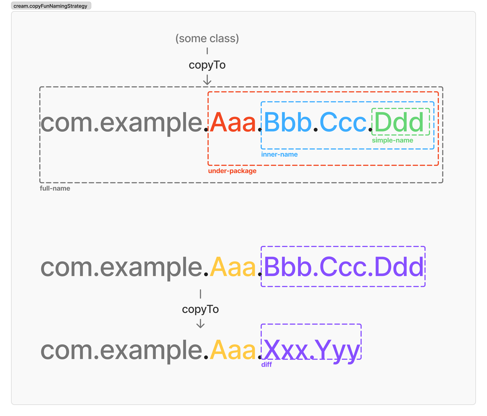

# cream.kt


English |
<a href="https://github.com/TBSten/cream/blob/main/README.ja.md">日本語</a> |
<a href="https://deepwiki.com/TBSten/cream">DeepWiki</a>

cream.kt is a KSP Plugin that enables **declarative data copy** and makes it easy to **copy across classes**.

Automatically generates a Mapper that copies an object to another instance of approximately the same
class.

## ⭐️ 0. Quick Summary

**KSP Plugin that automatically generates cross-class copy functions**

- **Before**: Manually copy properties one by one
- **After**: One-line conversion with `prevState.toNextState(data = newData)`. Readability is
  improved by eliminating the need to hand over non-trivial data.

```kt
// Traditional approach
// ❌ It is difficult to see which specific data has been added or changed.
MyUiState.Success(
    userName = prevState.userName,    // manual copy
    password = prevState.password,    // manual copy
    data = newData
)

// With cream.kt
// (toSuccess is generated automatically)
// ✅ A quick glance at the data added
prevState.toSuccess(data = newData)  // automatic copy
```

## 🤔 1. Motivation

Suppose you have a UiState like this in your project:

```kt
sealed interface MyUiState {
    val userName: String
    val password: String

    data class Loading(
        override val userName: String,
        override val password: String,
    ) : MyUiState

    data class Stable(
        override val userName: String,
        override val password: String,
        val loadedData: List<String>,
    ) : MyUiState
}
```

When MyUiState transitions from Loading to Stable:

```kt
val prevState: MyUiState.Loading = TODO()
val loadedData: List<String> = TODO()

MyUiState.Stable(
    // ⚠️ See here !
    userName = prevState.userName,
    password = prevState.password,
    loadedData = loadedData,
)
```

Look at the 2 lines below "⚠️ See here !".
We're instantiating a Stable state by inheriting data from prevState, but this means that changes to
MyUiState
(ex. adding, removing properties) will affect the child class MyUiState.Stable.
Every time MyUiState properties increase, we need to add more copy code.

Using cream.kt, the previous code can be simplified as follows:

```kt
val prevState: MyUiState.Loading = TODO()
val loadedData: List<String> = TODO()

prevState.toStable(
    loadedData = loadedData,
)
```

The `userName = prevState.userName, password = prevState.password,` part is gone and it's much
cleaner.

When there's no particular reason not to inherit previous values (in the example above, prevState:
MyUiState.Loading), this behavior is similar to **data class copy methods**.
Unlike copy, **cream.kt enables state transitions across classes** (in the example above, we're
copying state across classes from .Loading -> .Stable).

## ⚙️ 2. Setup

|                   |                                                                         |
|-------------------|-------------------------------------------------------------------------|
| `<cream-version>` |  |
| `<ksp-version>`   |    |

```kts
// module/build.gradle.kts
plugins {
    id("com.google.devtools.ksp") version "<ksp-version>"
}

dependencies {
    implementation("me.tbsten.cream:cream-runtime:<cream-version>")
    ksp("me.tbsten.cream:cream-ksp:<cream-version>")
}
```

<details>

<summary> Kotlin Multiplatform project </summary>

Currently KSP does not support generating code in intermediate source sets such as Kotlin
Multiplatform's commonMain .
([reference](https://github.com/google/ksp/issues/567))
This limitation currently prevents cream.kt from generating copy functions from classes such as
commonMain.

</details>

## ❇️ 3. Usage

### CopyTo

Generates copy functions to transition from classes annotated with `@CopyTo` to the specified target
class.

```kt
@CopyTo(UiState.Success::class)
class UiState {
    data class Success(
        val data: Data,
    )
}

// auto generate
fun UiState.copyToUiStateSuccess(
    data: Data,
): UiState.Success = /* ... */

// usage
val uiState: UiState = /* ... */
val nextUiState: UiState.Success = uiState.copyToUiStateSuccess(
    data = /* ... */,
)
```

Copy functions are generated for each constructor of the target class.
Constructor arguments that match property names of the source class are set as default values.

```kt
@CopyTo(UiState.Success::class)
class ItemDetailUiState(
    val itemId: String
) {
    data class Success(
        override val itemId: String,
        val data: Data,
    )
}

// auto generate
fun UiState.copyToUiStateSuccess(
    itemId: String = this.itemId,
    data: Data,
): UiState.Success = /* ... */

// usage
val uiState: UiState = /* ... */
val nextUiState: UiState.Success = uiState.copyToUiStateSuccess(
    data = /* ... */,
)
```

### CopyFrom

Similar to `@CopyTo`, but differs in that the **source** class is specified as an argument.

```kt
data class DataLayerModel(
    val data: Data,
)

@CopyFrom(DataLayerModel::class)
data class DomainLayerModel(
    val data: Data,
)

// auto generate
fun DataLayerModel.toDomainLayerModel(
    data: Data,
): DomainLayerModel = /* ... */
```

### CopyToChildren

When applied to a sealed class/interface, automatically generates copy functions from that sealed
class/interface to all classes that inherit from it.

```kt
@CopyToChildren
sealed interface UiState {
    data object Loading : UiState

    sealed interface Success : UiState {
        val data: Data

        data class Done(
            override val data: Data,
        ) : Success

        data class Refreshing(
            override val data: Data,
        ) : Success
    }
}

// auto generate
fun UiState.copyToUiStateSuccessDone(
    data: Data,
): UiState.Success.Done = /* ... */

fun UiState.copyToUiStateSuccessRefreshing(
    data: Data,
): UiState.Success.Refreshing = /* ... */
```

This is much easier than specifying @CopyTo for each sealed class/interface.

### CopyTo.Map, CopyFrom.Map

You can use `@CopyTo.Map` and `@CopyFrom.Map` to map properties between source and target
classes when their property names differ. This is useful for cases where the property names are not
the same but you want to copy values between them.

```kt
@CopyTo(DataModel::class)
data class DomainModel(
    @CopyTo.Map("dataId")
    val domainId: String,
)

data class DataModel(
    val dataId: String,
)

// auto generate
fun DomainModel.copyToDataModel(
    dataId: String = this.domainId, // domainId is mapped to dataId
): DataModel = ...
```

```kt
@CopyFrom(DataModel::class)
data class DomainModel(
    @CopyFrom.Map("dataId")
    val domainId: String,
)

data class DataModel(
    val dataId: String,
)

// auto generate
fun DataModel.copyToDomainModel(
    domainId: String = this.dataId, // dataId is mapped to domainId
)
```

## 🔨 4. Options

Several options are provided to customize the name of the generated copy function.
All options are optional. Set them as needed.

For a detailed example of the copy function name generated when setting each option, see
[@CopyFunctionNameTest.kt](./cream-ksp/src/test/kotlin/me/tbsten/cream/ksp/transform/CopyFunctionNameTest.kt)
See also the test case at .

```kts
// module/build.gradle.kts

ksp {
    arg("cream.copyFunNamePrefix", "copyTo")
    arg("cream.copyFunNamingStrategy", "under-package")
    arg("cream.escapeDot", "replace-to-underscore")
    arg("cream.notCopyToObject", "false")
}
```

### List of options

| Option name                       | Description                                                                 | Example                                                                  | Default            |
|-----------------------------------|-----------------------------------------------------------------------------|--------------------------------------------------------------------------|--------------------|
| **`cream.copyFunNamePrefix`**     | String prefixed to the generated copy function                              | `copyTo`, `transitionTo`, `to`, `mapTo`                                  | `copyTo`           |
| **`cream.copyFunNamingStrategy`** | Copy function naming conventions.                                           | `under-package`, `diff-parent`, `simple-name`, `full-name`, `inner-name` | `under-package`    |
| **`cream.escapeDot`**             | How to escape `. ` in the name given by `cream.copyFunNamingStrategy`.      | `replace-to-underscore`, `pascal-case`, `backquote`                      | `lower-camel-case` |
| **`cream.notCopyToObject`**       | If `true`, @CopyToChildren will not generate a copy function to the object. | `true` , `false`                                                         | `false`            |

### Option 1. `cream.copyFunNamePrefix`

| Default  | Possible values  |
|----------|------------------|
| `copyTo` | Arbitrary string |

Set the class name to be prefixed by the generated copy function name.
Set a straightforward string that describes the copy or state transition, such as `copyTo` or `to`.

### Option 2. `cream.copyFunNamingStrategy`

| Default         | `under-package`                                                                 |
|-----------------|---------------------------------------------------------------------------------|
| Possible values | One of `under-package`, `diff-parent`, `simple-name`, `full-name`, `inner-name` |

How to set the class name string after the prefix of the copy function. The following table shows
the supported configuration methods.
If you want a naming scheme other than these, please make a request
to [issue](https://github.com/TBSten/cream/issues?q=sort%3Aupdated-desc+is%3Aissue+is%3Aopen).

| Value           | Description                                                                                                         | Example of generating a copy function that transitions from `com.example.Aaa.Bbb` -> `com.example.Aaa.Bbb.Ccc.Ddd`. |
|-----------------|---------------------------------------------------------------------------------------------------------------------|---------------------------------------------------------------------------------------------------------------------|
| `under-package` | Use names that reflect the package hierarchy.                                                                       | Hoge.Fuga.copyTo **`Aaa.Bbb.Ccc.Ddd`** (...)                                                                        |
| `diff-parent`   | Use a name that includes only the difference from the transition source class.                                      | Hoge.Fuga.copyTo **`CccDdd`** (...)                                                                                 |
| `simple-name`   | Transition destination class::class.simpleName.                                                                     | Hoge.Fuga.copyTo **`Ddd`** (...)                                                                                    |
| `full-name`     | Target class::class.qualifiedName.                                                                                  | Hoge.Fuga.copyTo **`ComExampleAaaBbbCccDdd`** (...)                                                                 |
| `inner-name`    | Use the class name from the second level of the nested class onward. (Same as `simple-name` for non-nested classes) | Hoge.Fuga.copyTo **`BbbCccDdd`** (...)                                                                              |



### Option 3. `cream.escapeDot`

| Default            | Possible values                                            |
|--------------------|------------------------------------------------------------|
| `lower-camel-case` | One of `replace-to-underscore`, `pascal-case`, `backquote` |

Sets the method for escaping class names retrieved with `cream.copyFunNamingStrategy`.

Kotlin function names usually cannot contain `. ` in function names, they must be changed to a
string that can be named in one of the ways shown in the configuration examples.

| Value                   | Description                                                                        | Example of generating a copy function that transitions from `com.example.Hoge.Fuga` -> `com.example.Hoge.Piyo`. |
|-------------------------|------------------------------------------------------------------------------------|-----------------------------------------------------------------------------------------------------------------|
| `lower-camel-case`      | Concatenate each dotted element with camelCase, beginning with a lowercase letter. | Hoge.Fuga.copyTohogePiyo(...)                                                                                   |
| `replace-to-underscore` | Replace dots with underscores                                                      | Hoge.Fuga.copyTo_hoge_piyo(...)                                                                                 |
| `backquote`             | The full name, including the dot, is enclosed in backquotes (\``...`\`).           | Hoge.Fuga.\`copyTocom.example.Hoge.Piyo`\(...)                                                                  |

### Option 4. `cream.notCopyToObject`

| Default | Possible values |
|---------|-----------------|
| `false` | `true`, `false` |

If set to `true`, copy functions from a class to an `object` will not be generated.

Copy functions to an `object` do not actually copy, but simply return the instance of the object
itself. If you prefer not to generate copy functions to data objects, set this option to `true` to
suppress them.

This option affects the entire module, but you can also limit it to a specific class by setting the
`notCopyToObject` property of the `@CopyToChildren` annotation to `true`.
