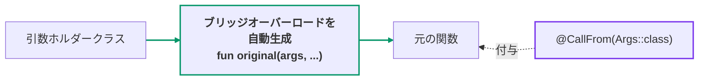
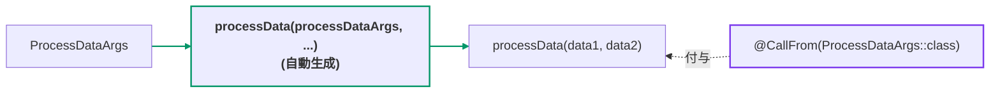

[← README](../README.ja.md) | [English](./call-from.md)

# @CallFrom

関数に付与することで、引数ホルダークラスからその関数を呼び出す **ブリッジオーバーロード** を
自動生成します。生成されるオーバーロードは第 1 引数にホルダーオブジェクトを取り、名前が
マッチするパラメータにはホルダーのプロパティがデフォルト値として設定されます。そのため、
ホルダーだけを渡すことも、個別のパラメータを上書きすることもできます — cream がコピー関数で
行っている「プロパティ → パラメータ」の名前マッチングを、関数呼び出しに応用したものです。



## 基本の例

```kt
import me.tbsten.cream.CallFrom

data class ProcessDataArgs(
    val data1: String,
    val data2: Int,
)

@CallFrom(ProcessDataArgs::class) // ブリッジオーバーロード processData(ProcessDataArgs, ...) を生成します。
fun processData(data1: String, data2: Int): String = "$data1-$data2"

// usage
val args = ProcessDataArgs("a", 1)
processData(args)            // "a-1" — 各パラメータには args の対応するプロパティがデフォルト値として使われます。
processData(args, data2 = 9) // "a-9" — 個別のパラメータを上書きすることもできます。
```



<details>
<summary>生成されるコード</summary>

```kt
// auto generate
fun processData(
    processDataArgs: ProcessDataArgs,
    data1: String = processDataArgs.data1,
    data2: Int = processDataArgs.data2,
): String = processData(
    data1 = data1,
    data2 = data2,
)
```

</details>

## 詳細

### 対応している関数

| 元の関数 | 生成されるブリッジ |
|---|---|
| top-level `fun` | 同じパッケージの top-level オーバーロード |
| member `fun`（`object` / `companion object` / interface のメンバーを含む） | enclosing 型の **拡張関数**（KSP は既存クラスにメンバーを追加できないため） |
| top-level の拡張 `fun` | 同じレシーバの拡張関数 |
| `suspend fun` | `suspend` を保持 |
| generic `fun` | 型パラメータ・境界・`where` 句を転写 |
| 戻り値のある `fun` | 戻り型を保持（nullable / generic / `Nothing` を含む） |
| `operator` / `infix` / `inline` / `tailrec` `fun` | 通常の関数としてブリッジ — これらの修飾子は **転写されません**（ブリッジは第 1 引数が増えるため operator / infix の規約を満たせず、`inline` / `tailrec` は元関数の内部でそのまま効きます） |
| `typealias` されたパラメータ / プロパティ型 | alias を通して実体の型でマッチ。ブリッジのシグネチャには alias 名を保持 |
| `@Deprecated`（WARNING）な関数 / source クラス / マッチしたプロパティ | ブリッジに `@Deprecated` を伝播し、生成コードの参照が警告なしでコンパイルされるようにします |

### マッチしないパラメータ: 必須引数になるか、元のデフォルトにフォールバックする

source クラスのプロパティに（名前、または
[`@CallFrom.Map`](#その他のカスタマイズ) で）マッチしないパラメータは、元の関数に
デフォルト値が宣言されているかどうかで扱いが変わります:

- **デフォルト値なし** — 生成されるオーバーロードのシグネチャに残りますが、デフォルト値は
  付きません。呼び出し側が明示的に渡す必要があります。
- **デフォルト値あり** — ブリッジのシグネチャと委譲呼び出しの両方から **省かれ**、元の関数
  自身のデフォルト値が適用されます（KSP はデフォルト値の式を読み取れず、デフォルトなしで
  転写すると「省略可能だったパラメータが必須になってしまう」ため）。このパラメータを
  上書きしたい場合は元の関数を直接呼んでください。

```kt
data class SubmitArgs(val id: String)

@CallFrom(SubmitArgs::class)
fun submit(id: String, comment: String, priority: Int = 0) { /* ... */ }

// usage: comment は SubmitArgs にマッチするプロパティがないため、明示的に渡す必要があります。
// priority は元関数にデフォルト値があるためブリッジからは省かれ、0 が適用されます。
submit(SubmitArgs("42"), comment = "hello")
```

<details>
<summary>生成されるコード</summary>

```kt
// auto generate
fun submit(
    submitArgs: SubmitArgs,
    id: String = submitArgs.id,
    comment: String,
): Unit = submit(
    id = id,
    comment = comment,
)
```

</details>

### member 関数は拡張関数として生成される

KSP は既存のクラスにメンバーを追加できないため、member 関数のブリッジは enclosing クラスの
**拡張関数** として生成されます。呼び出し側の見た目はメンバー呼び出しと同じです:

```kt
data class ProcessArgs(val value: String)

class DataProcessor {
    @CallFrom(ProcessArgs::class)
    fun process(value: String) { /* ... */ }
}

// usage
DataProcessor().process(ProcessArgs("value"))
```

<details>
<summary>生成されるコード</summary>

```kt
// auto generate
fun DataProcessor.process(
    processArgs: ProcessArgs,
    value: String = processArgs.value,
): Unit = process(
    value = value,
)
```

</details>

### 複数の source

`sources` に複数のクラスを渡すと、source クラスごとに 1 つずつブリッジオーバーロードが
生成されます。すべて元の関数と同名で、第 1 引数の型によって区別されます:

```kt
data class ArgsA(val value: String)
data class ArgsB(val value: String)

@CallFrom(ArgsA::class, ArgsB::class)
fun consume(value: String) { /* ... */ }

// 以下の両方が生成されます:
// fun consume(argsA: ArgsA, value: String = argsA.value): Unit = ...
// fun consume(argsB: ArgsB, value: String = argsB.value): Unit = ...
```

### ブリッジ名のカスタマイズ（`funName`）

デフォルトではブリッジは **元の関数と同名**（オーバーロード）です。`funName` を指定すると、
ブリッジに別の名前を付けられます — 例えばファクトリ風の名前:

```kt
data class BuildConfigArgs(val name: String, val size: Int)

@CallFrom(BuildConfigArgs::class, funName = "createBuildConfig")
fun buildConfig(name: String, size: Int): String = "$name:$size"

// usage — ブリッジは `createBuildConfig` で、中身は `buildConfig` に委譲します:
createBuildConfig(BuildConfigArgs("cream", 3))           // "cream:3"
createBuildConfig(BuildConfigArgs("cream", 3), size = 9) // "cream:9"
```

<details>
<summary>生成されるコード</summary>

```kt
// auto generate
fun createBuildConfig(
    buildConfigArgs: BuildConfigArgs,
    name: String = buildConfigArgs.name,
    size: Int = buildConfigArgs.size,
): String = buildConfig(
    name = name,
    size = size,
)
```

</details>

`funName` は **リテラル文字列** です。コピー系の注釈と異なり、`@CallFrom` は `CopyTarget*` の
命名トークンに対応しません（レンダリングする対象クラスが無いため）。モジュール全体の命名
オプション（`cream.copyFunNamePrefix`、`cream.copyFunNamingStrategy`、`cream.escapeDot`）も
作用しません。異なる source クラスから生成されるブリッジは第 1 引数の型が異なるため、
`funName` を共有しても衝突しません。ただし同名になる 2 つのブリッジのパラメータ型まで一致する
場合（2 つの関数で `funName` を共有した、あるいは手書きの関数と同名同型になった場合）は、
壊れたオーバーロードを生成する代わりに位置付きのコンパイルエラーを報告します。

### 生成されるブリッジの可視性

デフォルト（`visibility = CopyVisibility.INHERIT`）ではブリッジは付与した関数の可視性を
継承しますが、関数・enclosing クラス・source クラスのいずれかが `internal` の場合は
**`internal` に引き下げ** られます — それより広い可視性のブリッジは公開性違反で
コンパイルできないためです。この `internal` 制約があるのに `CopyVisibility.PUBLIC` を
明示（または `cream.defaultVisibility` オプションで指定）するとコンパイルエラーとして
報告されます。`private` / `protected` な source クラスも同様にエラーです（生成される
top-level ブリッジからは参照できないため）。

### 診断

コンパイルできないブリッジしか生成できない形は、壊れた生成コードではなく位置付きの
コンパイルエラーとして報告されます:

- `private` / `protected` / local / `abstract` / `expect` 関数、
- member の **拡張関数**（ブリッジに 2 つのレシーバが必要になるため）— top-level の
  拡張関数は対応しています、
- generic クラスの member 関数（generic な `inner` チェーン経由を含む）、
- `reified` 型パラメータを持つ関数（ブリッジは `inline` ではないため）、
- `DeprecationLevel.ERROR` / `HIDDEN` で deprecated な関数・source クラス
  （生成コードから参照できないため。`WARNING` は代わりにブリッジへ伝播されます）、
- `sources` が空・重複している場合、source クラスの lowerCamelCase 名が関数のパラメータと
  衝突する場合、
- ブリッジのシグネチャ衝突: 2 つの付与済み関数のブリッジが同名（同じ名前、または
  [`funName`](#ブリッジ名のカスタマイズfunname)）かつ同一パラメータ型になる場合、
  またはブリッジと同名同型の top-level 関数が既に手書きされている場合。

### 既知の制限

- **元の関数のデフォルト値はブリッジ経由では上書きできません。** KSP はデフォルト値の式を
  読み取れないため、マッチせずデフォルト値を持つパラメータはブリッジから省かれます
  （元のデフォルトが適用されます）。上書きしたい場合は元の関数を直接呼んでください。
- **`vararg` パラメータは対応する配列型の source プロパティにのみマッチします。**
  `vararg items: String` は `items: Array<String>` プロパティにマッチして自動コピーの
  デフォルト値が付きます（非 null のプリミティブ要素は対応するプリミティブ配列にマッチ、
  例: `vararg counts: Int` と `counts: IntArray`）。非配列型（または nullable な配列型）の
  同名プロパティにはマッチせず、その場合は必須の `vararg` のまま転写されます。
- **Kotlin 2.2 の context parameters は KSP から見えません**（KSP 2.2.20-2.0.4 時点で
  表現する API が存在しないため）。cream はブリッジすることも検出することもできません。
  `context(...)` 付き関数に付与すると context parameters を持たないブリッジが生成され、
  **生成ファイル** が `No context argument for '...' found` でコンパイルエラーになります。
  `CallFrom__*.kt` でこのエラーを見たら、context parameters 付き関数から `@CallFrom` を
  外してください。
- **アクセスできない source プロパティはマッチしなかった扱いになります。** `private` /
  `protected` なプロパティ（や他モジュールの `internal`、`ERROR` / `HIDDEN` で deprecated な
  もの）は生成されるブリッジから読めないため、そのパラメータは必須引数として残ります。
- **ブリッジ名はリテラルのみです。** [`funName`](#ブリッジ名のカスタマイズfunname) で名前を
  上書きできますが、`@CallFrom` は `CopyTarget*` 命名トークンに対応せず（対象クラスが無いため）、
  モジュール全体の命名オプション（`cream.copyFunNamePrefix`、`cream.copyFunNamingStrategy`、
  `cream.escapeDot`）も作用しません。

### その他のカスタマイズ

- パラメータと source プロパティの名前が一致しない場合は、**付与した関数のパラメータ** に
  `@CallFrom.Map("propertyName")` を付けて対応付けできます —
  [Property mapping](./customization/property-mapping.ja.md) を参照。
- パラメータに `@CallFrom.Exclude` を付与すると自動コピーのデフォルト値が外れ、呼び出し側が
  必ず指定するパラメータになります — [Exclude](./customization/exclude.ja.md) を参照。
- 生成される関数の **KDoc** は `kdoc = KDoc(...)` で拡張できます —
  [KDoc](./customization/kdoc.ja.md) を参照。
- 生成される関数の **可視性** は `visibility` 引数で制御できます —
  [Visibility](./customization/visibility.ja.md) を参照。
- 生成されるブリッジの **名前** は `funName` 引数で上書きできます —
  [ブリッジ名のカスタマイズ](#ブリッジ名のカスタマイズfunname) を参照。

## 関連ドキュメント

- [Copy — @CopyTo / @CopyFrom / @CopyMapping](./copy.ja.md) — クラス間コピーの対応物。
  `@CallFrom` は同じプロパティマッチングを、コンストラクタではなく関数呼び出しに適用します。
- [Property mapping (`.Map`)](./customization/property-mapping.ja.md)
- [Exclude (`.Exclude`)](./customization/exclude.ja.md)
- [KDoc (`kdoc = KDoc(...)`)](./customization/kdoc.ja.md)
- [Visibility](./customization/visibility.ja.md)
- [KSP options](./customization/options.ja.md)
