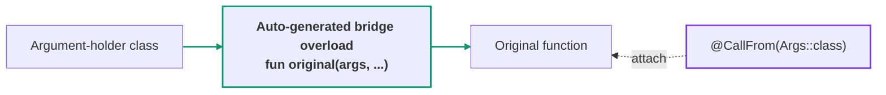
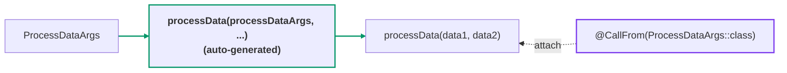

[← README](../README.md) | [日本語](./call-from.ja.md)

# @CallFrom

When applied to a function, `@CallFrom` generates a **bridge overload** that calls the function
from an argument-holder class. The overload takes the holder object as its first parameter and
defaults every matching parameter to the corresponding holder property, so callers can pass the
holder alone or override individual parameters — the same property-to-parameter matching cream
uses for copy functions, applied to a function call.



## Quick example

```kt
import me.tbsten.cream.CallFrom

data class ProcessDataArgs(
    val data1: String,
    val data2: Int,
)

@CallFrom(ProcessDataArgs::class) // generates a bridge overload processData(ProcessDataArgs, ...)
fun processData(data1: String, data2: Int): String = "$data1-$data2"

// usage
val args = ProcessDataArgs("a", 1)
processData(args)            // "a-1" — every parameter defaults to the matching property of args
processData(args, data2 = 9) // "a-9" — individual parameters can still be overridden
```



<details>
<summary>Generated code</summary>

```kt
// auto generate
fun processData(
    processDataArgs: ProcessDataArgs,
    data1: String = processDataArgs.data1,
    data2: Int = processDataArgs.data2,
): String = processData(
    data1 = data1,
    data2 = data2,
)
```

</details>

## Details

### Supported functions

| Original function | Generated bridge |
|---|---|
| top-level `fun` | Top-level overload in the same package |
| member `fun` (incl. `object` / `companion object` / interface members) | **Extension function** on the enclosing type (KSP cannot add members to an existing class) |
| top-level extension `fun` | Extension function on the same receiver |
| `suspend fun` | `suspend` is preserved |
| generic `fun` | Type parameters, bounds, and `where` clauses are carried over |
| `fun` with a return type | Return type is preserved (incl. nullable / generic / `Nothing`) |
| `operator` / `infix` / `inline` / `tailrec` `fun` | Bridged as an ordinary function — these modifiers are **not** carried over (the bridge's extra first parameter no longer satisfies the operator/infix conventions; `inline` / `tailrec` still apply inside the original) |
| `typealias`ed parameter / property types | Matched through the alias; the alias name is preserved in the bridge signature |
| `@Deprecated` (WARNING) function / source class / matched property | `@Deprecated` is propagated onto the bridge so the generated references compile warning-free |

### Unmatched parameters: required, or fall back to the original default

Parameters that do not match any property of the source class (by name, or via
[`@CallFrom.Map`](#other-customizations)) are handled by whether the original function declares a
default value for them:

- **No default value** — the parameter keeps its position in the generated overload but gets no
  default; the caller must pass it explicitly.
- **With a default value** — the parameter is **omitted** from the bridge and from the delegating
  call, so the original function's own default applies. (KSP cannot read default value
  expressions to copy them, and keeping the parameter without a default would have made an
  optional parameter required.) To override such a parameter, call the original function
  directly.

```kt
data class SubmitArgs(val id: String)

@CallFrom(SubmitArgs::class)
fun submit(id: String, comment: String, priority: Int = 0) { /* ... */ }

// usage: comment has no matching property on SubmitArgs, so it must be passed explicitly.
// priority has a default on the original function, so the bridge omits it and 0 applies.
submit(SubmitArgs("42"), comment = "hello")
```

<details>
<summary>Generated code</summary>

```kt
// auto generate
fun submit(
    submitArgs: SubmitArgs,
    id: String = submitArgs.id,
    comment: String,
): Unit = submit(
    id = id,
    comment = comment,
)
```

</details>

### Member functions become extension functions

KSP cannot add members to an existing class, so the bridge for a member function is generated as
an **extension function** on the enclosing class. The call site looks the same as a member call:

```kt
data class ProcessArgs(val value: String)

class DataProcessor {
    @CallFrom(ProcessArgs::class)
    fun process(value: String) { /* ... */ }
}

// usage
DataProcessor().process(ProcessArgs("value"))
```

<details>
<summary>Generated code</summary>

```kt
// auto generate
fun DataProcessor.process(
    processArgs: ProcessArgs,
    value: String = processArgs.value,
): Unit = process(
    value = value,
)
```

</details>

### Multiple sources

Passing multiple classes to `sources` generates one bridge overload per source class. All
overloads share the original function's name and are distinguished by the type of their first
parameter:

```kt
data class ArgsA(val value: String)
data class ArgsB(val value: String)

@CallFrom(ArgsA::class, ArgsB::class)
fun consume(value: String) { /* ... */ }

// generates both:
// fun consume(argsA: ArgsA, value: String = argsA.value): Unit = ...
// fun consume(argsB: ArgsB, value: String = argsB.value): Unit = ...
```

### Custom bridge name (`funName`)

By default the bridge keeps the **same name as the annotated function** (an overload). Set
`funName` to give the bridge a different name instead — for example a factory-style name:

```kt
data class BuildConfigArgs(val name: String, val size: Int)

@CallFrom(BuildConfigArgs::class, funName = "createBuildConfig")
fun buildConfig(name: String, size: Int): String = "$name:$size"

// usage — the bridge is `createBuildConfig`, and it still delegates to `buildConfig`:
createBuildConfig(BuildConfigArgs("cream", 3))           // "cream:3"
createBuildConfig(BuildConfigArgs("cream", 3), size = 9) // "cream:9"
```

<details>
<summary>Generated code</summary>

```kt
// auto generate
fun createBuildConfig(
    buildConfigArgs: BuildConfigArgs,
    name: String = buildConfigArgs.name,
    size: Int = buildConfigArgs.size,
): String = buildConfig(
    name = name,
    size = size,
)
```

</details>

`funName` is a **plain literal**. Unlike the copy annotations, `@CallFrom` does not support the
`CopyTarget*` naming tokens (there is no target class to render), and the module-wide naming
options (`cream.copyFunNamePrefix`, `cream.copyFunNamingStrategy`, `cream.escapeDot`) do not affect
it. Bridges from different source classes never collide on a shared `funName` — each has a distinct
first-parameter type — but if two same-named bridges would end up with identical parameter types
(a `funName` shared by two functions, or one that already exists as a hand-written function), cream
reports a positioned compile error instead of emitting conflicting overloads.

### Visibility of the generated bridge

By default (`visibility = CopyVisibility.INHERIT`) the bridge inherits the annotated function's
visibility, **lowered to `internal`** when the function, its enclosing class, or a source class
is `internal` — a more visible bridge would fail compilation with an exposure violation.
Requesting `CopyVisibility.PUBLIC` explicitly (or via the `cream.defaultVisibility` option) when
such an `internal` constraint exists is reported as a compile error, as is a `private` /
`protected` source class (the generated top-level bridge could not reference it at all).

### Diagnostics

Shapes that cannot produce a compiling bridge are rejected with a positioned compile error
instead of broken generated code:

- `private` / `protected` / local / `abstract` / `expect` functions,
- member **extension** functions (the bridge would need two receivers) — top-level extension
  functions are supported,
- member functions of generic classes (incl. via a generic `inner` chain),
- functions with `reified` type parameters (the bridge is not `inline`),
- functions / source classes deprecated with `DeprecationLevel.ERROR` / `HIDDEN` (their
  references never compile from generated code; `WARNING` is propagated instead),
- empty or duplicated `sources`, and a source class whose lowerCamelCase name collides with a
  parameter of the function,
- bridge signature collisions: two annotated functions whose bridges end up with the same name
  (a shared name or [`funName`](#custom-bridge-name-funname)) and identical parameter types, or a
  bridge whose name and signature already exist as a user-written top-level function.

### Known limitations

- **Original default values cannot be overridden through the bridge.** KSP cannot read default
  value expressions, so an unmatched parameter with a default is omitted from the bridge (the
  original default applies); call the original function directly to override it.
- **`vararg` parameters only match a source property of the corresponding array type.** A
  `vararg items: String` parameter gets an auto-copied default from an `items: Array<String>`
  property (a non-nullable primitive element matches its primitive array, e.g.
  `vararg counts: Int` matches `counts: IntArray`). A same-name property of a non-array (or
  nullable array) type does not match, so the parameter is carried over as a required `vararg`.
- **Kotlin 2.2 context parameters are invisible to KSP** (no API represents them as of KSP
  2.2.20-2.0.4), so cream can neither bridge nor detect them. Annotating a
  `context(...)` function generates a bridge without the context parameters, and the *generated
  file* fails to compile with `No context argument for '...' found`. If you see that error in a
  `CallFrom__*.kt` file, remove `@CallFrom` from the context-parameter function.
- **Inaccessible source properties are treated as unmatched.** A `private` / `protected`
  property (or an `internal` one from another module, or one deprecated with `ERROR` / `HIDDEN`)
  cannot be read by the generated bridge, so its parameter stays required instead.
- **Bridge names are plain literals.** [`funName`](#custom-bridge-name-funname) renames the
  bridge, but `@CallFrom` supports no `CopyTarget*` naming tokens (there is no target class), and
  the module-wide naming options (`cream.copyFunNamePrefix`, `cream.copyFunNamingStrategy`,
  `cream.escapeDot`) do not affect it.

### Other customizations

- Mismatched names between a parameter and a source property can be mapped by annotating the
  **parameter of the annotated function** with `@CallFrom.Map("propertyName")` —
  see [Property mapping](./customization/property-mapping.md).
- `@CallFrom.Exclude` on a parameter drops its auto-copied default, making it required at the
  call site — see [Exclude](./customization/exclude.md).
- The **KDoc** of the generated function can be augmented with `kdoc = KDoc(...)` —
  see [KDoc](./customization/kdoc.md).
- The **visibility** of the generated function can be controlled with the `visibility`
  argument — see [Visibility](./customization/visibility.md).
- The **name** of the generated bridge can be overridden with the `funName` argument —
  see [Custom bridge name](#custom-bridge-name-funname).

## See also

- [Copy — @CopyTo / @CopyFrom / @CopyMapping](./copy.md) — the class-to-class counterpart:
  `@CallFrom` applies the same property matching to a function call instead of a constructor.
- [Property mapping (`.Map`)](./customization/property-mapping.md)
- [Exclude (`.Exclude`)](./customization/exclude.md)
- [KDoc (`kdoc = KDoc(...)`)](./customization/kdoc.md)
- [Visibility](./customization/visibility.md)
- [KSP options](./customization/options.md)
