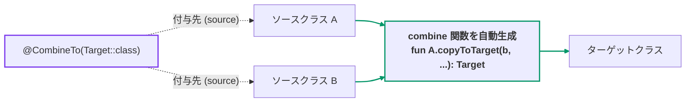
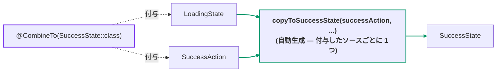
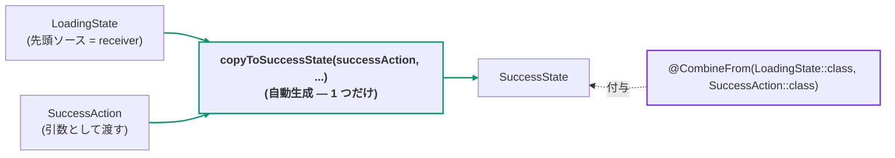
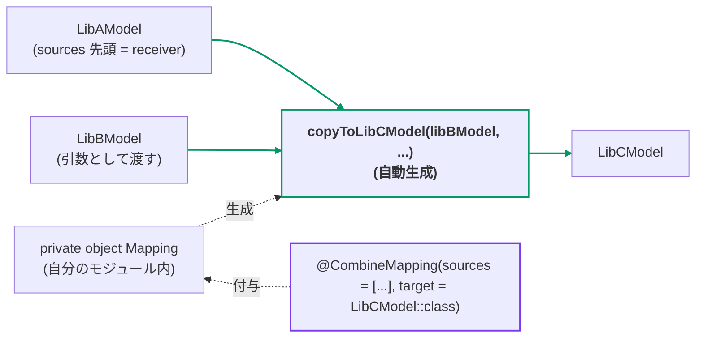

[← README](../README.ja.md) | [English](./combine.md)

# Combine — @CombineTo / @CombineFrom / @CombineMapping

cream は **複数のソースクラスから 1 つのターゲットクラスへ** のコピー関数（combine）を生成できます。
これは 1 つの生成機能に対して 3 つのアノテーションがある形で、アノテーションを付ける場所と
**生成される関数の数** が異なります:

| アノテーション | 付ける場所 | 生成される関数 | 選ぶ基準 |
|---|---|---|---|
| [`@CombineTo`](#combineto) | 各 **ソース** クラス | アノテーションを付けた **ソースごとに 1 つ** | ソース側を編集できる場合 |
| [`@CombineFrom`](#combinefrom) | **ターゲット** クラス | **1 つだけ**（先頭のソースが receiver） | ターゲット側を編集できる場合 |
| [`@CombineMapping`](#combinemapping) | 自分のモジュール内の別の宣言 | マッピングごとに **1 つだけ**（先頭のソースが receiver） | **どちらも** 編集できない場合（ライブラリのクラス同士など） |

生成される combine 関数は常に **いずれかのソースクラスの拡張関数** になり、receiver 以外のソースは
クラス名を lowerCamelCase にした名前の引数（例: `SuccessAction` -> `successAction`）として列挙順に渡します。



## @CombineTo

`@CombineTo` は **各ソースクラス** に付けます。複数のデータソースを組み合わせて 1 つの状態を
作成する際に便利です。

```kt
import me.tbsten.cream.CombineTo

@CombineTo(SuccessState::class) // LoadingState + SuccessAction -> SuccessState へ合成する関数を生成します。
data class LoadingState(val itemId: String)

@CombineTo(SuccessState::class) // SuccessAction + LoadingState -> SuccessState へ合成する関数を生成します。
data class SuccessAction(val data: String)

data class SuccessState(
    val itemId: String,  // from LoadingState.itemId
    val data: String,    // from SuccessAction.data
    val lastUpdateAt: Long,
)

// usage
val loadingState: LoadingState = /* ... */
val action: SuccessAction = /* ... */
val successState: SuccessState = loadingState.copyToSuccessState(
    successAction = action,
    // itemId はデフォルト引数の loadingState.itemId が使用されます
    // data はデフォルト引数の action.data が使用されます
    lastUpdateAt = /* lastUpdateAt はどちらのソースからも引き継げるプロパティがないため、必須引数として呼び出す必要があります。 */,
)
```



<details>
<summary>生成されるコード</summary>

```kt
// auto generate (アノテーションを付けたソースごとに 1 つ — この例では 2 つ)
fun LoadingState.copyToSuccessState(
    successAction: SuccessAction,
    itemId: String = this.itemId,
    data: String = successAction.data,
    lastUpdateAt: Long,
): SuccessState = SuccessState(
    itemId = itemId,
    data = data,
    lastUpdateAt = lastUpdateAt,
)

fun SuccessAction.copyToSuccessState(
    loadingState: LoadingState,
    itemId: String = loadingState.itemId,
    data: String = this.data,
    lastUpdateAt: Long,
): SuccessState = SuccessState(
    itemId = itemId,
    data = data,
    lastUpdateAt = lastUpdateAt,
)
```

</details>


## @CombineFrom

`@CombineFrom` は `@CombineTo` の逆で、**ターゲット側**に複数のソースクラスを指定します。
生成されるのは **1 つだけ** で、先頭に列挙したソースが receiver になります。

```kt
import me.tbsten.cream.CombineFrom

data class LoadingState(
    val itemId: String,
)

data class SuccessAction(
    val data: String,
)

@CombineFrom(LoadingState::class, SuccessAction::class) // LoadingState + SuccessAction -> SuccessState へ合成する関数を生成します。
data class SuccessState(
    val itemId: String,  // from LoadingState.itemId
    val data: String,    // from SuccessAction.data
    val lastUpdateAt: Long,
)

// usage
val loadingState: LoadingState = /* ... */
val action: SuccessAction = /* ... */
val successState: SuccessState = loadingState.copyToSuccessState(
    successAction = action,
    lastUpdateAt = /* どちらのソースからも引き継げないため必須引数 */,
)
```



<details>
<summary>生成されるコード</summary>

```kt
// 1 つだけ — 先頭に列挙したソース (LoadingState) が receiver
fun LoadingState.copyToSuccessState(
    successAction: SuccessAction,
    itemId: String = this.itemId,
    data: String = successAction.data,
    lastUpdateAt: Long,
): SuccessState = SuccessState(
    itemId = itemId,
    data = data,
    lastUpdateAt = lastUpdateAt,
)
```

</details>

## @CombineMapping

**ソースもターゲットも自分のソースコードではない** クラス同士で combine 関数を生成したい場合は、
`@CombineMapping` を使用できます。自分のモジュール内の別の宣言（通常は `private object`）に付けることで、
どのクラスも一切変更せずに `@CombineTo` / `@CombineFrom` と同じ combine 関数を生成できます。

```kt
import me.tbsten.cream.CombineMapping

// in library A — cannot be modified
data class LibAModel(
    val propA: String,
    val valueA: Int,
)

// in library B — cannot be modified
data class LibBModel(
    val propB: String,
    val valueB: Double,
)

// in library C — cannot be modified
data class LibCModel(
    val propA: String,
    val valueA: Int,
    val propB: String,
    val valueB: Double,
    val extra: String,
)

// in your module
@CombineMapping( // LibAModel + LibBModel -> LibCModel へ合成する関数を生成します。
    sources = [LibAModel::class, LibBModel::class],
    target = LibCModel::class,
)
private object Mapping

// usage
val libA: LibAModel = /* ... */
val libB: LibBModel = /* ... */
val libC: LibCModel = libA.copyToLibCModel(
    libBModel = libB,
    extra = /* どちらのソースからも引き継げないため必須引数 */,
)
```



<details>
<summary>生成されるコード</summary>

```kt
fun LibAModel.copyToLibCModel(
    libBModel: LibBModel,
    propA: String = this.propA,
    valueA: Int = this.valueA,
    propB: String = libBModel.propB,
    valueB: Double = libBModel.valueB,
    extra: String,
): LibCModel = LibCModel(
    propA = propA,
    valueA = valueA,
    propB = propB,
    valueB = valueB,
    extra = extra,
)
```

</details>

`sources` には **2 つ以上のクラス** を指定する必要があり、足りない場合はコンパイル時エラーになります。
`@CombineMapping` は repeatable なので、1 つの宣言に複数のマッピングをまとめられます。

## 詳細

- 複数のソースクラスに同じプロパティ名がある場合、**(receiver ではなく) 引数として渡したソースクラス
  （最後に列挙したもの）の値が優先** されます。

### その他のカスタマイズ

- 名前の異なるプロパティ間の対応付けは `@CombineTo.Map`（ソースクラスのプロパティに付ける）または
  `@CombineFrom.Map`（ターゲットのコンストラクタパラメータに付ける）で行えます —
  詳細は [Property mapping](./customization/property-mapping.ja.md) を参照。`@CombineMapping` では代わりに
  `properties = [CombineMapping.Map(source = "...", target = "...")]` パラメータを使います。
- `.Exclude`（`@CombineTo.Exclude` / `@CombineFrom.Exclude`）で **プロパティをデフォルト値の設定から
  除外** できます — [Exclude](./customization/exclude.ja.md) を参照。`@CombineMapping` は `.Exclude` に
  対応していません（ソース/ターゲットクラスが自分のコードではないため）。
- 生成される関数の **KDoc** は `kdoc = KDoc(...)` で拡張できます —
  [KDoc](./customization/kdoc.ja.md) を参照。
- 生成される関数の **可視性** は `visibility` 引数で制御できます —
  [Visibility](./customization/visibility.ja.md) を参照。
- 生成される関数の **名前** は宣言ごと（`funName`）にも KSP オプションでグローバルにも
  カスタマイズできます — [Function name](./customization/fun-name.ja.md) を参照。

## 関連ドキュメント

- [Copy — @CopyTo / @CopyFrom / @CopyMapping](./copy.ja.md) — ソースが 1 つの場合の対応機能
  （`@CopyMapping` は `@CombineMapping` の 1 対 1 版）
- [Property mapping — .Map](./customization/property-mapping.ja.md)
- [Exclude — .Exclude](./customization/exclude.ja.md)
- [KDoc](./customization/kdoc.ja.md)
- [Visibility](./customization/visibility.ja.md)
- [Function name — funName](./customization/fun-name.ja.md)
- [KSP options](./customization/options.ja.md)
- [他ライブラリとの比較](./comparison.ja.md#vs-mappie) — 複数ソースの合成を含む Mappie などとの比較
