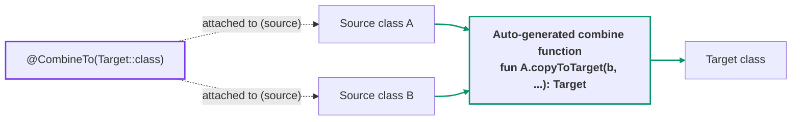
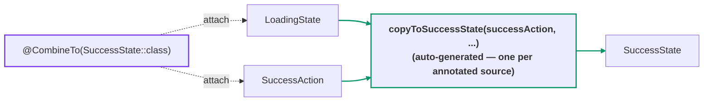
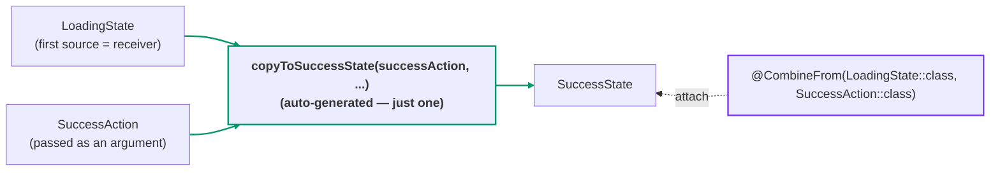
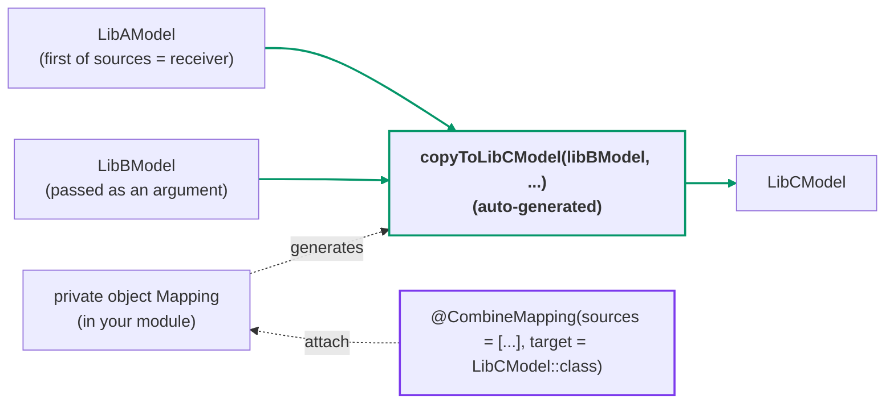

[← README](../README.md) | [日本語](./combine.ja.md)

# Combine — @CombineTo / @CombineFrom / @CombineMapping

cream can generate copy functions **from multiple source classes to a single target class** ("combine").
This is one generation feature with three annotations; they differ in where you place the annotation and in
**how many functions are generated**:

| Annotation | Place it on | Generated functions | Choose when |
|---|---|---|---|
| [`@CombineTo`](#combineto) | each **source** class | one **per annotated source** | you can modify the source side |
| [`@CombineFrom`](#combinefrom) | the **target** class | exactly **one** (first source = receiver) | you can modify the target side |
| [`@CombineMapping`](#combinemapping) | a separate declaration in your own module | exactly **one** per mapping (first source = receiver) | you can modify **neither** (e.g. library classes) |

The generated combine function is always an **extension function on one of the source classes**;
the remaining sources are passed as arguments named after their class in lowerCamelCase
(e.g. `SuccessAction` -> `successAction`), in the listed order.



## @CombineTo

Attach `@CombineTo` to **each source class**. It is convenient when you build one state from
multiple data sources.

```kt
import me.tbsten.cream.CombineTo

@CombineTo(SuccessState::class) // generates a combine function LoadingState + SuccessAction -> SuccessState
data class LoadingState(val itemId: String)

@CombineTo(SuccessState::class) // generates a combine function SuccessAction + LoadingState -> SuccessState
data class SuccessAction(val data: String)

data class SuccessState(
    val itemId: String,  // from LoadingState.itemId
    val data: String,    // from SuccessAction.data
    val lastUpdateAt: Long,
)

// usage
val loadingState: LoadingState = /* ... */
val action: SuccessAction = /* ... */
val successState: SuccessState = loadingState.copyToSuccessState(
    successAction = action,
    // itemId falls back to the default argument loadingState.itemId
    // data falls back to the default argument action.data
    lastUpdateAt = /* lastUpdateAt has no matching property on either source, so it must be passed explicitly. */,
)
```



<details>
<summary>Generated code</summary>

```kt
// auto generate (one function per annotated source — two in this example)
fun LoadingState.copyToSuccessState(
    successAction: SuccessAction,
    itemId: String = this.itemId,
    data: String = successAction.data,
    lastUpdateAt: Long,
): SuccessState = SuccessState(
    itemId = itemId,
    data = data,
    lastUpdateAt = lastUpdateAt,
)

fun SuccessAction.copyToSuccessState(
    loadingState: LoadingState,
    itemId: String = loadingState.itemId,
    data: String = this.data,
    lastUpdateAt: Long,
): SuccessState = SuccessState(
    itemId = itemId,
    data = data,
    lastUpdateAt = lastUpdateAt,
)
```

</details>

## @CombineFrom

`@CombineFrom` is the inverse of `@CombineTo` — you list the source classes **on the target side**.
Exactly **one** function is generated, with the first listed source as the receiver.

```kt
import me.tbsten.cream.CombineFrom

data class LoadingState(
    val itemId: String,
)

data class SuccessAction(
    val data: String,
)

@CombineFrom(LoadingState::class, SuccessAction::class) // generates a combine function LoadingState + SuccessAction -> SuccessState
data class SuccessState(
    val itemId: String,  // from LoadingState.itemId
    val data: String,    // from SuccessAction.data
    val lastUpdateAt: Long,
)

// usage
val loadingState: LoadingState = /* ... */
val action: SuccessAction = /* ... */
val successState: SuccessState = loadingState.copyToSuccessState(
    successAction = action,
    lastUpdateAt = /* required — no matching property on either source */,
)
```



<details>
<summary>Generated code</summary>

```kt
// exactly one function — the first listed source (LoadingState) is the receiver
fun LoadingState.copyToSuccessState(
    successAction: SuccessAction,
    itemId: String = this.itemId,
    data: String = successAction.data,
    lastUpdateAt: Long,
): SuccessState = SuccessState(
    itemId = itemId,
    data = data,
    lastUpdateAt = lastUpdateAt,
)
```

</details>

## @CombineMapping

If **neither the sources nor the target** are in your own source code, you can use
`@CombineMapping`. Attach it to another declaration in your module (usually a `private object`)
to generate the same combine function as `@CombineTo` / `@CombineFrom` without modifying any of
the classes.

```kt
import me.tbsten.cream.CombineMapping

// in library A — cannot be modified
data class LibAModel(
    val propA: String,
    val valueA: Int,
)

// in library B — cannot be modified
data class LibBModel(
    val propB: String,
    val valueB: Double,
)

// in library C — cannot be modified
data class LibCModel(
    val propA: String,
    val valueA: Int,
    val propB: String,
    val valueB: Double,
    val extra: String,
)

// in your module
@CombineMapping( // generates a combine function LibAModel + LibBModel -> LibCModel
    sources = [LibAModel::class, LibBModel::class],
    target = LibCModel::class,
)
private object Mapping

// usage
val libA: LibAModel = /* ... */
val libB: LibBModel = /* ... */
val libC: LibCModel = libA.copyToLibCModel(
    libBModel = libB,
    extra = /* required — no matching property on either source */,
)
```



<details>
<summary>Generated code</summary>

```kt
fun LibAModel.copyToLibCModel(
    libBModel: LibBModel,
    propA: String = this.propA,
    valueA: Int = this.valueA,
    propB: String = libBModel.propB,
    valueB: Double = libBModel.valueB,
    extra: String,
): LibCModel = LibCModel(
    propA = propA,
    valueA = valueA,
    propB = propB,
    valueB = valueB,
    extra = extra,
)
```

</details>

`sources` requires **at least two classes** — fewer is a compile-time error. `@CombineMapping` is
repeatable, so one declaration can hold several mappings.

## Details

- When multiple source classes have the same property name, **the value from the source passed as
  an argument (the last listed one) wins over the receiver**.

### Other customizations

- Mismatched property names can be mapped with `@CombineTo.Map` (on a source property) or
  `@CombineFrom.Map` (on a target constructor parameter) —
  see [Property mapping](./customization/property-mapping.md) for details. `@CombineMapping` uses the
  `properties = [CombineMapping.Map(source = "...", target = "...")]` parameter instead.
- `.Exclude` (`@CombineTo.Exclude` / `@CombineFrom.Exclude`) **removes the auto-copy default** from
  the matching parameter — see [Exclude](./customization/exclude.md). `@CombineMapping` does not
  support `.Exclude` (the source/target classes are not your own code).
- The **KDoc** of the generated function can be augmented with `kdoc = KDoc(...)` —
  see [KDoc](./customization/kdoc.md).
- The **visibility** of the generated function can be controlled with the `visibility`
  argument — see [Visibility](./customization/visibility.md).
- The **name** of the generated function can be customized per declaration (`funName`) or
  globally via KSP options — see [Function name](./customization/fun-name.md).

## See also

- [Copy — @CopyTo / @CopyFrom / @CopyMapping](./copy.md) — the single-source counterpart
  (`@CopyMapping` is the 1-to-1 version of `@CombineMapping`)
- [Property mapping — .Map](./customization/property-mapping.md)
- [Exclude — .Exclude](./customization/exclude.md)
- [KDoc](./customization/kdoc.md)
- [Visibility](./customization/visibility.md)
- [Function name — funName](./customization/fun-name.md)
- [KSP options](./customization/options.md)
- [Comparison with other libraries](./comparison.md#vs-mappie) — including multi-source mapping in Mappie and others
