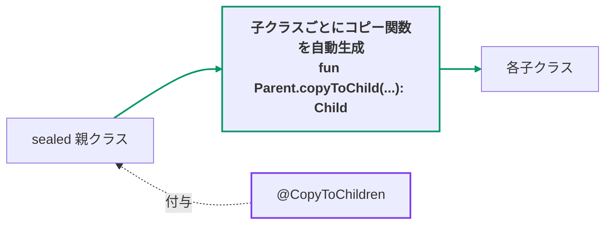
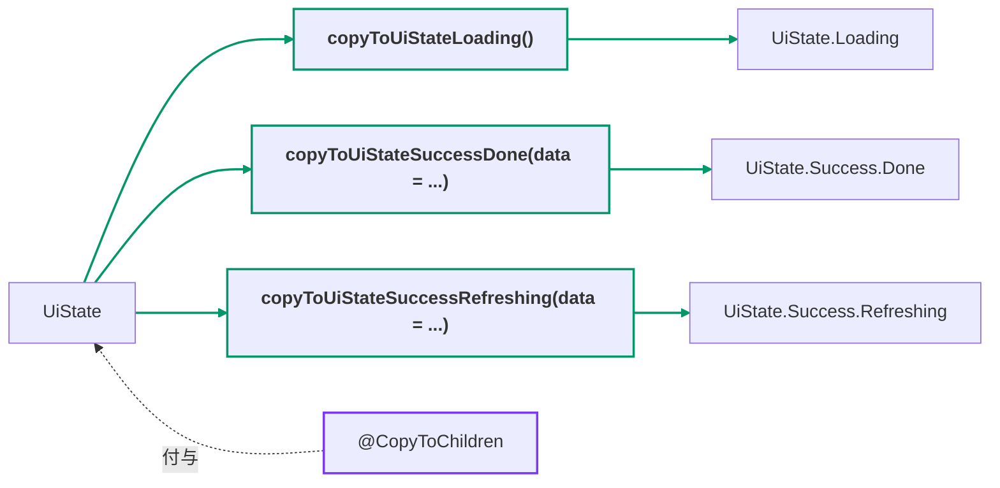

[← README](../README.ja.md) | [English](./copy-to-children.md)

# @CopyToChildren

sealed class/interface に付与することで、その sealed class/interface -> 継承する
**すべての子クラス** へコピーするコピー関数を自動生成します。直接の子だけでなく、
途中のネストした sealed 型を再帰的に辿って末端の具象クラスまで生成されます。



## 基本の例

```kt
import me.tbsten.cream.CopyToChildren

@CopyToChildren // UiState -> 全ての子クラス（Loading, Success.Done, Success.Refreshing）へコピーする関数を生成します。
sealed interface UiState {
    data object Loading : UiState

    sealed interface Success : UiState {
        val data: Data

        data class Done(
            override val data: Data,
        ) : Success

        data class Refreshing(
            override val data: Data,
        ) : Success
    }
}

// usage
val state: UiState = UiState.Loading
val done: UiState.Success.Done = state.copyToUiStateSuccessDone(
    data = /* data は state から引き継げるプロパティがないため、必須引数として呼び出す必要があります。 */,
)
```



<details>
<summary>生成されるコード</summary>

```kt
// auto generate
fun UiState.copyToUiStateLoading() = UiState.Loading

fun UiState.copyToUiStateSuccessDone(
    data: Data,
): UiState.Success.Done = UiState.Success.Done(
    data = data,
)

fun UiState.copyToUiStateSuccessRefreshing(
    data: Data,
): UiState.Success.Refreshing = UiState.Success.Refreshing(
    data = data,
)
```

</details>

## 詳細

### notCopyToObject

| デフォルト   | 設定可能な値                |
|---------|-----------------------|
| `false` | `true`,`false` のいずれか。 |

デフォルトでは `object` の子クラスへのコピー関数も生成されます (単に singleton インスタンスを
返すだけです)。抑止したい場合は [notCopyToObject](#notcopytoobject) を使ってください。

notCopyToObject に true を設定すると、あるクラスから object へのコピー関数を生成しなくなります。

object へのコピー関数は、実際にはコピーではなく object のインスタンスをそのまま返します
(上の[基本の例](#基本の例)では、`UiState.Loading` へのコピー関数がこれに該当します)。
これがあなたの好みに合わない場合、`true` を設定して data object へのコピーを抑止できます。

設定方法は 2 通りあります:

- **アノテーションのプロパティ** — アノテーションをつけた sealed class/interface のみに効きます:

  ```kt
  @CopyToChildren(notCopyToObject = true)
  sealed interface UiState { /* ... */ }
  ```

- **KSP 引数 `cream.notCopyToObject`** — モジュール全体に効きます:

  ```kotlin
  // build.gradle.kts
  ksp {
      arg("cream.notCopyToObject", "true")
  }
  ```

KSP 引数はモジュール全体に影響しますが、アノテーションのプロパティを使うと
アノテーションをつけたクラスのみに絞ることができます。KSP 引数の一覧 (索引) は
[Options](./customization/options.ja.md) を参照してください。

### その他のカスタマイズ

- sealed 親に宣言したプロパティに `@CopyToChildren.Exclude` を付与すると、**すべての**
  per-child コピー関数からそのパラメータの自動コピーのデフォルト値 (`= this.<プロパティ>`) が
  取り除かれ、呼び出し側が必ず指定するパラメータになります。詳細は [Exclude](./customization/exclude.ja.md) を参照してください。
- 生成される関数の **KDoc** は `kdoc = KDoc(...)` で拡張できます —
  [KDoc](./customization/kdoc.ja.md) を参照。
- 生成される関数の **可視性** は `visibility` 引数で制御できます —
  [Visibility](./customization/visibility.ja.md) を参照。
- 生成される関数の **名前** は宣言ごと（`funName`）にも KSP オプションでグローバルにも
  カスタマイズできます — [Function name](./customization/fun-name.ja.md) を参照。

## 関連ドキュメント

- [@SealedCopy](./sealed-copy.ja.md) — 対をなすアノテーション。`@CopyToChildren` が子ごとに
  **戻り型が子 type** のコピー関数を生成する (型を絞る遷移) のに対し、`@SealedCopy` は
  **sealed 親 type を保つ** 単一の `copy()` を生成します。
- [Exclude](./customization/exclude.ja.md) — `@CopyToChildren.Exclude` とその他の `.Exclude` アノテーション。
- [KDoc](./customization/kdoc.ja.md) — 生成関数への `kdoc = KDoc(...)` 引数。
- [Visibility](./customization/visibility.ja.md) — `visibility` 引数と `cream.defaultVisibility`。
- [Function name](./customization/fun-name.ja.md) — `funName` 引数と命名系の KSP オプション。
- [Options](./customization/options.ja.md) — KSP 引数の索引。
- ユースケース: [sealed class を使った UI 状態の管理（第 3 回: ネストした sealed StateMachine を1つの注釈で網羅する）](./use-case/ui-state-management-by-sealed-class/03.ja.md)
- ユースケース: [sealed class を使った UI 状態の管理（第 5 回: 状態管理ライブラリ Koma との併用）](./use-case/ui-state-management-by-sealed-class/05.ja.md)
