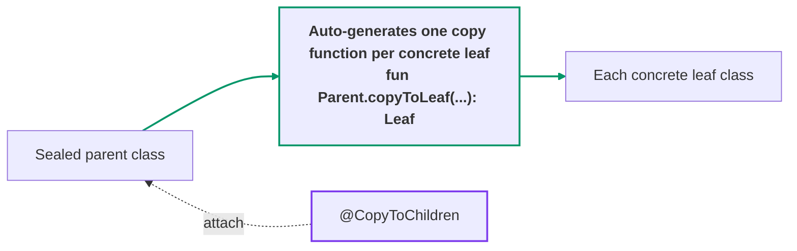
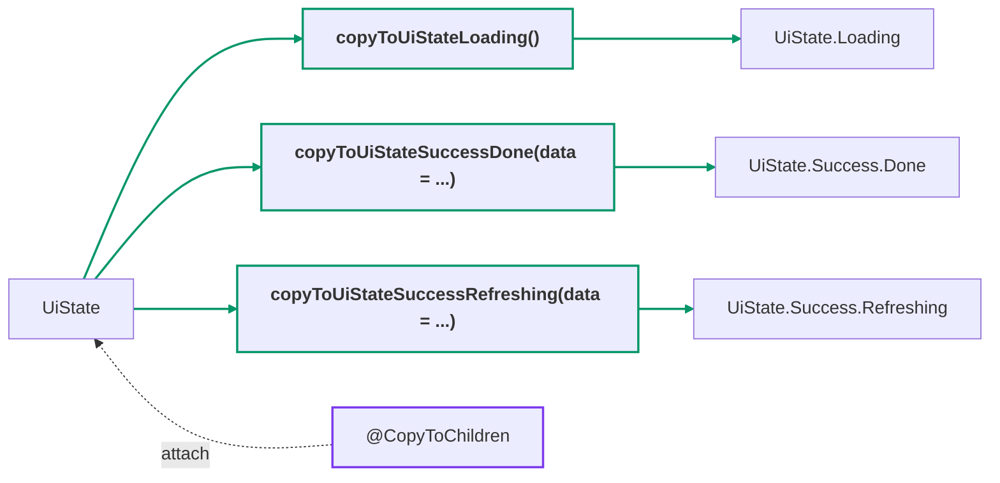

[← README](../README.md) | [日本語](./copy-to-children.ja.md)

# @CopyToChildren

When applied to a sealed class/interface, `@CopyToChildren` automatically generates copy functions
from that sealed class/interface to **all transitive concrete leaves** that inherit from it —
recursing through any intermediate sealed types, not just the direct children.



## Quick example

```kt
import me.tbsten.cream.CopyToChildren

@CopyToChildren // generates copy functions UiState -> every concrete leaf (Loading, Success.Done, Success.Refreshing)
sealed interface UiState {
    data object Loading : UiState

    sealed interface Success : UiState {
        val data: Data

        data class Done(
            override val data: Data,
        ) : Success

        data class Refreshing(
            override val data: Data,
        ) : Success
    }
}

// usage
val state: UiState = UiState.Loading
val done: UiState.Success.Done = state.copyToUiStateSuccessDone(
    data = /* data has no matching property on state, so it must be passed explicitly. */,
)
```



<details>
<summary>Generated code</summary>

```kt
// auto generate
fun UiState.copyToUiStateLoading() = UiState.Loading

fun UiState.copyToUiStateSuccessDone(
    data: Data,
): UiState.Success.Done = UiState.Success.Done(
    data = data,
)

fun UiState.copyToUiStateSuccessRefreshing(
    data: Data,
): UiState.Success.Refreshing = UiState.Success.Refreshing(
    data = data,
)
```

</details>

## Details

### notCopyToObject

| Default | Possible values |
|---------|-----------------|
| `false` | `true`, `false` |

By default, copy functions to `object` leaves are also generated; they just return the singleton
instance. Use [notCopyToObject](#notcopytoobject) to suppress them.

Setting `notCopyToObject` to `true` stops generating copy functions from a class to an `object`.

Copy functions to an `object` do not actually copy, but simply return the instance of the object
itself (in the Quick example above, that is all a copy function to `UiState.Loading` could do). If
you prefer not to generate copy functions to data objects, set this to `true` to suppress them.

There are two ways to set it:

- **Annotation property** — limits the effect to the annotated sealed class/interface:

  ```kt
  @CopyToChildren(notCopyToObject = true)
  sealed interface UiState { /* ... */ }
  ```

- **KSP argument `cream.notCopyToObject`** — affects the entire module:

  ```kotlin
  // build.gradle.kts
  ksp {
      arg("cream.notCopyToObject", "true")
  }
  ```

The KSP argument affects the entire module, while the annotation property narrows it to a specific
class. All KSP arguments are indexed in [Options](./customization/options.md).

### Other customizations

- Annotating a property declared on the sealed parent with `@CopyToChildren.Exclude` removes its
  auto-copy default (`= this.<property>`) from **every** generated per-child copy function, making
  the parameter required. See [Exclude](./customization/exclude.md) for details.
- The **KDoc** of the generated function can be augmented with `kdoc = KDoc(...)` —
  see [KDoc](./customization/kdoc.md).
- The **visibility** of the generated function can be controlled with the `visibility`
  argument — see [Visibility](./customization/visibility.md).
- The **name** of the generated function can be customized per declaration (`funName`) or
  globally via KSP options — see [Function name](./customization/fun-name.md).

## See also

- [@SealedCopy](./sealed-copy.md) — the complementary annotation: it generates a single `copy()`
  that **keeps the sealed parent type** as receiver and return type, whereas `@CopyToChildren`
  generates per-child functions whose return type is the child.
- [Exclude](./customization/exclude.md) — `@CopyToChildren.Exclude` and the other `.Exclude` annotations.
- [KDoc](./customization/kdoc.md) — the `kdoc = KDoc(...)` argument for generated functions.
- [Visibility](./customization/visibility.md) — the `visibility` argument and `cream.defaultVisibility`.
- [Function name](./customization/fun-name.md) — the `funName` argument and naming-related KSP options.
- [Options](./customization/options.md) — index of all KSP arguments.
- Use case: [Managing UI state with sealed classes (Part 3: Covering a nested sealed state machine with one annotation)](./use-case/ui-state-management-by-sealed-class/03.md)
- Use case: [Managing UI state with sealed classes (Part 5: Using cream.kt with the Koma state-management library)](./use-case/ui-state-management-by-sealed-class/05.md)
