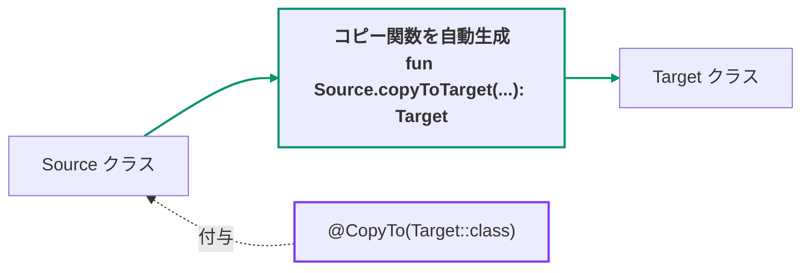
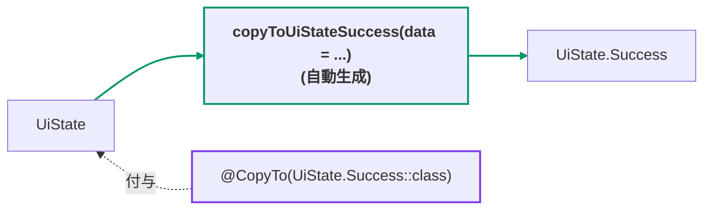
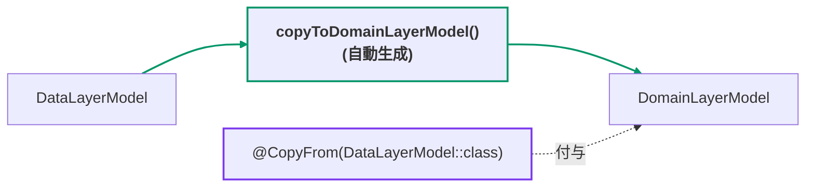
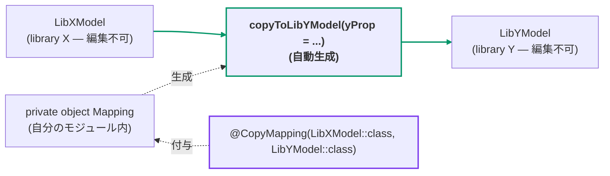

[← README](../README.ja.md) | [English](./copy.md)

# Copy — @CopyTo / @CopyFrom / @CopyMapping

cream.kt は、あるクラスのインスタンスを別のクラスへコピーするコピー関数を自動生成します。
生成されるコピー関数はコピー前後のクラス間で共通するプロパティがある場合はデフォルト引数として引き継がれるため、似たクラス間の変換を非常に簡潔に記述できます。

| アノテーション | 付ける場所 | 使いどころ |
|---|---|---|
| [`@CopyTo(Target::class)`](#copyto) | **遷移元 (source)** クラス | 遷移元クラスを編集できる場合 |
| [`@CopyFrom(Source::class)`](#copyfrom) | **遷移先 (target)** クラス | 遷移先クラスを編集できる場合 |
| [`@CopyMapping(Source::class, Target::class)`](#copymapping) | **自分のモジュール内** の宣言（どちらのクラスも触らない） | 両方ともライブラリのクラスで編集できない場合 |



## @CopyTo

`@CopyTo` を付与したクラスから指定した遷移先のクラスへ遷移する copy 関数を生成します。

```kt
import me.tbsten.cream.CopyTo

@CopyTo(UiState.Success::class)
class UiState(
    val itemId: String,
) {
    data class Success(
        val itemId: String,
        val data: Data,
    )
}

// usage
val uiState: UiState = /* ... */
val nextUiState: UiState.Success = uiState.copyToUiStateSuccess(
    data = /* ... */,
)
```



<details>
<summary>生成されるコード</summary>

```kt
fun UiState.copyToUiStateSuccess(
    itemId: String = this.itemId,
    data: Data,
): UiState.Success = UiState.Success(
    itemId = itemId,
    data = data,
)
```

</details>

## @CopyFrom

`@CopyTo` と似ていますが、引数に **遷移元** のクラスを指定する点が違います。

```kt
data class DataLayerModel(
    val data: Data,
)

@CopyFrom(DataLayerModel::class) // DataLayerModel -> DomainLayerModel へコピーする関数を生成します。
data class DomainLayerModel(
    val data: Data,
)

// usage
val dataLayerModel: DataLayerModel = /* ... */
// data はデフォルト引数の dataLayerModel.data が使用されるため、引数なしで呼び出せます
val domainLayerModel: DomainLayerModel = dataLayerModel.copyToDomainLayerModel()
```



<details>
<summary>生成されるコード</summary>

```kt
fun DataLayerModel.copyToDomainLayerModel(
    data: Data = this.data,
): DomainLayerModel = DomainLayerModel(
    data = data,
)
```

</details>

## @CopyMapping

コピー元/コピー先クラスが両方とも自分のソースコードではないが、コピー関数を生成したい場合は
`@CopyMapping` を使用できます。これにより、コピー元クラス・コピー先クラスを両方とも一切編集する
ことなくコピー関数を生成することが可能です。

```kt
// in library X
data class LibXModel(
    val shareProp: String,
    val xProp: Int,
)

// in library Y
data class LibYModel(
    val shareProp: String,
    val yProp: Int,
)

// in your module
@CopyMapping(LibXModel::class, LibYModel::class) // LibXModel -> LibYModel へコピーする関数を生成します。
private object Mapping

// usage
val libXModel: LibXModel = /* ... */
val libYModel: LibYModel = libXModel.copyToLibYModel(
    // shareProp はデフォルト引数の libXModel.shareProp が使用されます
    yProp = /* yProp は LibXModel から引き継げるプロパティがないため、必須引数として呼び出す必要があります。 */,
)
```



<details>
<summary>生成されるコード</summary>

```kt
fun LibXModel.copyToLibYModel(
    shareProp: String = this.shareProp,
    yProp: Int,
): LibYModel = LibYModel(
    shareProp = shareProp,
    yProp = yProp,
)
```

</details>

> **Note:** `@CopyMapping` は **クラスのペア** を対応付けるものです。コピー時の
> **プロパティ名** の対応付けには `.Map` を使います — [Property mapping](./customization/property-mapping.ja.md)
> を参照してください。

## 詳細

### その他のカスタマイズ

- 遷移元と遷移先で **プロパティ名が一致しない** 場合は `.Map` で対応付けできます —
  詳細は [Property mapping](./customization/property-mapping.ja.md) を参照。
- `.Exclude` で **プロパティをデフォルト値の設定から除外** できます —
  [Exclude](./customization/exclude.ja.md) を参照。
- 型が **`value class` のラップ 1 枚だけ違う** プロパティ（例: `id: String` ↔ `id: DomainId`）は
  自動でコピーされます（デフォルトで有効。`cream.autoValueClassMapping=false` で
  モジュール全体で無効化できます）— [Value class mapping](./customization/value-class-mapping.ja.md) を参照。
- 生成される関数の **KDoc** は `kdoc = KDoc(...)` で拡張できます —
  [KDoc](./customization/kdoc.ja.md) を参照。
- 生成される関数の **可視性** は `visibility` 引数で制御できます —
  [Visibility](./customization/visibility.ja.md) を参照。
- 生成される関数の **名前** は宣言ごと（`funName`）にも KSP オプションでグローバルにも
  カスタマイズできます — [Function name](./customization/fun-name.ja.md) を参照。

## 関連ドキュメント

- [Property mapping (`.Map`)](./customization/property-mapping.ja.md)
- [Exclude (`.Exclude`)](./customization/exclude.ja.md)
- [Value class mapping（自動）](./customization/value-class-mapping.ja.md)
- [KDoc (`kdoc = KDoc(...)`)](./customization/kdoc.ja.md)
- [Visibility](./customization/visibility.ja.md)
- [Function name (`funName` / naming options)](./customization/fun-name.ja.md)
- [KSP options](./customization/options.ja.md)
- [Combine — @CombineTo / @CombineFrom / @CombineMapping](./combine.ja.md) — N 個の遷移元を 1 つの遷移先に合成
- [@CopyToChildren](./copy-to-children.ja.md) — sealed 型からすべての子クラスへのコピー
- ユースケース: [異なるレイヤーのモデルのマッピングを cream.kt で簡素化する](./use-case/model-mapping.ja.md)
- ユースケース: [sealed class を使った UI 状態の管理（第 1 回: Loading / Success / Error と共通プロパティの保守）](./use-case/ui-state-management-by-sealed-class/01.ja.md)
