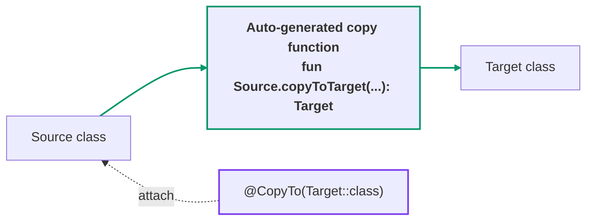
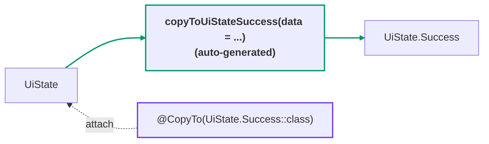
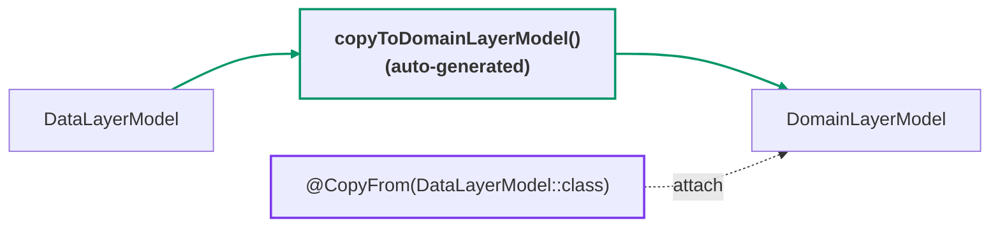
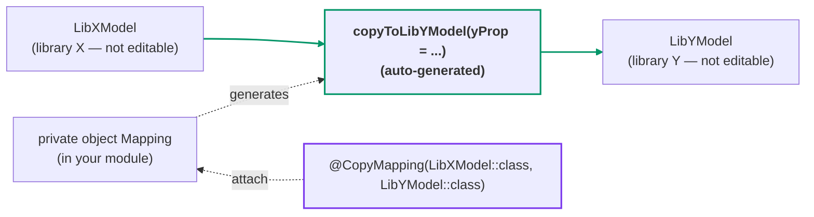

[← README](../README.md) | [日本語](./copy.ja.md)

# Copy — @CopyTo / @CopyFrom / @CopyMapping

cream.kt generates copy functions that transition an instance of one class into another.
When the source and target share properties, the generated function carries them over as
default arguments, so conversions between similar classes stay very concise.

| Annotation | Attach to | Use when |
|---|---|---|
| [`@CopyTo(Target::class)`](#copyto) | the **source** class | You can edit the source class |
| [`@CopyFrom(Source::class)`](#copyfrom) | the **target** class | You can edit the target class |
| [`@CopyMapping(Source::class, Target::class)`](#copymapping) | a declaration in **your own module** (neither class is touched) | Both classes are in libraries you cannot edit |



## @CopyTo

Generates a copy function that transitions from the annotated class to the specified target class.

```kt
import me.tbsten.cream.CopyTo

@CopyTo(UiState.Success::class)
class UiState(
    val itemId: String,
) {
    data class Success(
        val itemId: String,
        val data: Data,
    )
}

// usage
val uiState: UiState = /* ... */
val nextUiState: UiState.Success = uiState.copyToUiStateSuccess(
    data = /* ... */,
)
```



<details>
<summary>Generated code</summary>

```kt
fun UiState.copyToUiStateSuccess(
    itemId: String = this.itemId,
    data: Data,
): UiState.Success = UiState.Success(
    itemId = itemId,
    data = data,
)
```

</details>

## @CopyFrom

Similar to `@CopyTo`, but differs in that the **source** class is specified as the argument.

```kt
data class DataLayerModel(
    val data: Data,
)

@CopyFrom(DataLayerModel::class) // generates a copy function DataLayerModel -> DomainLayerModel
data class DomainLayerModel(
    val data: Data,
)

// usage
val dataLayerModel: DataLayerModel = /* ... */
// data falls back to the default argument dataLayerModel.data, so no arguments are needed
val domainLayerModel: DomainLayerModel = dataLayerModel.copyToDomainLayerModel()
```



<details>
<summary>Generated code</summary>

```kt
fun DataLayerModel.copyToDomainLayerModel(
    data: Data = this.data,
): DomainLayerModel = DomainLayerModel(
    data = data,
)
```

</details>

## @CopyMapping

If you want to generate a copy function between classes where neither the source nor the
destination is in your own source code, you can use `@CopyMapping`. This allows you to generate
copy functions between library classes without modifying either class at all.

```kt
// in library X
data class LibXModel(
    val shareProp: String,
    val xProp: Int,
)

// in library Y
data class LibYModel(
    val shareProp: String,
    val yProp: Int,
)

// in your module
@CopyMapping(LibXModel::class, LibYModel::class) // generates a copy function LibXModel -> LibYModel
private object Mapping

// usage
val libXModel: LibXModel = /* ... */
val libYModel: LibYModel = libXModel.copyToLibYModel(
    // shareProp falls back to the default argument libXModel.shareProp
    yProp = /* yProp has no matching property on LibXModel, so it must be passed explicitly. */,
)
```



<details>
<summary>Generated code</summary>

```kt
fun LibXModel.copyToLibYModel(
    shareProp: String = this.shareProp,
    yProp: Int,
): LibYModel = LibYModel(
    shareProp = shareProp,
    yProp = yProp,
)
```

</details>

> **Note:** `@CopyMapping` maps a **pair of classes**. To map mismatched **property names**
> within a copy, use `.Map` instead — see [Property mapping](./customization/property-mapping.md).

## Details

### Other customizations

- **Mismatched property names** between source and target can be mapped with `.Map` —
  see [Property mapping](./customization/property-mapping.md) for details.
- **Properties can be excluded** from default-value assignment with `.Exclude` —
  see [Exclude](./customization/exclude.md).
- **Properties that differ only by a `value class` wrapper** (e.g. `id: String` ↔ `id: DomainId`)
  receive auto-copy defaults automatically (always on; disable module-wide with
  `cream.autoValueClassMapping=false`) — see
  [Value class mapping](./customization/value-class-mapping.md).
- The **KDoc** of the generated function can be augmented with `kdoc = KDoc(...)` —
  see [KDoc](./customization/kdoc.md).
- The **visibility** of the generated function can be controlled with the `visibility`
  argument — see [Visibility](./customization/visibility.md).
- The **name** of the generated function can be customized per declaration (`funName`) or
  globally via KSP options — see [Function name](./customization/fun-name.md).

## See also

- [Property mapping (`.Map`)](./customization/property-mapping.md)
- [Exclude (`.Exclude`)](./customization/exclude.md)
- [Value class mapping (automatic)](./customization/value-class-mapping.md)
- [KDoc (`kdoc = KDoc(...)`)](./customization/kdoc.md)
- [Visibility](./customization/visibility.md)
- [Function name (`funName` / naming options)](./customization/fun-name.md)
- [KSP options](./customization/options.md)
- [Combine — @CombineTo / @CombineFrom / @CombineMapping](./combine.md) — combine N sources into 1 target
- [@CopyToChildren](./copy-to-children.md) — copy from a sealed type to all of its concrete leaves
- Use case: [Simplifying model mapping across layers with cream.kt](./use-case/model-mapping.md)
- Use case: [Managing UI state with sealed classes (Part 1: Maintaining shared properties across Loading / Success / Error)](./use-case/ui-state-management-by-sealed-class/01.md)
