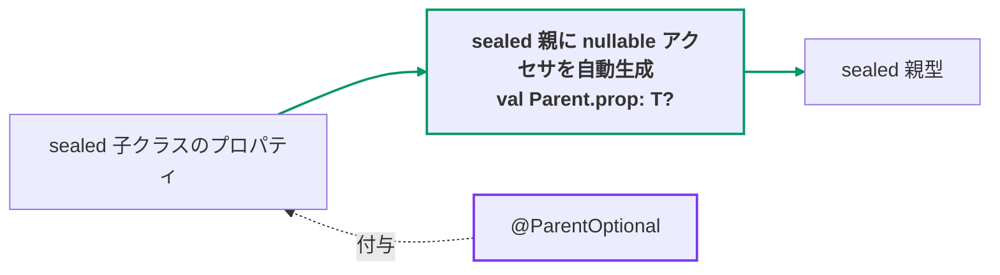
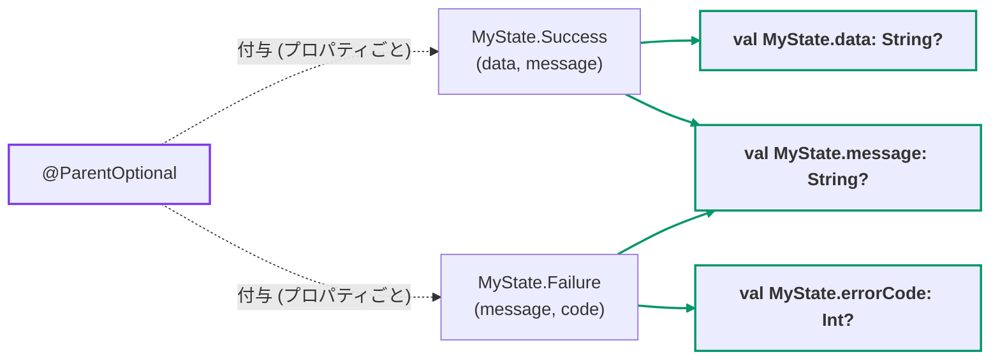

[← README](../README.ja.md) | [English](./parent-optional.md)

# @ParentOptional / @ChildOptionals

`@ParentOptional` は、sealed 階層の子クラスのプロパティを sealed 親型の
**nullable 拡張プロパティ** として公開します。生成されるアクセサは、レシーバがアノテーションを
付けた子クラスのときはプロパティの値を、それ以外のときは `null` を返します — UI 状態
(MVI / UiState) 周りで積み上がりがちな `(state as? Success)?.data` という boilerplate を
置き換えられます。

`@ChildOptionals` はその一括適用版です。sealed 親に 1 度付けるだけで、末端の全具象クラスの
対象プロパティすべてにアクセサが生成されます。



## 基本の例

```kt
import me.tbsten.cream.ParentOptional

sealed interface MyState {
    data class Success(
        @ParentOptional val data: String,
        @ParentOptional val message: String,
    ) : MyState

    data class Failure(
        @ParentOptional val message: String,
        @ParentOptional(propertyName = "errorCode") val code: Int,
    ) : MyState

    data object Loading : MyState
}

// usage
val state: MyState = MyState.Success(data = "d", message = "hello")
state.data      // "d" — state が Failure / Loading のときは null
state.message   // "hello" — Success.message と Failure.message は 1 つのアクセサにマージされます
state.errorCode // null — propertyName で `code` からリネーム。state が Failure のときは Int の値
```



<details>
<summary>生成されるコード</summary>

```kt
// auto generate
public val MyState.data: String?
    get() = when (this) {
        is MyState.Success -> data
        else -> null
    }

public val MyState.message: String?
    get() = when (this) {
        is MyState.Success -> message
        is MyState.Failure -> message
        else -> null
    }

public val MyState.errorCode: Int?
    get() = when (this) {
        is MyState.Failure -> code
        else -> null
    }
```

</details>

## @ChildOptionals

sealed **親** に `@ChildOptionals` を付けると、末端の全具象クラスの対象プロパティすべてに
同じ生成が一括で適用されます — プロパティごとのアノテーションは不要です。

```kt
import me.tbsten.cream.ChildOptionals

@ChildOptionals
sealed interface DownloadState {
    // 親で既に見えるプロパティ (override 含む) にはアクセサは生成されません
    val id: String

    data class Downloading(
        override val id: String,
        val progress: Int,
    ) : DownloadState

    data class Done(
        override val id: String,
        val resultPath: String,
    ) : DownloadState {
        // body で宣言したプロパティも対象になります
        val fileName: String get() = resultPath.substringAfterLast('/')
    }

    data object Idle : DownloadState {
        override val id: String = ""
    }
}

// usage
val state: DownloadState = DownloadState.Downloading(id = "1", progress = 40)
state.progress   // 40 — state が Done / Idle のときは null
state.resultPath // null — state が Done のときは String の値
state.id         // 通常のメンバアクセス — `id` にはアクセサは生成されません
```

<details>
<summary>生成されるコード</summary>

```kt
// auto generate
public val DownloadState.progress: Int?
    get() = when (this) {
        is DownloadState.Downloading -> progress
        else -> null
    }

public val DownloadState.resultPath: String?
    get() = when (this) {
        is DownloadState.Done -> resultPath
        else -> null
    }

public val DownloadState.fileName: String?
    get() = when (this) {
        is DownloadState.Done -> fileName
        else -> null
    }
```

</details>

対象になるプロパティ:

- 末端の各具象クラス ([@CopyToChildren](./copy-to-children.ja.md) と同様、途中の sealed 型を
  再帰的に辿ります) について、**その具象クラス自身が宣言する** プロパティ
  (constructor + body) が対象です。
- アノテーションを付けた親より下の **中間 sealed 型** 自身が宣言する `@ParentOptional` 付き
  プロパティも対象になります — `is 中間型` の 1 分岐で配下の全 leaf をカバーします。
- アノテーションを付けた sealed 型で既に見えるプロパティ (override 含む) はスキップされます —
  member は extension に必ず勝つため、アクセサを生成しても dead code になるからです。明示的な
  `@ParentOptional(propertyName = ...)` はこのフィルタをバイパスし、リネーム後の名前でアクセサを
  生成します (リネーム後も見えている member と衝突する場合はエラーとして報告されます)。
- `private` プロパティ (および生成アクセサから参照できない leaf) は **暗黙的に** スキップ
  されます。(`@ParentOptional` の場合はエラーになります — [エラー](#エラー) を参照。)
- **拡張プロパティ** (`val String.suffix get() = ...`) は暗黙的にスキップされます —
  アクセサは extension receiver を用意できないためです。(`@ParentOptional` を付けた場合は
  エラーになります。)
- アノテーションを付けた親が **pin していない** 型パラメータを参照するプロパティ
  (例: `Tagged<M> : Parent` の `val meta: M`) は **警告付きで** スキップされます —
  その型は親レシーバ上で表現できないためです。(`@ParentOptional` を付けた場合はエラーに
  なります — [generic な親](#generic-な親) を参照。)

## 詳細

### 複数の子クラスの同名プロパティは 1 つのアクセサにマージ

複数の子クラスのプロパティが同じ sealed 親上で同じ生成名になる場合、子クラスごとの `is`
分岐を持つ **単一の** アクセサにマージされます ([基本の例](#基本の例) の `MyState.message`
を参照)。マージされるプロパティはすべて同じ型でなければならず、型が一致しない場合はエラーに
なります。片方を `@ParentOptional(propertyName = ...)` でリネームすればマージを回避できます。

マージされる子同士が **subtype 関係** にある場合 (例: 中間の sealed class 自身のプロパティと
その配下の leaf のプロパティが同じアクセサにマージされる場合)、`is` 分岐は **より派生した子が
先** になるよう並べられます。派生した子のインスタンスでは必ずその子のプロパティが返り、
上位型の分岐に shadow されることはありません。

### すべての sealed 祖先にアクセサが生成される

アクセサは子クラスから見た **すべての transitive な sealed 上位型** に生成されます —
途中の sealed 型も含み、親ごとに別の生成ファイルになります。呼び出し側ではレシーバの
静的な型に合ったアクセサが選ばれます。

```kt
sealed interface Shape {
    sealed interface Polygon : Shape {
        data class Rect(
            @ParentOptional val corners: Int,
        ) : Polygon
    }

    data object Circle : Shape
}

// auto generate — 最上位と中間の sealed 型の両方にアクセサが生成されます:
// val Shape.corners: Int?           (ParentOptional__Shape.kt)
// val Shape.Polygon.corners: Int?   (ParentOptional__Shape.Polygon.kt)
```

### @ParentOptional と @ChildOptionals の併用

2 つのアノテーションが重複したアクセサを生成して衝突しないよう、生成の所有権は
(プロパティ, sealed 祖先) のペア単位で一意に決まります:

- sealed 祖先に `@ChildOptionals` が **付いている** 場合、その祖先へのアクセサは
  `@ChildOptionals` が生成します。配下のプロパティに付いた `@ParentOptional` も尊重され、
  その `propertyName` / `kdoc` / `visibility` はそのプロパティのアクセサに適用されます。
- 付いていない場合、その祖先へのアクセサは `@ParentOptional` が生成します
  (アノテーションを付けたプロパティのみが対象)。

```kt
@ChildOptionals
sealed interface AuthState {
    data class LoggedIn(
        // @ChildOptionals の一括対象ですが、propertyName が尊重され `userNameOrNull` として生成されます
        @ParentOptional(propertyName = "userNameOrNull") val userName: String,
    ) : AuthState

    data object LoggedOut : AuthState
}
```

### sweep からプロパティを除外する

`@ChildOptionals` には `@ParentOptional` のようなプロパティ単位の opt-in がないため、一括適用の中から
特定のプロパティ 1 つだけを外したいときは `@ChildOptionals.Exclude` を使います。**子クラスのプロパティ**
に付けると、その寄与からはアクセサが **一切生成されません**。

```kt
@ChildOptionals
sealed interface UploadState {
    data class Uploading(
        val progress: Int,
        @ChildOptionals.Exclude val tempToken: String,  // 除外 — アクセサは生成されない
    ) : UploadState

    data object Idle : UploadState
}

val state: UploadState = UploadState.Uploading(progress = 40, tempToken = "…")
state.progress   // 40 — アクセサが生成される
// state.tempToken は存在しない — sweep から除外されたため
```

cream の `.Exclude` はどれも「そのプロパティをアノテーションの自動挙動から外す」という同じ意味ですが、
自動挙動の中身がアノテーションごとに異なります。コピー系 ([@CopyTo](./copy.ja.md) など) では自動挙動は
`= this.<property>` の自動コピー既定値なので、除外するとその引数は残りますが **必須** になります。
`@ChildOptionals` では自動挙動は生成アクセサなので、除外すると **アクセサ自体が生成されません**。

- **マージ.** 複数の子が同じアクセサ名に解決される場合、除外された寄与はマージから外れ
  (その `is <子>` 分岐が省かれ)、他の子は従来どおり寄与します。ある名前への **すべての** 寄与が
  除外された場合、その名前のアクセサは生成されません。
- **`@ParentOptional` が優先.** `@ChildOptionals.Exclude` は sweep で拾われるプロパティにのみ効きます。
  明示的に `@ParentOptional` を付けたプロパティは手動で opt-in したものであり、その opt-in が sweep の
  opt-out に勝ちます: `@ChildOptionals.Exclude` を同時に付けてもアクセサは生成されます。
- **効果なし → 警告.** そもそも sweep が拾わないプロパティ (囲むクラスが `@ChildOptionals` 階層に属さない、
  あるいは private / 拡張プロパティ / 親で既に見える / pin されていない型パラメータを含む等で既にスキップ
  される) に `@ChildOptionals.Exclude` を付けても効果はなく、KSP 警告が出ます。

`@ParentOptional` は opt-in なので除外の概念を持ちません — 対象にしたくないプロパティは注釈しなければ
よいだけです。

### generic な親

generic な sealed 親は、子クラスが親の型パラメータを継承リストで **直接 pin する**
(`Child<T> : Parent<T>` の形) 場合にサポートされます:

```kt
sealed interface Source<T> {
    data class Filled<E>(
        @ParentOptional val item: E,
    ) : Source<E>
}

// auto generate
public val <T : Any?> Source<T>.item: T?
    get() = when (this) {
        is Source.Filled -> item
        else -> null
    }
```

**途中の sealed 型を挟んで** 型パラメータを祖先まで伝える形 (`Leaf<X> : Middle<X>`、
`Middle<E> : Root<E>` として `Root` を参照する形) はサポートされません: 直接 pin された親
(`Middle`) へのアクセサは生成されますが、chain の先の祖先 (`Root`) はエラーとして報告されます。

複数の上限境界を持つ型パラメータは、生成される拡張プロパティ上の `where` 句として維持されます。

### nullable なプロパティ型

nullable なプロパティ (`val data: String?`) はそのまま使えます — 型はそのまま維持され、`?` が
重なることはありません。ただしアクセサの `null` は **曖昧** になります: 「その子ではない」と
「プロパティ自体が `null`」の両方を意味し得ます。生成されるアクセサの KDoc にはこの注記が
入ります。区別が必要な場合は `is` チェックを使ってください。

### プロパティの形

子インスタンス上で通常のプロパティとして読めるものはすべてサポートされ、テストで固定化
されています:

- constructor の `val`/`var` と **body 宣言** プロパティ (カスタム getter 含む)。
- **委譲** プロパティ (`by lazy { ... }`)。
- **`lateinit var`** — 直接読む場合と同様、初期化前にアクセサ経由で読むと throw します。
- **`object` / `data object`** の子が宣言するプロパティ。
- **ハードキーワード名** (`val \`object\``) — 生成コードではバッククォートでエスケープ
  されます。(`propertyName` 引数の不正な名前は cream では検証しません — `funName` と同じ
  ポリシーで、生成ファイルのコンパイルエラーになります。)
- **typealias** の型は展開せず、エイリアスのまま生成シグネチャに維持されます。そのため
  エイリアス表記と非エイリアス表記の同じ型はマージされず、型不一致エラーになります。
- **拡張プロパティ** はサポートされません ([エラー](#エラー) を参照)。

### @Deprecated の伝播

マージされる子クラスまたはプロパティが `@Deprecated` の場合、そのアノテーション
(message + level) は生成されるアクセサに伝播されます。呼び出し側には非推奨が見え続け、
`DeprecationLevel.ERROR` のソースもコンパイル可能なままです。マージされたアクセサでは
分岐順で最初に見つかった deprecation が採用されます。

### エラー

以下の使い方はコンパイルエラーとして報告されます (解決方法のメッセージ付き):

- **sealed 上位型を 1 つも持たない** クラスのプロパティへの `@ParentOptional`。
- **private** プロパティへの `@ParentOptional` (生成されるトップレベルのアクセサから参照
  できないため)。なお `@ChildOptionals` は private プロパティを暗黙的にスキップします。
- 生成されるアクセサから **参照できないクラス** (自身または enclosing チェーンのどこかが
  `private` / `protected`) が宣言するプロパティへの `@ParentOptional` (生成される `is`
  チェックがコンパイルできないため)。なお `@ChildOptionals` はそのような leaf を暗黙的に
  スキップします。
- 1 つのアクセサにマージされるプロパティ間の **型不一致**。
- sealed 親に **生成名と同名のメンバが既に存在する** 場合 (見えているメンバは extension に
  必ず勝つため、アクセサが dead code になります)。
- **sealed でない** class/interface への `@ChildOptionals`。
- sealed 親に **直接 pin されていない** 型パラメータを参照するプロパティ型
  ([generic な親](#generic-な親) を参照)。
- **拡張プロパティ** への `@ParentOptional` (アクセサは extension receiver を用意できません)。
- アクセサのシグネチャが **internal なシンボルを公開してしまう** のに
  `visibility = CopyVisibility.PUBLIC` (または `cream.defaultVisibility=PUBLIC`) で public を
  強制した場合 — internal な sealed 親 (レシーバ) や internal なプロパティ型が該当します。
  Kotlin が生成宣言を拒否するため、cream が先にエラーとして報告します。(public アクセサから
  *internal プロパティ* を読むこと自体は問題ありません — 制約はシグネチャのみです。)

### 既知の制限

- fallback 値は常に `null` です — null 以外の fallback は設定できません。
- モジュール全体の命名テンプレート (すべてのアクセサに `...OrNull` を付ける等) はありません。
  リネームはプロパティごとに `propertyName` で行います。
- 型が一致しないマージを共通の上位型に広げる解決 (LUB) は行いません。`T` と `T?`、typealias と
  その展開型もマージされません。
- 子クラス固有の (pin されていない) 型パラメータを使うプロパティ型はサポートされません —
  中間 sealed 型を **挟んだ** pin も同様です ([generic な親](#generic-な親) を参照)。
- `propertyName` 引数は検証されません (`funName` と同じポリシー): バッククォートでも表現
  できない不正な名前は生成ファイルのコンパイルエラーになります。
- **マージされた** アクセサの `kdoc = KDoc(...)` 引数は、分岐順で先頭の entry の値だけが
  描画されます。
- `expect`/`actual` の sealed 階層は未検証です: KSP は各コンパイルを独立に処理するため、
  処理対象のコンパイルに見えている宣言に従います。
- KSP のマルチラウンド処理: round を跨いで deferred になった symbol が、書き込み済みの
  `ParentOptional__<Parent>` / `ChildOptionals__<Parent>` ファイルに再集約されると衝突し得ます。
  実際には未観測・未検証です。

### その他のカスタマイズ

- 生成されるアクセサの **KDoc** は `kdoc = KDoc(...)` で拡張できます —
  [KDoc](./customization/kdoc.ja.md) を参照。
- 生成されるアクセサの **可視性** は `visibility` 引数で制御できます —
  [Visibility](./customization/visibility.ja.md) を参照。デフォルトの `INHERIT` では
  `cream.defaultVisibility` オプションが先に適用され、その後 sealed 親・子クラス・
  プロパティのうち最も狭い可視性を継承します。
- **名前** はプロパティごとに `@ParentOptional(propertyName = ...)` でカスタマイズします。
  これらのアノテーションは関数ではなく拡張プロパティを生成するため、関数名系のオプション
  (`funName`, `cream.copyFunNamePrefix`, ...) は適用されません。

## 関連ドキュメント

- [@CopyToChildren](./copy-to-children.ja.md) — sealed 親に付けるコピー関数版の対:
  `Parent.copyToChild(...)` 形式のコピー関数を生成するのに対し、こちらのアノテーションは
  親への読み取り専用の nullable アクセサを生成します。
- [@SealedCopy](./sealed-copy.ja.md) — 子 type を維持する、sealed 親の `copy()`。
- [KDoc](./customization/kdoc.ja.md) — 生成される宣言への `kdoc = KDoc(...)` 引数。
- [Visibility](./customization/visibility.ja.md) — `visibility` 引数と `cream.defaultVisibility`。
- [Options](./customization/options.ja.md) — KSP 引数の索引。
