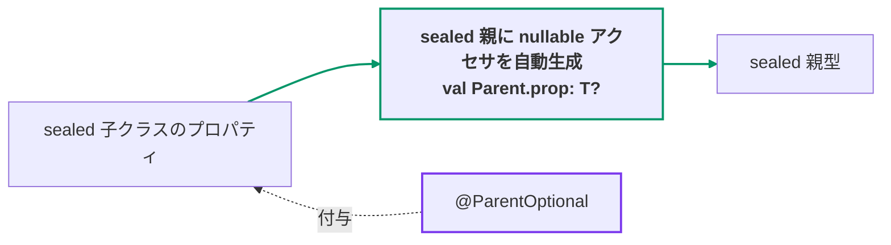
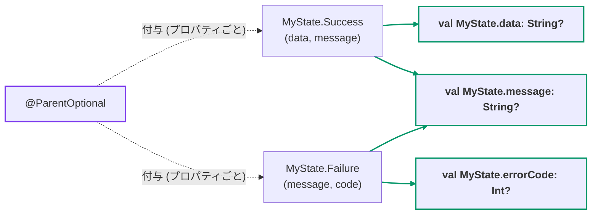

[← README](../README.ja.md) | [English](./parent-optional.md)

# @ParentOptional

`@ParentOptional` は、sealed 階層の子クラスのプロパティを sealed 親型の
**nullable 拡張プロパティ** として公開します。生成されるアクセサは、レシーバがアノテーションを
付けた子クラスのときはプロパティの値を、それ以外のときは `null` を返します — UI 状態
(MVI / UiState) 周りで積み上がりがちな `(state as? Success)?.data` という boilerplate を
置き換えられます。


```mermaid
flowchart LR
    Prop["sealed 子クラスのプロパティ"] --> Fn["sealed 親に nullable アクセサを自動生成<br>val Parent.prop: T?"]
    Fn --> Parent["sealed 親型"]
    Prop ~~~ ParentOptional["@ParentOptional"]
    ParentOptional -. "付与" .-> Prop
    linkStyle 0,1 stroke:#059669,stroke-width:2px
    classDef annotated stroke:#7c3aed,stroke-width:2px
    classDef generated stroke:#059669,stroke-width:2px,font-weight:bold
    class ParentOptional annotated
    class Fn generated
```

## 基本の例

```kt
import me.tbsten.cream.ParentOptional

sealed interface MyState {
    data class Success(
        @ParentOptional val data: String,
        @ParentOptional val message: String,
    ) : MyState

    data class Failure(
        @ParentOptional val message: String,
        @ParentOptional(propertyName = "errorCode") val code: Int,
    ) : MyState

    data object Loading : MyState
}

// usage
val state: MyState = MyState.Success(data = "d", message = "hello")
state.data      // "d" — state が Failure / Loading のときは null
state.message   // "hello" — Success.message と Failure.message は 1 つのアクセサにマージされます
state.errorCode // null — propertyName で `code` からリネーム。state が Failure のときは Int の値
```


```mermaid
flowchart LR
    Success["MyState.Success<br>(data, message)"] --> Fn1["val MyState.data: String?"]
    Success --> Fn2["val MyState.message: String?"]
    Failure["MyState.Failure<br>(message, code)"] --> Fn2
    Failure --> Fn3["val MyState.errorCode: Int?"]
    ParentOptional["@ParentOptional"] -. "付与 (プロパティごと)" .-> Success
    ParentOptional -. "付与 (プロパティごと)" .-> Failure
    linkStyle 0,1,2,3 stroke:#059669,stroke-width:2px
    classDef annotated stroke:#7c3aed,stroke-width:2px
    classDef generated stroke:#059669,stroke-width:2px,font-weight:bold
    class ParentOptional annotated
    class Fn1,Fn2,Fn3 generated
```

<details>
<summary>生成されるコード</summary>

```kt
// auto generate
public val MyState.data: String?
    get() = when (this) {
        is MyState.Success -> data
        else -> null
    }

public val MyState.message: String?
    get() = when (this) {
        is MyState.Success -> message
        is MyState.Failure -> message
        else -> null
    }

public val MyState.errorCode: Int?
    get() = when (this) {
        is MyState.Failure -> code
        else -> null
    }
```

</details>

## 詳細

### 複数の子クラスの同名プロパティは 1 つのアクセサにマージ

複数の子クラスのプロパティが同じ sealed 親上で同じ生成名になる場合、子クラスごとの `is`
分岐を持つ **単一の** アクセサにマージされます ([基本の例](#基本の例) の `MyState.message`
を参照)。マージされるプロパティはすべて同じ型でなければならず、型が一致しない場合はエラーに
なります。片方を `@ParentOptional(propertyName = ...)` でリネームすればマージを回避できます。

マージされる子同士が **subtype 関係** にある場合 (例: 中間の sealed class 自身のプロパティと
その配下の leaf のプロパティが同じアクセサにマージされる場合)、`is` 分岐は **より派生した子が
先** になるよう並べられます。派生した子のインスタンスでは必ずその子のプロパティが返り、
上位型の分岐に shadow されることはありません。

### すべての sealed 祖先にアクセサが生成される

アクセサは子クラスから見た **すべての transitive な sealed 上位型** に生成されます —
途中の sealed 型も含み、親ごとに別の生成ファイルになります。呼び出し側ではレシーバの
静的な型に合ったアクセサが選ばれます。

```kt
sealed interface Shape {
    sealed interface Polygon : Shape {
        data class Rect(
            @ParentOptional val corners: Int,
        ) : Polygon
    }

    data object Circle : Shape
}

// auto generate — 最上位と中間の sealed 型の両方にアクセサが生成されます:
// val Shape.corners: Int?           (ParentOptional__Shape.kt)
// val Shape.Polygon.corners: Int?   (ParentOptional__Shape.Polygon.kt)
```

### generic な親

generic な sealed 親は、子クラスが親の型パラメータを継承リストで **直接 pin する**
(`Child<T> : Parent<T>` の形) 場合にサポートされます:

```kt
sealed interface Source<T> {
    data class Filled<E>(
        @ParentOptional val item: E,
    ) : Source<E>
}

// auto generate
public val <T : Any?> Source<T>.item: T?
    get() = when (this) {
        is Source.Filled -> item
        else -> null
    }
```

**途中の sealed 型を挟んで** 型パラメータを祖先まで伝える形 (`Leaf<X> : Middle<X>`、
`Middle<E> : Root<E>` として `Root` を参照する形) はサポートされません: 直接 pin された親
(`Middle`) へのアクセサは生成されますが、chain の先の祖先 (`Root`) はエラーとして報告されます。

複数の上限境界を持つ型パラメータは、生成される拡張プロパティ上の `where` 句として維持されます。

### nullable なプロパティ型

nullable なプロパティ (`val data: String?`) はそのまま使えます — 型はそのまま維持され、`?` が
重なることはありません。ただしアクセサの `null` は **曖昧** になります: 「その子ではない」と
「プロパティ自体が `null`」の両方を意味し得ます。生成されるアクセサの KDoc にはこの注記が
入ります。区別が必要な場合は `is` チェックを使ってください。

### プロパティの形

子インスタンス上で通常のプロパティとして読めるものはすべてサポートされ、テストで固定化
されています:

- constructor の `val`/`var` と **body 宣言** プロパティ (カスタム getter 含む)。
- **委譲** プロパティ (`by lazy { ... }`)。
- **`lateinit var`** — 直接読む場合と同様、初期化前にアクセサ経由で読むと throw します。
- **`object` / `data object`** の子が宣言するプロパティ。
- **ハードキーワード名** (`val \`object\``) — 生成コードではバッククォートでエスケープ
  されます。(`propertyName` 引数の不正な名前は cream では検証しません — `funName` と同じ
  ポリシーで、生成ファイルのコンパイルエラーになります。)
- **typealias** の型は展開せず、エイリアスのまま生成シグネチャに維持されます。そのため
  エイリアス表記と非エイリアス表記の同じ型はマージされず、型不一致エラーになります。
- **拡張プロパティ** はサポートされません ([エラー](#エラー) を参照)。

### @Deprecated の伝播

マージされる子クラスまたはプロパティが `@Deprecated` の場合、そのアノテーション
(message + level) は生成されるアクセサに伝播されます。呼び出し側には非推奨が見え続け、
`DeprecationLevel.ERROR` のソースもコンパイル可能なままです。マージされたアクセサでは
分岐順で最初に見つかった deprecation が採用されます。

### エラー

以下の使い方はコンパイルエラーとして報告されます (解決方法のメッセージ付き):

- **sealed 上位型を 1 つも持たない** クラスのプロパティへの `@ParentOptional`。
- **private** プロパティへの `@ParentOptional` (生成されるトップレベルのアクセサから参照
  できないため)。
- 生成されるアクセサから **参照できないクラス** (自身または enclosing チェーンのどこかが
  `private` / `protected`) が宣言するプロパティへの `@ParentOptional` (生成される `is`
  チェックがコンパイルできないため)。
- 1 つのアクセサにマージされるプロパティ間の **型不一致**。
- sealed 親に **生成名と同名のメンバが既に存在する** 場合 (見えているメンバは extension に
  必ず勝つため、アクセサが dead code になります)。
- sealed 親に **直接 pin されていない** 型パラメータを参照するプロパティ型
  ([generic な親](#generic-な親) を参照)。
- **拡張プロパティ** への `@ParentOptional` (アクセサは extension receiver を用意できません)。
- アクセサのシグネチャが **internal なシンボルを公開してしまう** のに
  `visibility = CopyVisibility.PUBLIC` (または `cream.defaultVisibility=PUBLIC`) で public を
  強制した場合 — internal な sealed 親 (レシーバ) や internal なプロパティ型が該当します。
  Kotlin が生成宣言を拒否するため、cream が先にエラーとして報告します。(public アクセサから
  *internal プロパティ* を読むこと自体は問題ありません — 制約はシグネチャのみです。)

### 既知の制限

- fallback 値は常に `null` です — null 以外の fallback は設定できません。
- **モジュール全体** の命名テンプレートはありません。`propertyName` が届く範囲はプロパティ 1 つ
  までで、モジュール内の全アクセサに効く `cream.*` オプションはありません。
- 型が一致しないマージを共通の上位型に広げる解決 (LUB) は行いません。`T` と `T?`、typealias と
  その展開型もマージされません。
- 子クラス固有の (pin されていない) 型パラメータを使うプロパティ型はサポートされません —
  中間 sealed 型を **挟んだ** pin も同様です ([generic な親](#generic-な親) を参照)。
- `propertyName` 引数は検証されません (`funName` と同じポリシー): バッククォートでも表現
  できない不正な名前は生成ファイルのコンパイルエラーになります。
- **マージされた** アクセサの `kdoc = KDoc(...)` 引数は、分岐順で先頭の entry の値だけが
  描画されます。
- `expect`/`actual` の sealed 階層は未検証です: KSP は各コンパイルを独立に処理するため、
  処理対象のコンパイルに見えている宣言に従います。
- KSP のマルチラウンド処理: round を跨いで deferred になった symbol が、書き込み済みの
  `ParentOptional__<Parent>` ファイルに再集約されると衝突し得ます。実際には未観測・未検証です。

### その他のカスタマイズ

- 生成されるアクセサの **KDoc** は `kdoc = KDoc(...)` で拡張できます —
  [KDoc](./customization/kdoc.ja.md) を参照。
- 生成されるアクセサの **可視性** は `visibility` 引数で制御できます —
  [Visibility](./customization/visibility.ja.md) を参照。デフォルトの `INHERIT` では
  `cream.defaultVisibility` オプションが先に適用され、その後 sealed 親・子クラス・
  プロパティのうち最も狭い可視性を継承します。
- **名前** はプロパティごとに `@ParentOptional(propertyName = ...)` でカスタマイズします —
  [アクセサ名の指定](#アクセサ名の指定) を参照。このアノテーションは関数ではなく拡張
  プロパティを生成するため、関数名系のオプション (`funName`, `cream.copyFunNamePrefix`, ...)
  は適用されません。

### アクセサ名の指定

`propertyName` は、コピー/コンバイン系アノテーションの `funName` と同じく **テンプレート
文字列** です。トークン `DefaultAccessorPropertyName` は注釈を付けたプロパティ自身の名前に
解決され、これが引数のデフォルト値です — つまり `propertyName` を省略すると元の名前が
そのまま使われます。

```kt
import me.tbsten.cream.*

sealed interface Fetch {
    data class Loaded(
        @ParentOptional                                                         // body
        val body: String,
        @ParentOptional(propertyName = "${DefaultAccessorPropertyName}OrNull")  // statusOrNull
        val status: Int,
        @ParentOptional(propertyName = "resultCode")                            // resultCode
        val code: Int,
    ) : Fetch

    data object Pending : Fetch
}
```

トークンは `const val` なので、`"${DefaultAccessorPropertyName}OrNull"` と
`DefaultAccessorPropertyName + "OrNull"` のどちらの書き方でもコンパイル時定数のままです。

解決後の名前が **マージ** の単位になります。同じ名前に解決された子同士は 1 つのアクセサに
マージされ、同じテンプレートを使っていても元のプロパティ名が違えば別々のアクセサになります。

## 関連ドキュメント

- [@CopyToChildren](./copy-to-children.ja.md) — sealed 親に付けるコピー関数版の対:
  `Parent.copyToChild(...)` 形式のコピー関数を生成するのに対し、こちらのアノテーションは
  親への読み取り専用の nullable アクセサを生成します。
- [@SealedCopy](./sealed-copy.ja.md) — 子 type を維持する、sealed 親の `copy()`。
- [KDoc](./customization/kdoc.ja.md) — 生成される宣言への `kdoc = KDoc(...)` 引数。
- [Visibility](./customization/visibility.ja.md) — `visibility` 引数と `cream.defaultVisibility`。
- [Options](./customization/options.ja.md) — KSP 引数の索引。
