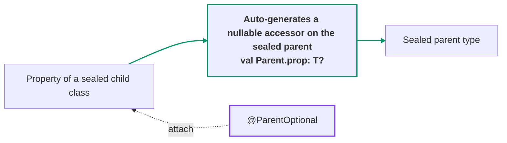
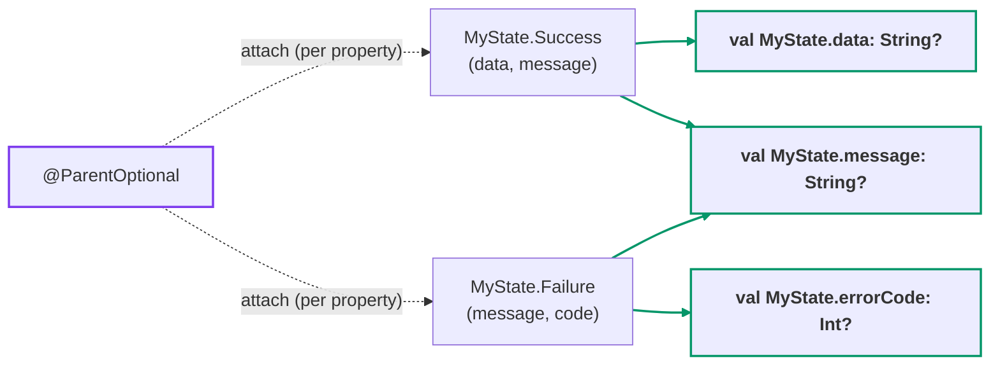

[← README](../README.md) | [日本語](./parent-optional.ja.md)

# @ParentOptional / @ChildOptionals

`@ParentOptional` exposes a property of a sealed child class on the sealed parent type as a
**nullable extension property**. The generated accessor returns the property's value when the
receiver is the annotated child, or `null` otherwise — replacing the
`(state as? Success)?.data` boilerplate that piles up around UI state (MVI / UiState) code.

`@ChildOptionals` is the blanket counterpart: annotate the sealed parent once, and every
eligible property of every transitive concrete leaf gets such an accessor.



## Quick example

```kt
import me.tbsten.cream.ParentOptional

sealed interface MyState {
    data class Success(
        @ParentOptional val data: String,
        @ParentOptional val message: String,
    ) : MyState

    data class Failure(
        @ParentOptional val message: String,
        @ParentOptional(propertyName = "errorCode") val code: Int,
    ) : MyState

    data object Loading : MyState
}

// usage
val state: MyState = MyState.Success(data = "d", message = "hello")
state.data      // "d" — null when state is Failure or Loading
state.message   // "hello" — Success.message and Failure.message merge into ONE accessor
state.errorCode // null — renamed from `code` via propertyName; the Int value when state is Failure
```



<details>
<summary>Generated code</summary>

```kt
// auto generate
public val MyState.data: String?
    get() = when (this) {
        is MyState.Success -> data
        else -> null
    }

public val MyState.message: String?
    get() = when (this) {
        is MyState.Success -> message
        is MyState.Failure -> message
        else -> null
    }

public val MyState.errorCode: Int?
    get() = when (this) {
        is MyState.Failure -> code
        else -> null
    }
```

</details>

## @ChildOptionals

Annotating the sealed **parent** with `@ChildOptionals` applies the same generation to every
eligible property of every transitive concrete leaf at once — no per-property annotation needed.

```kt
import me.tbsten.cream.ChildOptionals

@ChildOptionals
sealed interface DownloadState {
    // properties already visible on the parent (overrides included) get NO accessor
    val id: String

    data class Downloading(
        override val id: String,
        val progress: Int,
    ) : DownloadState

    data class Done(
        override val id: String,
        val resultPath: String,
    ) : DownloadState {
        // body-declared properties are picked up too
        val fileName: String get() = resultPath.substringAfterLast('/')
    }

    data object Idle : DownloadState {
        override val id: String = ""
    }
}

// usage
val state: DownloadState = DownloadState.Downloading(id = "1", progress = 40)
state.progress   // 40 — null when state is Done or Idle
state.resultPath // null — the String value when state is Done
state.id         // plain member access — no accessor is generated for `id`
```

<details>
<summary>Generated code</summary>

```kt
// auto generate
public val DownloadState.progress: Int?
    get() = when (this) {
        is DownloadState.Downloading -> progress
        else -> null
    }

public val DownloadState.resultPath: String?
    get() = when (this) {
        is DownloadState.Done -> resultPath
        else -> null
    }

public val DownloadState.fileName: String?
    get() = when (this) {
        is DownloadState.Done -> fileName
        else -> null
    }
```

</details>

Which properties are picked up:

- For each transitive concrete leaf (recursing through intermediate sealed types, like
  [@CopyToChildren](./copy-to-children.md)), the properties **declared by that leaf itself**
  (constructor + body) are eligible.
- `@ParentOptional`-annotated properties declared by an **intermediate sealed type** below the
  annotated parent are picked up too — a single `is Intermediate` branch covers every leaf
  below it.
- Properties already visible on the annotated sealed type (overrides included) are skipped —
  a member always wins over an extension, so the accessor would be dead code. An explicit
  `@ParentOptional(propertyName = ...)` bypasses this filter: the renamed accessor is
  generated (a name that still collides with a visible member is reported as an error).
- `private` properties (and leaves the generated accessor cannot reference) are skipped
  **silently**. (With `@ParentOptional`, annotating them is an error instead — see
  [Errors](#errors).)
- **Extension properties** (`val String.suffix get() = ...`) are skipped silently — the
  accessor cannot supply their extension receiver. (With `@ParentOptional`, annotating one is
  an error instead.)
- Properties whose type references a type parameter the annotated parent does **not pin**
  (e.g. `Tagged<M> : Parent` with `val meta: M`) are skipped **with a warning** — their type
  cannot be expressed on the parent receiver. (With `@ParentOptional`, annotating one is an
  error instead — see [Generic parents](#generic-parents).)

## Details

### Same-name properties of multiple children are merged into one accessor

When properties of multiple children resolve to the same generated name on the same sealed
parent, they are merged into a **single** accessor with one `is` branch per child (see
`MyState.message` in the [Quick example](#quick-example)). All merged properties must have the
same type — a type mismatch is an error. Renaming one side with
`@ParentOptional(propertyName = ...)` avoids the merge.

When the merged children are themselves in a **subtype relation** (e.g. a sealed intermediate
class contributes its own property and so does a leaf below it), the `is` branches are ordered
**most-derived-first**, so the most derived child's property wins for its instances — the
broader supertype branch can never shadow it.

### Accessors are generated for every sealed ancestor

Accessors are generated for **all transitive sealed supertypes** of the child — intermediate
sealed types included, each in its own generated file. The call site picks the accessor
matching the static type of the receiver.

```kt
sealed interface Shape {
    sealed interface Polygon : Shape {
        data class Rect(
            @ParentOptional val corners: Int,
        ) : Polygon
    }

    data object Circle : Shape
}

// auto generate — both the root and the intermediate sealed type get an accessor:
// val Shape.corners: Int?           (in ParentOptional__Shape.kt)
// val Shape.Polygon.corners: Int?   (in ParentOptional__Shape.Polygon.kt)
```

### Using @ParentOptional and @ChildOptionals together

Generation ownership is decided per (property, sealed ancestor) pair so that the two
annotations never emit conflicting duplicate accessors:

- If the sealed ancestor is annotated with `@ChildOptionals`, that annotation generates the
  accessors for it. A `@ParentOptional` on a property underneath is still honoured — its
  `propertyName` / `kdoc` / `visibility` apply to that property's accessor.
- Otherwise, `@ParentOptional` generates the accessors for that ancestor (annotated
  properties only).

```kt
@ChildOptionals
sealed interface AuthState {
    data class LoggedIn(
        // swept by @ChildOptionals, but generated as `userNameOrNull` (propertyName respected)
        @ParentOptional(propertyName = "userNameOrNull") val userName: String,
    ) : AuthState

    data object LoggedOut : AuthState
}
```

### Excluding a property from the sweep

`@ChildOptionals` has no per-property opt-in the way `@ParentOptional` does, so
`@ChildOptionals.Exclude` is how you carve a single property out of an otherwise blanket
application. Annotate a **child-class property** with it and cream generates **no accessor** from
that contributor.

```kt
@ChildOptionals
sealed interface UploadState {
    data class Uploading(
        val progress: Int,
        @ChildOptionals.Exclude val tempToken: String,  // opted out — no accessor generated
    ) : UploadState

    data object Idle : UploadState
}

val state: UploadState = UploadState.Uploading(progress = 40, tempToken = "…")
state.progress   // 40 — accessor generated
// state.tempToken does not exist — the property was excluded from the sweep
```

Every `.Exclude` in cream means the same thing — *opt this property out of the annotation's
automatic behaviour* — but the automatic behaviour differs per annotation. For the copy
annotations ([@CopyTo](./copy.md) etc.) it is the `= this.<property>` auto-copy default, so
excluding a property keeps its parameter but makes it **required**. For `@ChildOptionals` it is the
generated accessor, so excluding a property means **no accessor at all**.

- **Merging.** When several children share a generated accessor name, an excluded contributor drops
  out of the merge (its `is <Child>` branch is omitted) while the others still contribute. If
  **every** contributor to a name is excluded, no accessor is generated for that name.
- **`@ParentOptional` wins.** `@ChildOptionals.Exclude` only affects sweep-discovered properties. A
  property you explicitly annotate with `@ParentOptional` is opted in by hand, and that opt-in beats
  the sweep opt-out: its accessor is still generated even if it also carries
  `@ChildOptionals.Exclude`.
- **No effect → warning.** Excluding a property the sweep would never have picked up anyway — its
  enclosing class is not part of a `@ChildOptionals` hierarchy, or it is already skipped for being
  `private` / an extension property / already visible on the parent / carrying an unpinned type
  parameter — has no effect and emits a KSP warning.

`@ParentOptional` needs no exclude concept — it is opt-in, so simply do not annotate a property you
do not want lifted.

### Generic parents

A generic sealed parent is supported when the child **pins the parent's type parameter
directly** in its supertype list (`Child<T> : Parent<T>` style):

```kt
sealed interface Source<T> {
    data class Filled<E>(
        @ParentOptional val item: E,
    ) : Source<E>
}

// auto generate
public val <T : Any?> Source<T>.item: T?
    get() = when (this) {
        is Source.Filled -> item
        else -> null
    }
```

Carrying a type parameter to an ancestor **across an intermediate sealed type**
(`Leaf<X> : Middle<X>`, `Middle<E> : Root<E>` — then referring to `Root`) is not supported:
the directly pinned parent (`Middle`) still gets its accessor, but the chained ancestor
(`Root`) is reported as an error.

Type parameters with multiple upper bounds are preserved via a `where` clause on the
generated extension property.

### Nullable property types

A nullable property (`val data: String?`) is allowed and keeps its type as-is — the `?` is
never doubled. The accessor's `null` is then **ambiguous**: it can mean "the receiver is not
such a child" or the property's own `null` value. The generated accessor's KDoc carries a note
about this; use an `is` check when the distinction matters.

### Property shapes

Anything readable as a plain property on the child instance is supported and pinned by tests:

- Constructor `val`/`var` and **body-declared** properties (custom getters included).
- **Delegated** properties (`by lazy { ... }`).
- **`lateinit var`** — like a direct read, the accessor throws if it is read before
  initialization.
- Properties declared by an **`object` / `data object`** child.
- **Hard-keyword names** (`val \`object\``) — escaped with backticks in the generated code.
  (An illegal `propertyName` argument is not validated by cream, mirroring `funName`: it
  simply fails to compile in the generated file.)
- **Typealiased types** are preserved as the alias in the generated signature (not expanded).
  Note that an aliased and a non-aliased spelling of the same type therefore do **not** merge —
  that is a type-mismatch error.
- **Extension properties** are not supported (see [Errors](#errors)).

### @Deprecated propagation

When a merged child class or property is `@Deprecated`, the annotation (message + level) is
propagated onto the generated accessor, so callers keep seeing the deprecation — and a
`DeprecationLevel.ERROR` source stays compilable. For a merged accessor the first deprecation
in branch order wins.

### Errors

The following usages are reported as compile errors (with a suggested solution):

- `@ParentOptional` on a property whose enclosing class has **no sealed supertype**.
- `@ParentOptional` on a **private** property (the generated top-level accessor could not
  reference it). Note: `@ChildOptionals` silently skips private properties instead.
- `@ParentOptional` on a property declared by a class the generated accessor **cannot
  reference** (`private` / `protected` anywhere in its enclosing chain — the generated `is`
  check would not compile). Note: `@ChildOptionals` silently skips such leaves instead.
- **Type mismatch** among properties merged into one accessor.
- The sealed parent **already has a member with the generated name** (visible members always
  win over extensions, so the accessor would be dead code).
- `@ChildOptionals` on a **non-sealed** class/interface.
- A property type referencing a type parameter **not pinned directly** by the sealed parent
  (see [Generic parents](#generic-parents)).
- `@ParentOptional` on an **extension property** (the accessor cannot supply the extension
  receiver).
- Forcing `visibility = CopyVisibility.PUBLIC` (or `cream.defaultVisibility=PUBLIC`) when the
  accessor's signature would **expose an internal symbol** — an internal sealed parent
  (receiver) or an internal property type. Kotlin would reject the generated declaration, so
  cream rejects it up front. (Reading an *internal property* from a public accessor is fine —
  only the signature is constrained.)

### Known limitations

- The fallback value is always `null` — a non-null fallback cannot be configured.
- No module-wide naming template (e.g. an `...OrNull` suffix for every accessor); rename per
  property with `propertyName`.
- Type-mismatched merges are not unified to a common supertype (no LUB resolution); this
  includes `T` vs `T?` and a typealias vs its expansion.
- Properties whose type uses a child-specific (unpinned) type parameter are not supported —
  including pinning **across** an intermediate sealed type (see
  [Generic parents](#generic-parents)).
- The `propertyName` argument is not validated (same policy as `funName`): a name that is not
  a legal Kotlin identifier even with backticks fails to compile in the generated file.
- The KDoc `kdoc = KDoc(...)` argument of a **merged** accessor renders only the first entry's
  value (in branch order).
- `expect`/`actual` sealed hierarchies are untested: KSP processes each compilation
  independently, so behavior follows whatever declarations the processed compilation sees.
- KSP multi-round processing: symbols deferred across rounds that re-aggregate into an
  already-written `ParentOptional__<Parent>` / `ChildOptionals__<Parent>` file could collide;
  not observed in practice, unverified.

### Other customizations

- The **KDoc** of the generated accessor can be augmented with `kdoc = KDoc(...)` —
  see [KDoc](./customization/kdoc.md).
- The **visibility** of the generated accessor can be controlled with the `visibility`
  argument — see [Visibility](./customization/visibility.md). With the default `INHERIT`, the
  `cream.defaultVisibility` option applies first, then the accessor inherits the narrowest
  visibility among the sealed parent, the child, and the property.
- The **name** is customized per property via `@ParentOptional(propertyName = ...)`. The
  function-naming options (`funName`, `cream.copyFunNamePrefix`, ...) do not apply here,
  since these annotations generate extension properties, not functions.

## See also

- [@CopyToChildren](./copy-to-children.md) — the copy-function counterpart on sealed parents:
  it generates `Parent.copyToChild(...)` functions, whereas these annotations generate
  read-only nullable accessors on the parent.
- [@SealedCopy](./sealed-copy.md) — `copy()` on the sealed parent that preserves the subtype.
- [KDoc](./customization/kdoc.md) — the `kdoc = KDoc(...)` argument for generated declarations.
- [Visibility](./customization/visibility.md) — the `visibility` argument and `cream.defaultVisibility`.
- [Options](./customization/options.md) — index of all KSP arguments.
