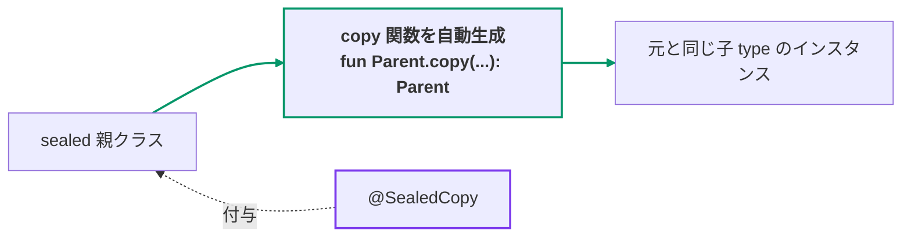
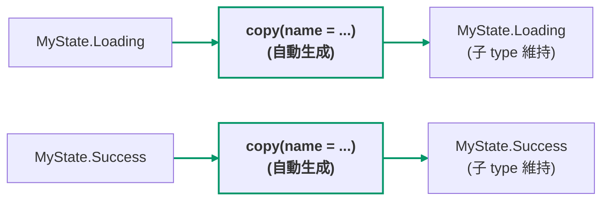

[← README](../README.ja.md) | [English](./sealed-copy.md)

# @SealedCopy

sealed class/interface に付与することで、**子 type を保ったまま** 共通の abstract プロパティ
を更新する `copy()` 関数を自動生成します。

[`@CopyToChildren`](./copy-to-children.ja.md) は子 type ごとに **戻り型が子 type** のコピー関数を生成する
(型を絞る遷移) のに対し、`@SealedCopy` は **親 type を保つ** 単一関数を生成します。



## 基本の例

```kt
import me.tbsten.cream.SealedCopy

@SealedCopy // MyState に、子 type を維持する copy() 拡張関数を生成します。
sealed interface MyState {
    val name: String
    val count: Int

    data class Loading(override val name: String, override val count: Int) : MyState
    data class Success(
        override val name: String,
        override val count: Int,
        val data: String,
    ) : MyState
}

// usage
val state: MyState = MyState.Loading("a", 1)
val updated: MyState = state.copy(name = "b") // Loading のまま name だけ更新されます: MyState.Loading("b", 1)
```



<details>
<summary>生成されるコード</summary>

```kt
fun MyState.copy(
    name: String = this.name,
    count: Int = this.count,
): MyState = when (this) {
    is MyState.Loading -> this.copy(name = name, count = count)
    is MyState.Success -> this.copy(name = name, count = count)
}
```

</details>

## @SealedCopy.Via

デフォルトでは、`@SealedCopy` は各分岐をその子 type の `copy(...)` — `data class` が自動生成するもの、
またはすべての abstract プロパティを受け取る手書きの `copy(...)` メンバ — に委譲します。
**`@SealedCopy.Via`** を関数に付けるのは、委譲できる `copy(...)` が存在しない場合 (例: 互換な `copy` を
持たない非 `data class`) や、委譲先が別の名前・別のパラメータ形状を持つ場合だけです。

```kt
@SealedCopy
sealed interface MyState {
    val name: String
    val count: Int

    data class Loading(override val name: String, override val count: Int) : MyState

    class Custom(
        override val name: String,
        override val count: Int,
    ) : MyState {
        @SealedCopy.Via // 生成される copy() の Custom 分岐はこの関数に委譲されます。
        fun cloneWith(
            name: String,                          // abstract プロパティ `name` に対応
            @SealedCopy.Map("count") amount: Int,  // abstract プロパティ `count` に対応
        ): Custom = Custom(name = name, count = amount)
    }
}

// usage
val state: MyState = MyState.Custom("a", 1)
val updated: MyState = state.copy(count = 2) // Custom のまま cloneWith(name = ..., amount = ...) 経由で更新されます
```

<details>
<summary>生成されるコード</summary>

```kt
fun MyState.copy(
    name: String = this.name,
    count: Int = this.count,
): MyState = when (this) {
    is MyState.Custom -> this.cloneWith(name = name, amount = count)  // 委譲先自身のパラメータ名で呼び出す
    is MyState.Loading -> this.copy(name = name, count = count)
}
```

</details>

## 詳細

- 生成される `copy()` は、**アノテーションを付けた sealed type と同じパッケージ** に top-level の
  拡張関数として生成されます。別パッケージから呼び出す場合は、拡張関数自体の import
  (例: `import com.example.state.copy`) が必要です。
- 生成される呼び出しは委譲先自身のパラメータ名を使うため、必ず `@SealedCopy.Via` を付けた
  メンバ関数に解決され、生成された拡張関数自身にフォールバックすることはありません。
- cream は委譲先を事前に **検証** します: すべての abstract プロパティが (名前または
  `@SealedCopy.Map` で) 供給されること、すべてのパラメータが abstract プロパティに紐付くか
  デフォルト値を持つこと。満たさない場合は黙って誤生成せず、コンパイル時エラーとして報告されます。

### nonCopyableStrategy

デフォルトでは、`object` の子 type (または `copy(...)` を持たない通常 class) は
「copy 不能」 として扱われ、コンパイル時にエラーになります (`nonCopyableStrategy = ERROR`)。
`nonCopyableStrategy` を変更すると、copy 不能な子 type の扱い方を切り替えられます。

**`nonCopyableStrategy = RETURN_AS_IS`** — copy 不能な場合は **更新せずにインスタンスをそのまま
返します** (`-> this`)。

```kt
import me.tbsten.cream.NonCopyableStrategy
import me.tbsten.cream.SealedCopy

@SealedCopy(nonCopyableStrategy = NonCopyableStrategy.RETURN_AS_IS)
sealed interface MyState {
    val name: String

    data class Loading(override val name: String) : MyState
    data object Empty : MyState { override val name: String = "" }
}

// usage
val state: MyState = MyState.Empty
val updated: MyState = state.copy(name = "b") // Empty は copy 不能 — そのまま返されます: MyState.Empty
```

<details>
<summary>生成されるコード</summary>

```kt
fun MyState.copy(
    name: String = this.name,
): MyState = when (this) {
    is MyState.Empty -> this  // copy 不能: そのまま返す
    is MyState.Loading -> this.copy(name = name)
}
```

</details>

**`nonCopyableStrategy = RETURN_NULL`** — copy 不能な場合は **null を返します**。この場合、
生成関数の戻り型は `MyState?` に広がります。

```kt
import me.tbsten.cream.NonCopyableStrategy
import me.tbsten.cream.SealedCopy

@SealedCopy(nonCopyableStrategy = NonCopyableStrategy.RETURN_NULL)
sealed interface MyState {
    val name: String

    data class Loading(override val name: String) : MyState
    data object Empty : MyState { override val name: String = "" }
}

// usage
val state: MyState = MyState.Empty
val updated: MyState? = state.copy(name = "b") // Empty は copy 不能 — null が返り、戻り型は MyState? に広がります
```

<details>
<summary>生成されるコード</summary>

```kt
fun MyState.copy(
    name: String = this.name,
): MyState? = when (this) {
    is MyState.Empty -> null  // copy 不能: null を返す
    is MyState.Loading -> this.copy(name = name)
}
```

</details>

### その他のカスタマイズ

- `@SealedCopy.Via` の委譲先のパラメータ名が abstract プロパティ名と一致しない場合は、
  `@SealedCopy.Map("<プロパティ名>")` でそのパラメータを別名の abstract プロパティに紐付けできます
  （上の [@SealedCopy.Via](#sealedcopyvia) の例では `amount` を `count` に対応付けています）—
  詳細は [Property mapping](./customization/property-mapping.ja.md) を参照。
- sealed 親の abstract プロパティに `@SealedCopy.Exclude` を付与すると、生成される `copy()` から
  そのパラメータのデフォルト値 (`= this.<プロパティ>`) が取り除かれ、呼び出し側が必ず指定する
  パラメータになります。これは `@SealedCopy` が生成する `copy()` のみに効き、`@CopyToChildren` が
  生成する per-child コピー関数には影響しません。詳細は [Exclude](./customization/exclude.ja.md) を参照してください。
- 生成される関数の **KDoc** は `kdoc = KDoc(...)` で拡張できます —
  [KDoc](./customization/kdoc.ja.md) を参照。
- 生成される関数の **可視性** は `visibility` 引数で制御できます —
  [Visibility](./customization/visibility.ja.md) を参照。
- 生成される関数の **名前** は宣言ごと（`funName`）にも KSP オプションでグローバルにも
  カスタマイズできます — [Function name](./customization/fun-name.ja.md) を参照。

## 関連ドキュメント

- [@CopyToChildren](./copy-to-children.ja.md) — 対をなすアノテーション。子 type ごとに **戻り型が子 type**
  のコピー関数を生成する (型を絞る遷移) のに対し、`@SealedCopy` は親 type を保つ単一の `copy()` を
  生成します。
- [Property mapping](./customization/property-mapping.ja.md) — `@SealedCopy.Map` を含む、全アノテーション横断の
  `.Map` 解説。
- [Exclude](./customization/exclude.ja.md) — `@SealedCopy.Exclude` とその他の `.Exclude` アノテーション。
- [KDoc](./customization/kdoc.ja.md) — 生成関数への `kdoc = KDoc(...)` 引数。
- [Visibility](./customization/visibility.ja.md) — `visibility` 引数と `cream.defaultVisibility`。
- [Function name](./customization/fun-name.ja.md) — `funName` 引数と命名系の KSP オプション。
- [Options](./customization/options.ja.md) — KSP 引数の索引。
- ユースケース: [sealed class を使った UI 状態の管理（第 2 回: データを保ったままの遷移とリフレッシュ・楽観的更新）](./use-case/ui-state-management-by-sealed-class/02.ja.md)
- ユースケース: [sealed class を使った UI 状態の管理（第 4 回: MVI の reduce を宣言的に書く）](./use-case/ui-state-management-by-sealed-class/04.ja.md)
