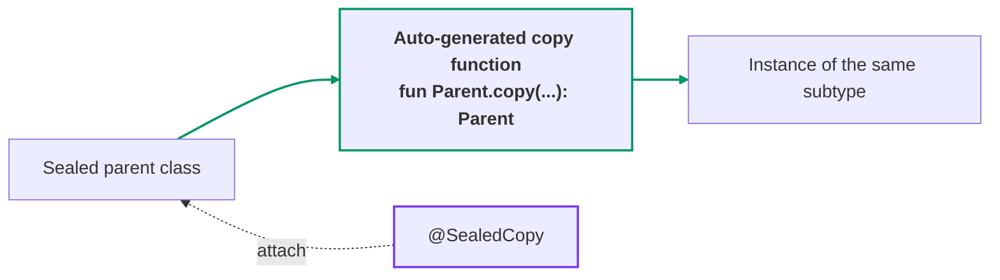
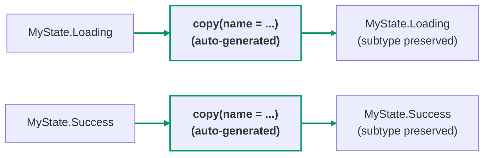

[← README](../README.md) | [日本語](./sealed-copy.ja.md)

# @SealedCopy

When applied to a sealed class/interface, `@SealedCopy` generates a `copy()` extension on the
sealed parent that preserves the original subtype while updating shared abstract properties.

Unlike [`@CopyToChildren`](./copy-to-children.md) (which generates per-child copy functions whose
return type is the child), `@SealedCopy` keeps the parent type as both receiver and return type.



## Quick example

```kt
import me.tbsten.cream.SealedCopy

@SealedCopy // generates a copy() extension on MyState that preserves the subtype
sealed interface MyState {
    val name: String
    val count: Int

    data class Loading(override val name: String, override val count: Int) : MyState
    data class Success(
        override val name: String,
        override val count: Int,
        val data: String,
    ) : MyState
}

// usage
val state: MyState = MyState.Loading("a", 1)
val updated: MyState = state.copy(name = "b") // stays Loading — only name is updated: MyState.Loading("b", 1)
```



<details>
<summary>Generated code</summary>

```kt
fun MyState.copy(
    name: String = this.name,
    count: Int = this.count,
): MyState = when (this) {
    is MyState.Loading -> this.copy(name = name, count = count)
    is MyState.Success -> this.copy(name = name, count = count)
}
```

</details>

## @SealedCopy.Via

By default `@SealedCopy` delegates each branch to that subtype's `copy(...)` — the synthetic one a
`data class` provides, or a manually declared `copy(...)` member that already accepts every
abstract property. Mark a function with **`@SealedCopy.Via`** only when there is no such
`copy(...)` to delegate to (e.g. a non-`data class` without a compatible `copy`), or when the
delegate has a different name or a different parameter shape.

```kt
@SealedCopy
sealed interface MyState {
    val name: String
    val count: Int

    data class Loading(override val name: String, override val count: Int) : MyState

    class Custom(
        override val name: String,
        override val count: Int,
    ) : MyState {
        @SealedCopy.Via // the Custom branch of the generated copy() delegates to this function
        fun cloneWith(
            name: String,                          // matched to abstract property `name`
            @SealedCopy.Map("count") amount: Int,  // matched to abstract property `count`
        ): Custom = Custom(name = name, count = amount)
    }
}

// usage
val state: MyState = MyState.Custom("a", 1)
val updated: MyState = state.copy(count = 2) // stays Custom — updated via cloneWith(name = ..., amount = ...)
```

<details>
<summary>Generated code</summary>

```kt
fun MyState.copy(
    name: String = this.name,
    count: Int = this.count,
): MyState = when (this) {
    is MyState.Custom -> this.cloneWith(name = name, amount = count)  // uses the delegate's own parameter names
    is MyState.Loading -> this.copy(name = name, count = count)
}
```

</details>

## Details

- The generated `copy()` is a top-level extension function generated **in the same package as the
  annotated sealed type**; when calling it from a different package, import the extension function
  itself (e.g. `import com.example.state.copy`).
- Because the generated call uses the delegate's own parameter names, it always resolves to the
  `@SealedCopy.Via`-annotated member function and never falls back to the generated extension.
- cream **validates** the delegate up front: every abstract property must be supplied (by name or
  via `@SealedCopy.Map`) and every parameter must either bind to an abstract property or have a
  default value. A gap is reported as a compile-time error instead of silently mis-generating.

### nonCopyableStrategy

By default, an `object` subtype (or a non-data class without a compatible `copy(...)`) is
treated as non-copyable and triggers a compile-time error (`nonCopyableStrategy = ERROR`).
Change `nonCopyableStrategy` to control how non-copyable subtypes are handled.

**`nonCopyableStrategy = RETURN_AS_IS`** — returns the instance **unchanged** (`-> this`) when it
cannot be copied.

```kt
import me.tbsten.cream.NonCopyableStrategy
import me.tbsten.cream.SealedCopy

@SealedCopy(nonCopyableStrategy = NonCopyableStrategy.RETURN_AS_IS)
sealed interface MyState {
    val name: String

    data class Loading(override val name: String) : MyState
    data object Empty : MyState { override val name: String = "" }
}

// usage
val state: MyState = MyState.Empty
val updated: MyState = state.copy(name = "b") // Empty is non-copyable — returned as-is: MyState.Empty
```

<details>
<summary>Generated code</summary>

```kt
fun MyState.copy(
    name: String = this.name,
): MyState = when (this) {
    is MyState.Empty -> this  // non-copyable: returned as-is
    is MyState.Loading -> this.copy(name = name)
}
```

</details>

**`nonCopyableStrategy = RETURN_NULL`** — returns **null** when it cannot be copied. The generated
function's return type widens to `MyState?`.

```kt
import me.tbsten.cream.NonCopyableStrategy
import me.tbsten.cream.SealedCopy

@SealedCopy(nonCopyableStrategy = NonCopyableStrategy.RETURN_NULL)
sealed interface MyState {
    val name: String

    data class Loading(override val name: String) : MyState
    data object Empty : MyState { override val name: String = "" }
}

// usage
val state: MyState = MyState.Empty
val updated: MyState? = state.copy(name = "b") // Empty is non-copyable — null; the return type widens to MyState?
```

<details>
<summary>Generated code</summary>

```kt
fun MyState.copy(
    name: String = this.name,
): MyState? = when (this) {
    is MyState.Empty -> null  // non-copyable: null
    is MyState.Loading -> this.copy(name = name)
}
```

</details>

### Other customizations

- If the `@SealedCopy.Via` delegate does not accept every abstract property under its own parameter
  names, bind a parameter to a differently-named abstract property with
  `@SealedCopy.Map("<property>")` (in the [@SealedCopy.Via](#sealedcopyvia) example above, `amount`
  is bound to `count`) — see [Property mapping](./customization/property-mapping.md) for details.
- Annotating an abstract property on the sealed parent with `@SealedCopy.Exclude` removes its
  default (`= this.<property>`) from the generated `copy()`, making the caller specify it
  explicitly; it only affects the `@SealedCopy`-generated `copy()`, not `@CopyToChildren`
  per-child functions. See [Exclude](./customization/exclude.md) for details.
- The **KDoc** of the generated function can be augmented with `kdoc = KDoc(...)` —
  see [KDoc](./customization/kdoc.md).
- The **visibility** of the generated function can be controlled with the `visibility`
  argument — see [Visibility](./customization/visibility.md).
- The **name** of the generated function can be customized per declaration (`funName`) or
  globally via KSP options — see [Function name](./customization/fun-name.md).

## See also

- [@CopyToChildren](./copy-to-children.md) — the complementary annotation: it generates per-child
  copy functions whose return type is the child (narrowing transitions), whereas `@SealedCopy`
  generates a single `copy()` that keeps the parent type.
- [Property mapping](./customization/property-mapping.md) — `.Map` across all annotations, including
  `@SealedCopy.Map`.
- [Exclude](./customization/exclude.md) — `@SealedCopy.Exclude` and the other `.Exclude` annotations.
- [KDoc](./customization/kdoc.md) — the `kdoc = KDoc(...)` argument for generated functions.
- [Visibility](./customization/visibility.md) — the `visibility` argument and `cream.defaultVisibility`.
- [Function name](./customization/fun-name.md) — the `funName` argument and naming-related KSP options.
- [Options](./customization/options.md) — index of all KSP arguments.
- Use case: [Managing UI state with sealed classes (Part 2: Data-preserving transitions — refresh and optimistic updates)](./use-case/ui-state-management-by-sealed-class/02.md)
- Use case: [Managing UI state with sealed classes (Part 4: Writing MVI reducers declaratively)](./use-case/ui-state-management-by-sealed-class/04.md)
