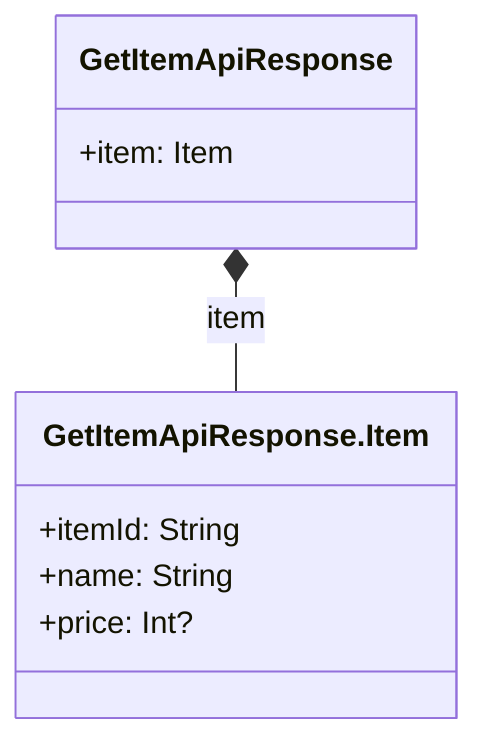
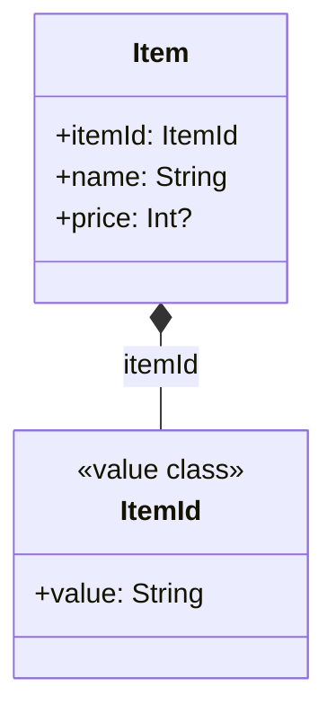
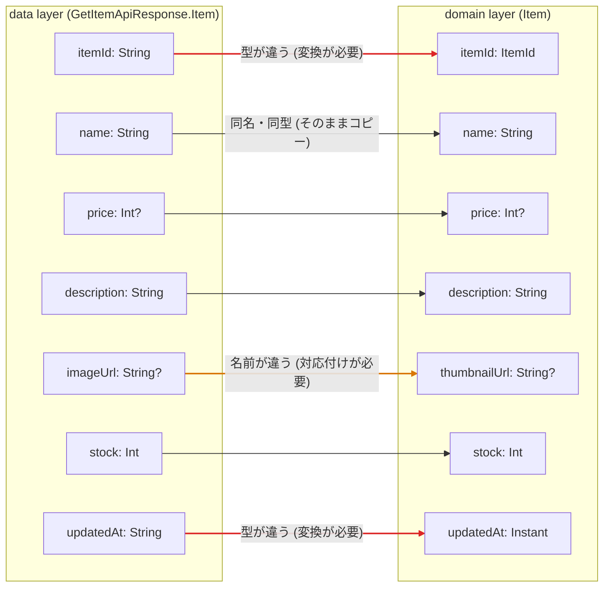

[← README](../../README.ja.md) | [English](./model-mapping.md)

# 異なるレイヤーのモデルのマッピングを cream.kt で簡素化する

目次:

- [例: data layer - domain layer 間のモデルのマッピング](#例-data-layer---domain-layer-間のモデルのマッピング)
  - [実装すべき機能が増えると途端に複雑になります](#実装すべき機能が増えると途端に複雑になります)
  - [cream.kt で自明なボイラープレートを解決する](#creamkt-で自明なボイラープレートを解決する)
  - [Next steps](#next-steps)

> [!TIP]
> このドキュメントでは以下の機能に関するトピックを扱います。
>
> - [Copy — @CopyTo / @CopyFrom / @CopyMapping](../copy.ja.md)

昨今のソフトウェア開発ではアプリ全体を2つ以上のレイヤーに分割するのが一般的です。[Android のアプリアーキテクチャガイド](https://developer.android.com/topic/architecture?hl=ja) からもその片鱗を垣間見ることができます。

これは Kotlin を使った開発でもよく取り入れられる手法ですが、レイヤーごとにデータモデルが存在することでこれらのマッピングが必要になります。
経験上データモデルのマッピングの実装には以下のような配慮が必要です。

- Kotlin 標準の機能では異なるデータモデルの詰め替えを実装するにはボイラープレートが必要になります。これはコードレビューの負荷を高めます。
- レイヤー間のデータモデルのマッピングはしばしば独自のロジックが必要になることがあり、そのロジックは コードレビュワー や 実装当時の事情を知り得ない新規参画者(1ヶ月後の自分を含む) にとってボイラープレートよりも目立つべきです。
- 特筆すべき重要なマッピングのロジックがボイラープレートに紛れてコードレビュワーが見逃すことがあります。
- 単純なマッピングと重要なマッピングは別々の関数等に区別して定義すべきです。ですがこれには実装コードが数行増えるというデメリットも存在します。

## 例: data layer - domain layer 間のモデルのマッピング

例えばサーバから渡されるデータを表現する以下のような data layer のモデルがあったとします。

```kt
@Serializable
data class GetItemApiResponse(
    val item: Item,
) {
    @Serializable
    data class Item(val itemId: String, val name: String, val price: Int?)
}
```



これを以下のようなアプリの扱うデータを表現する domain layer のモデルにマッピングしたいとします。

```kt
data class Item(
    val itemId: ItemId,
    val name: String,
    val price: Int?,
)

@JvmInline
value class ItemId(val value: String)
```



このマッピングを拡張関数として実現する具体例は以下の通りです。

```kt
fun GetItemApiResponse.Item.toDomain(): Item = Item(
    itemId = ItemId(this.itemId),
    name = this.name,
    price = this.price,
)
```

シンプルで明白です。あなたのプロジェクトでもよくやっている手法かもしれません。

### 実装すべき機能が増えると途端に複雑になります

開発が進むとモデルにはプロパティが増えていきます。例えば商品の詳細画面を実装するために、両レイヤーのモデルが以下のように成長したとします。

```kt
// data layer
@Serializable
data class GetItemApiResponse(
    val item: Item,
) {
    @Serializable
    data class Item(
        val itemId: String,
        val name: String,
        val price: Int?,
        val description: String,
        val imageUrl: String?,
        val stock: Int,
        val updatedAt: String, // ISO-8601 形式の文字列
    )
}

// domain layer
data class Item(
    val itemId: ItemId,
    val name: String,
    val price: Int?,
    val description: String,
    val thumbnailUrl: String?, // data layer では imageUrl という名前
    val stock: Int,
    val updatedAt: Instant,    // data layer では ISO-8601 の String
)
```

両モデルのプロパティの対応関係は、次の 3 種類に分かれます。そのままコピーできるプロパティと違い、**名前が違うプロパティのマッピング**と**型が違うプロパティの変換**は見落とせない重要なポイントです。



これに合わせて `toDomain()` もこう成長します。

```kt
fun GetItemApiResponse.Item.toDomain(): Item = Item(
    itemId = ItemId(this.itemId),              // ← 重要: value class への変換
    name = this.name,                          // 自明なコピー
    price = this.price,                        // 自明なコピー
    description = this.description,            // 自明なコピー
    thumbnailUrl = this.imageUrl,              // 名前が違うだけのコピー
    stock = this.stock,                        // 自明なコピー
    updatedAt = Instant.parse(this.updatedAt), // ← 重要: 型変換
)
```

7 行のうちレビューで本当に注意すべき行は `itemId` と `updatedAt` の 2 行だけですが、コード上では自明なコピーとまったく同じ顔をして並んでいます。この規模でもすでに次の問題が起きています。

- プロパティが 1 つ増えるたびに `toDomain()` にも 1 行増えます。その diff のほとんどはレビューする価値のないボイラープレートです。
- 重要な変換 (`ItemId(...)` / `Instant.parse(...)`) がボイラープレートに埋もれ、レビュワーは全行を読んでその 2 行を探すことになります。
- `thumbnailUrl = this.imageUrl` のような「名前が違うだけ」の行は、コピペ由来の詰め替えミス (`imageUrl` を別のプロパティに入れてしまう等) の温床になります。

そしてこのような関数は Api レスポンスごと・DB エンティティごとに量産されていきます。

### cream.kt で自明なボイラープレートを解決する

cream.kt を使うと、この「自明なコピー」の部分をコード生成に任せられます。マッピングを定義したい場所（例: data layer のマッピング用ファイル）に [`@CopyMapping`](../copy.ja.md#copymapping) を付けた宣言を置くだけです。ソース・ターゲットのどちらのクラスにも手を入れないため、domain layer のモデルに data layer への参照を持ち込まずに済みます。名前が違うだけのプロパティは `properties` で対応付けます。

```kt
import me.tbsten.cream.CopyMapping

// GetItemApiResponse.Item にも Item にも手を入れない
@CopyMapping(
    source = GetItemApiResponse.Item::class,
    target = Item::class,
    properties = [CopyMapping.Map(source = "imageUrl", target = "thumbnailUrl")],
)
private object ItemMapping
```

cream は名前と型が一致するプロパティにデフォルト値を付けたコピー関数を生成します。

```kt
// auto generate
fun GetItemApiResponse.Item.copyToItem(
    itemId: ItemId,                        // String → ItemId は型が合わないためデフォルト値なし
    name: String = this.name,
    price: Int? = this.price,
    description: String = this.description,
    thumbnailUrl: String? = this.imageUrl, // properties の指定により imageUrl と対応付け
    stock: Int = this.stock,
    updatedAt: Instant,                    // String → Instant は型が合わないためデフォルト値なし
): Item = /* ... */
```

ポイントは、`itemId` (String → ItemId) や `updatedAt` (String → Instant) のように**型が一致しないプロパティにはデフォルト値が生成されない**ことです。呼び出し側はこれらを明示的に渡さない限りコンパイルが通りません。つまり `toDomain()` は次のようになります。

```kt
fun GetItemApiResponse.Item.toDomain(): Item = copyToItem(
    itemId = ItemId(this.itemId),
    updatedAt = Instant.parse(this.updatedAt),
)
```

自明なコピーは cream が生成するデフォルト値に任せ、**意味のある変換 (value class 化・型変換・導出) だけが引数として残ります**。冒頭で挙げた「重要なマッピングのロジックはボイラープレートよりも目立つべき」という要求が、追加の関数を定義することなく実現できました。

さらに、この後モデルにプロパティが増えても:

- 同名・同型のプロパティなら、生成関数にデフォルト値付きの引数が自動で増えるだけで `toDomain()` の変更は不要です。
- 型の合わないプロパティが増えた (あるいは既存プロパティの型が変わった) 場合は、デフォルト値が生成されずコンパイルエラーになるため、変換の実装漏れにその場で気付けます。

### Next steps

- [ユースケース一覧に戻る](./README.ja.md)
- `@CopyMapping` をより深く理解する
    - [Copy — @CopyTo / @CopyFrom / @CopyMapping](../copy.ja.md)
    - [Property mapping (`.Map`)](../customization/property-mapping.ja.md)
