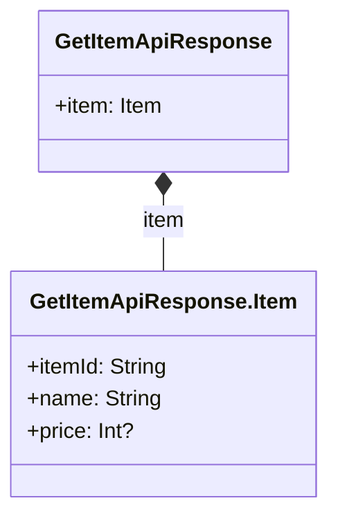
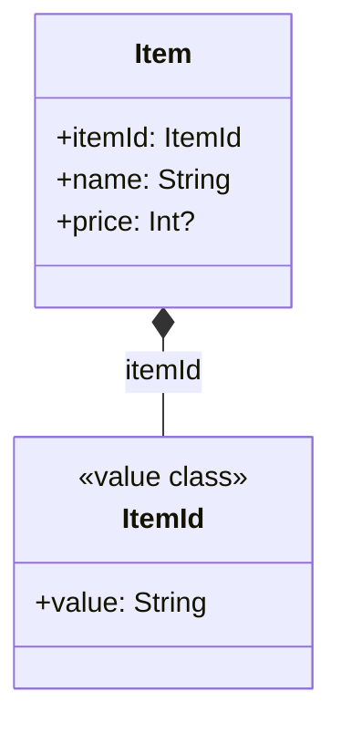
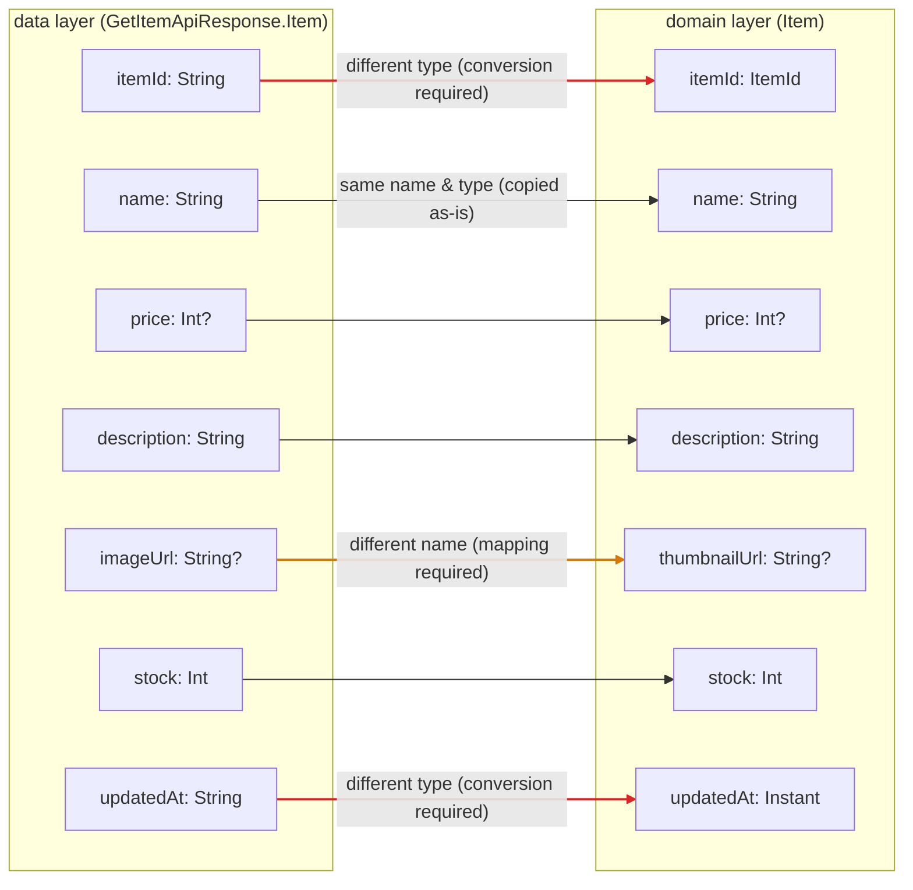

[← README](../../README.md) | [日本語](./model-mapping.ja.md)

# Simplifying model mapping across layers with cream.kt

Contents:

- [Example: mapping models between the data layer and the domain layer](#example-mapping-models-between-the-data-layer-and-the-domain-layer)
  - [It suddenly gets complicated as the features you must implement grow](#it-suddenly-gets-complicated-as-the-features-you-must-implement-grow)
  - [Solving the obvious boilerplate with cream.kt](#solving-the-obvious-boilerplate-with-creamkt)
  - [Next steps](#next-steps)

> [!TIP]
> This article covers the following features.
>
> - [Copy — @CopyTo / @CopyFrom / @CopyMapping](../copy.md)

In modern software development, an application is commonly divided into two or more layers — you can catch a glimpse of this in the [Android app architecture guide](https://developer.android.com/topic/architecture).

This approach is often adopted in Kotlin development as well, but having a data model per layer means mappings between them become necessary.
In our experience, implementing data model mappings calls for the following considerations.

- With Kotlin's standard features alone, reshuffling data between different models requires boilerplate. This increases the burden on code reviewers.
- Mappings between layer models often need custom logic, and that logic deserves to stand out more than the boilerplate — both for code reviewers and for newcomers (including yourself one month from now) who cannot know the circumstances at implementation time.
- Important, noteworthy mapping logic can get lost among the boilerplate and be overlooked by code reviewers.
- Simple mappings and important mappings should be defined separately, e.g. in distinct functions. But this comes with the downside of a few extra lines of implementation code.

## Example: mapping models between the data layer and the domain layer

For example, suppose you have the following data layer model representing data returned from a server.

```kt
@Serializable
data class GetItemApiResponse(
    val item: Item,
) {
    @Serializable
    data class Item(val itemId: String, val name: String, val price: Int?)
}
```



You want to map it to the following domain layer model, which represents the data the app works with.

```kt
data class Item(
    val itemId: ItemId,
    val name: String,
    val price: Int?,
)

@JvmInline
value class ItemId(val value: String)
```



A concrete example of implementing this mapping as an extension function looks like this.

```kt
fun GetItemApiResponse.Item.toDomain(): Item = Item(
    itemId = ItemId(this.itemId),
    name = this.name,
    price = this.price,
)
```

Simple and obvious. It may well be a technique you already use in your own projects.

### It suddenly gets complicated as the features you must implement grow

As development progresses, models gain properties. Say both layers' models have grown as follows to implement an item detail screen.

```kt
// data layer
@Serializable
data class GetItemApiResponse(
    val item: Item,
) {
    @Serializable
    data class Item(
        val itemId: String,
        val name: String,
        val price: Int?,
        val description: String,
        val imageUrl: String?,
        val stock: Int,
        val updatedAt: String, // ISO-8601 string
    )
}

// domain layer
data class Item(
    val itemId: ItemId,
    val name: String,
    val price: Int?,
    val description: String,
    val thumbnailUrl: String?, // named imageUrl in the data layer
    val stock: Int,
    val updatedAt: Instant,    // an ISO-8601 String in the data layer
)
```

The property correspondences between the two models fall into three kinds. Unlike the properties that can simply be copied as-is, **mapping properties whose names differ** and **converting properties whose types differ** are the important points you must not overlook.



And `toDomain()` grows along with them.

```kt
fun GetItemApiResponse.Item.toDomain(): Item = Item(
    itemId = ItemId(this.itemId),              // ← important: conversion into a value class
    name = this.name,                          // trivial copy
    price = this.price,                        // trivial copy
    description = this.description,            // trivial copy
    thumbnailUrl = this.imageUrl,              // copy that only differs in name
    stock = this.stock,                        // trivial copy
    updatedAt = Instant.parse(this.updatedAt), // ← important: type conversion
)
```

Out of these 7 lines, only the `itemId` and `updatedAt` lines truly deserve reviewer attention — yet in the code they look exactly like the trivial copies sitting next to them. Even at this scale, the following problems have already appeared.

- Every new property adds one more line to `toDomain()`. Most of that diff is boilerplate not worth reviewing.
- The important conversions (`ItemId(...)` / `Instant.parse(...)`) get buried in the boilerplate; reviewers have to read every line to find those two.
- Lines that "only differ in name", such as `thumbnailUrl = this.imageUrl`, are a breeding ground for copy-paste reshuffling mistakes (e.g. assigning `imageUrl` to the wrong property).

And functions like this get mass-produced — one per API response, one per DB entity.

### Solving the obvious boilerplate with cream.kt

With cream.kt, you can hand the "trivial copy" part over to code generation. Just place a declaration annotated with [`@CopyMapping`](../copy.md#copymapping) wherever you want the mapping defined (e.g. a mapping file in the data layer). Since neither the source nor the target class is touched, the domain layer model stays free of any reference to the data layer. Properties that only differ in name are bound with `properties`.

```kt
import me.tbsten.cream.CopyMapping

// neither GetItemApiResponse.Item nor Item is touched
@CopyMapping(
    source = GetItemApiResponse.Item::class,
    target = Item::class,
    properties = [CopyMapping.Map(source = "imageUrl", target = "thumbnailUrl")],
)
private object ItemMapping
```

cream generates a copy function with default values for the properties whose name and type match.

```kt
// auto generate
fun GetItemApiResponse.Item.copyToItem(
    itemId: ItemId,                        // no default: String → ItemId types don't match
    name: String = this.name,
    price: Int? = this.price,
    description: String = this.description,
    thumbnailUrl: String? = this.imageUrl, // bound to imageUrl via the properties mapping
    stock: Int = this.stock,
    updatedAt: Instant,                    // no default: String → Instant types don't match
): Item = /* ... */
```

The key point is that **no default value is generated for properties whose types don't match**, such as `itemId` (String → ItemId) and `updatedAt` (String → Instant). The call site won't compile unless it passes them explicitly. So `toDomain()` becomes:

```kt
fun GetItemApiResponse.Item.toDomain(): Item = copyToItem(
    itemId = ItemId(this.itemId),
    updatedAt = Instant.parse(this.updatedAt),
)
```

The trivial copies are left to the default values cream generates, and **only the meaningful conversions (value class wrapping, type conversions, derivations) remain as arguments**. The requirement from the beginning of this article — "important mapping logic deserves to stand out more than the boilerplate" — is fulfilled without defining any extra functions.

Moreover, when the models gain properties later:

- For a property with matching name and type, the generated function simply gains one more parameter with a default value — `toDomain()` needs no change.
- If a property with mismatched types is added (or an existing property's type changes), no default value is generated and you get a compile error, so you notice the missing conversion on the spot.

### Next steps

- [Back to the use-case index](./README.md)
- Understand `@CopyMapping` in more depth
    - [Copy — @CopyTo / @CopyFrom / @CopyMapping](../copy.md)
    - [Property mapping (`.Map`)](../customization/property-mapping.md)
