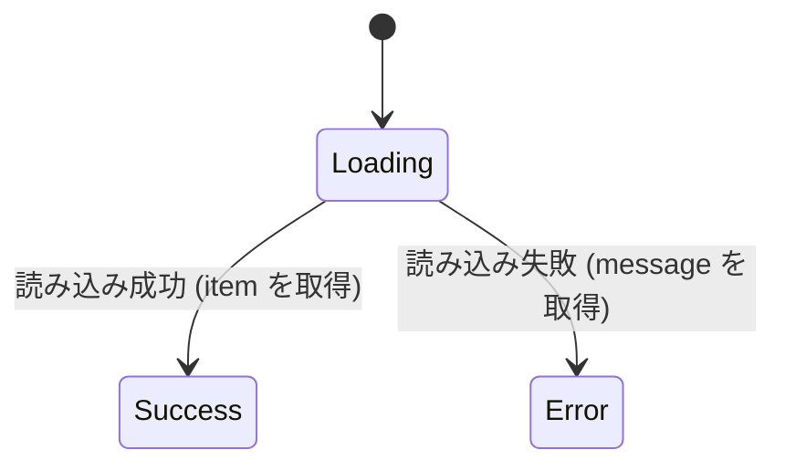

[← README](../../../README.ja.md) | [English](./01.md)

# sealed class を使った UI 状態の管理に cream.kt を利用する（第 1 回: Loading / Success / Error と共通プロパティの保守）

目次:

- （第 1 回: Loading / Success / Error と共通プロパティの保守）
  - [例: 商品詳細画面の UiState](#例-商品詳細画面の-uistate)
  - [実装すべき機能が増えると途端に複雑になります](#実装すべき機能が増えると途端に複雑になります)
  - [cream.kt で自明なボイラープレートを解決する](#creamkt-で自明なボイラープレートを解決する)
  - [補足](#補足)
  - [Next steps](#next-steps)
- [第 2 回: データを保ったままの遷移とリフレッシュ・楽観的更新](./02.ja.md)
- [第 3 回: ネストした sealed StateMachine を1つの注釈で網羅する](./03.ja.md)
- [第 4 回: MVI の reduce を宣言的に書く](./04.ja.md)
- [第 5 回: 状態管理ライブラリ Koma との併用](./05.ja.md)

> [!TIP]
> このドキュメントでは以下の機能に関するトピックを扱います。
>
> - [Copy — @CopyTo / @CopyFrom / @CopyMapping](../../copy.ja.md)
> - [Copy to children — @CopyToChildren](../../copy-to-children.ja.md)

昨今の宣言的 UI では、画面の状態を 1 つの immutable な値として表現し、状態が変わるたびに新しい値を流す UDF (Unidirectional Data Flow) の設計がよく採用されます。Android の [アプリアーキテクチャガイド](https://developer.android.com/topic/architecture?hl=ja) でも、`ViewModel` が公開する UiState を UI が購読し、イベントに応じて次の UiState を生成する、という流れが基本形として紹介されています。

Kotlin でこの UiState をモデリングするとき、`sealed interface` (または `sealed class`) は非常に相性の良い道具です。「読み込み中」「成功」「失敗」といった排他的な状態を型として表現できるため、`when` による網羅的な分岐が可能になり、UI 側で状態の取りこぼしをコンパイラが検出してくれます。

一方で、これらの状態には「どの状態でも共通して必要な情報」がしばしば存在します。例えば「どの商品を表示しているか」を表す `itemId` は、読み込み中でも成功でも失敗でも保持しておきたい値です。こうした共通プロパティを sealed の各状態に持たせると、状態遷移のたびにそれらを手で書き写すボイラープレートが発生します。そして厄介なのは、**共通プロパティが 1 つ増えるたびに、すべての遷移箇所を直して回る保守コストが積み上がっていく**ことです。

UiState の実装では、経験上こうした点に配慮が必要です。

- 状態遷移のたびに共通プロパティを手で書き写すコードが増え、**コードレビュワー** の負荷を高めます。
- 「その遷移で本質的に変化したもの」（例: `Loading` → `Success` で新たに得た `item`）が、共通プロパティを書き写すだけのコードに埋もれて見えづらくなります。
- 実装当時の事情を知らない **新規参画者 (1ヶ月後の自分を含む)** にとって、どれが本質的な差分でどれが機械的な書き写しなのか、パッと読み取れないコードになりがちです。
- 共通プロパティを 1 つ足すだけで、宣言だけでなく **すべての遷移呼び出し箇所** に修正が波及します。修正漏れがあっても、名前付き引数で辻褄が合ってしまいコンパイルは通るため、レビューで気づきにくいこともあります。

## 例: 商品詳細画面の UiState

商品詳細画面の状態を、次のような `sealed interface` でモデリングしたとします。共通プロパティ `itemId` を親に宣言し、各状態が `override` で保持しています。

```kt
sealed interface ItemDetailUiState {
    val itemId: String
    data class Loading(override val itemId: String) : ItemDetailUiState
    data class Success(override val itemId: String, val item: Item) : ItemDetailUiState
    data class Error(override val itemId: String, val message: String) : ItemDetailUiState
}
```

この UiState は、読み込みの結果に応じて次のように遷移します。



ViewModel 側では、読み込みが完了したら `Loading` から `Success` へ遷移します。素朴に書くと、直前の状態 `prev` が持っていた共通プロパティを手で渡すことになります。

```kt
fun onItemLoaded(prev: ItemDetailUiState, item: Item): ItemDetailUiState =
    ItemDetailUiState.Success(
        itemId = prev.itemId, // 共通プロパティを手で書き写す
        item = item,          // この遷移で本質的に変化したのはここだけ
    )
```

シンプルで明白です。あなたのプロジェクトでもよくやっている手法かもしれません。共通プロパティが `itemId` 1 つだけのうちは、これで何の問題もありません。

### 実装すべき機能が増えると途端に複雑になります

ここで、次のような要件が追加されたとします。

- 商品をブックマークできるようにしたい → 共通プロパティ `isBookmarked: Boolean` を追加。
- 任意の状態でスナックバー通知を出せるようにしたい → 共通プロパティ `snackbarMessage: String?` を追加。

これらはどの状態でも保持したい情報なので、親の共通プロパティとして追加します。すると、まず 3 つの状態すべてに `override` を足す必要があります。

```kt
sealed interface ItemDetailUiState {
    val itemId: String
    val isBookmarked: Boolean       // 追加
    val snackbarMessage: String?    // 追加

    data class Loading(
        override val itemId: String,
        override val isBookmarked: Boolean,    // 追加
        override val snackbarMessage: String?, // 追加
    ) : ItemDetailUiState

    data class Success(
        override val itemId: String,
        val item: Item,
        override val isBookmarked: Boolean,    // 追加
        override val snackbarMessage: String?, // 追加
    ) : ItemDetailUiState

    data class Error(
        override val itemId: String,
        val message: String,
        override val isBookmarked: Boolean,    // 追加
        override val snackbarMessage: String?, // 追加
    ) : ItemDetailUiState
}
```

問題はここからです。宣言を直しただけでは終わらず、**すべての遷移呼び出し箇所** で共通プロパティを書き写すコードを追加しなければなりません。

```kt
fun onItemLoaded(prev: ItemDetailUiState, item: Item): ItemDetailUiState =
    ItemDetailUiState.Success(
        itemId = prev.itemId,
        item = item,
        isBookmarked = prev.isBookmarked,       // ← 遷移のたびにこの行が増える
        snackbarMessage = prev.snackbarMessage, // ← 遷移のたびにこの行が増える
    )
```

遷移箇所が画面内に 5 つ 10 つとあれば、そのすべてに同じ 2 行を書き足すことになります。本質的な差分は依然として `item = item` の一行だけなのに、書き写しコードがそれを覆い隠していきます。しかも `prev.isBookmarked` を渡し忘れて `isBookmarked = false` などと固定値を書いてしまっても、型は合うためコンパイルは通り、レビューでも見逃されがちです。共通プロパティが増えるたびに、この保守コストとリスクが線形に膨らんでいきます。

### cream.kt で自明なボイラープレートを解決する

この「共通プロパティの書き写し」は、まさに cream.kt が解決するために用意された自明なボイラープレートです。遷移元となる状態クラス（ここでは `Loading`）に `@CopyTo` を付けて、遷移先を指定するだけで済みます。

```kt
import me.tbsten.cream.CopyTo

sealed interface ItemDetailUiState {
    val itemId: String
    val isBookmarked: Boolean
    val snackbarMessage: String?

    @CopyTo(
        ItemDetailUiState.Success::class,
        ItemDetailUiState.Error::class,
    )
    data class Loading(
        override val itemId: String,
        override val isBookmarked: Boolean,
        override val snackbarMessage: String?,
    ) : ItemDetailUiState

    data class Success(
        override val itemId: String,
        val item: Item,
        override val isBookmarked: Boolean,
        override val snackbarMessage: String?,
    ) : ItemDetailUiState

    data class Error(
        override val itemId: String,
        val message: String,
        override val isBookmarked: Boolean,
        override val snackbarMessage: String?,
    ) : ItemDetailUiState
}
```

`@CopyTo` は、付与したクラスを receiver として、指定した各遷移先へのコピー関数を生成します。名前が一致する共有プロパティは `= this.xxx` の既定値になります。例えば `Success` 向けには次のシグネチャの関数が生成されます。

```kt
fun ItemDetailUiState.Loading.copyToItemDetailUiStateSuccess(
    itemId: String = this.itemId,
    isBookmarked: Boolean = this.isBookmarked,
    snackbarMessage: String? = this.snackbarMessage,
    item: Item,
): ItemDetailUiState.Success
```

これを使えば、先ほどの遷移はこう書けます。

```kt
fun onItemLoaded(prev: ItemDetailUiState.Loading, item: Item): ItemDetailUiState =
    prev.copyToItemDetailUiStateSuccess(item = item)
```

共通プロパティは既定値で `prev` から引き継がれるため、遷移側に書くのは「本質的に変化したもの」（`item = item`）だけです。レビュワーは差分の意図をひと目で読み取れますし、1ヶ月後の自分も迷いません。書き味も Kotlin の data class が生成する `copy` 関数とよく似ているので、直感的に馴染むはずです。

そして最大の利点は保守面です。将来 `isBookmarked` や `snackbarMessage`、さらに別の共通プロパティを追加しても、**遷移の呼び出し側は一切変わりません**。共通プロパティは自動的に既定値で引き継がれるので、直すのは sealed の宣言だけ。書き写しコードの追記も、渡し忘れによる固定値バグの心配も要らなくなります。

<details>
<summary>@CopyToChildren で全ての子クラスへまとめて生成する</summary>

遷移先を 1 つずつ列挙する代わりに、sealed の親に `@CopyToChildren` を付けると、その sealed の **全ての推移的な子クラス**（`Loading` / `Success` / `Error`）へのコピー関数をまとめて生成できます。生成される関数の receiver は sealed 親になるため、今の状態がどの子クラスかわからない `ItemDetailUiState` 型の値からも呼べます。

```kt
import me.tbsten.cream.CopyToChildren

@CopyToChildren
sealed interface ItemDetailUiState {
    // 宣言は同じ
}
```

子クラスが増えても注釈を書き足す必要がないため、状態や遷移の数が多い画面ではこちらが便利です。

- `Loading` のように状態を `data object` で表現した場合、`@CopyToChildren` は既定でその object への copy 関数（シングルトンを返すだけ）も生成します。不要なら `cream.notCopyToObject=true`、または `@CopyToChildren(notCopyToObject = true)` で抑制できます。
- 共通プロパティの中に「遷移時は必ず明示的に指定させたい」ものがある場合は、親の abstract property に `@CopyToChildren.Exclude` を付けると、全ての子クラスの copy 関数でその引数の自動 default が外れ、呼び出し側で必須になります。

詳細は [Copy to children — @CopyToChildren](../../copy-to-children.ja.md) を参照してください。

</details>

### 補足

- 生成関数名 `copyToItemDetailUiStateSuccess` は、既定オプション（`copyFunNamePrefix=copyTo` / `copyFunNamingStrategy=under-package` / `escapeDot=lower-camel-case`）に由来します。ネストした型 `A.B.C` は `copyToABC` のように連結されます。プレフィックスなどはオプションで変更できます。
- 遷移先で subtype を変えず、共通プロパティだけを更新したい（`ItemDetailUiState` のまま `snackbarMessage` を消すなど）ケースには、親型を receiver / 戻り値の双方に保つ `@SealedCopy`（生成関数名は `copy`）が向いています。用途に応じて `@CopyTo` / `@CopyToChildren` と使い分けてください。

### Next steps

- [第 2 回: データを保ったままの遷移とリフレッシュ・楽観的更新](./02.ja.md)
- `@CopyTo` / `@CopyToChildren` をより深く理解する
    - [Copy — @CopyTo / @CopyFrom / @CopyMapping](../../copy.ja.md)
    - [Copy to children — @CopyToChildren](../../copy-to-children.ja.md)
    - [Function name (`funName` / 命名オプション)](../../customization/fun-name.ja.md)
