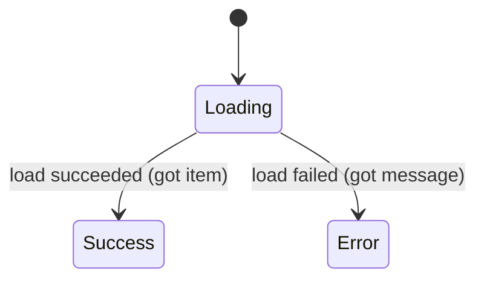

[← README](../../../README.md) | [日本語](./01.ja.md)

# Managing UI state with sealed classes and cream.kt (Part 1: Maintaining shared properties across Loading / Success / Error)

Contents:

- (Part 1: Maintaining shared properties across Loading / Success / Error)
  - [Example: an item detail screen's UiState](#example-an-item-detail-screens-uistate)
  - [It suddenly gets complicated as the features you must implement grow](#it-suddenly-gets-complicated-as-the-features-you-must-implement-grow)
  - [Solving the obvious boilerplate with cream.kt](#solving-the-obvious-boilerplate-with-creamkt)
  - [Notes](#notes)
  - [Next steps](#next-steps)
- [Part 2: Data-preserving transitions — refresh and optimistic updates](./02.md)
- [Part 3: Covering a nested sealed state machine with one annotation](./03.md)
- [Part 4: Writing MVI reducers declaratively](./04.md)
- [Part 5: Using cream.kt with the Koma state-management library](./05.md)

> [!TIP]
> This article covers the following features.
>
> - [Copy — @CopyTo / @CopyFrom / @CopyMapping](../../copy.md)
> - [Copy to children — @CopyToChildren](../../copy-to-children.md)

In today's declarative UI, it is common to adopt a UDF (Unidirectional Data Flow) design where a screen's state is expressed as a single immutable value and a new value is emitted every time the state changes. The [Android app architecture guide](https://developer.android.com/topic/architecture) also presents this flow as the basic pattern: the UI subscribes to the UiState exposed by a `ViewModel`, and the next UiState is produced in response to events.

When modeling this UiState in Kotlin, a `sealed interface` (or `sealed class`) is an extremely good fit. Mutually exclusive states such as "loading", "success", and "failure" can be expressed as types, enabling exhaustive `when` branches so the compiler catches any state the UI fails to handle.

On the other hand, these states often share information that is needed in every state. For example, `itemId` — which item is being displayed — is a value you want to keep whether the screen is loading, succeeded, or failed. Once you give such shared properties to each state of the sealed hierarchy, every state transition produces boilerplate that hand-copies them from the previous state. And the nasty part is that **every additional shared property piles up more maintenance cost, forcing you to go around fixing every transition site**.

In our experience, implementing a UiState calls for the following considerations.

- Every state transition adds code that hand-copies the shared properties, increasing the burden on **code reviewers**.
- What actually changed in the transition (e.g. the `item` newly obtained in `Loading` → `Success`) gets buried in code that merely hand-copies shared properties and becomes hard to see.
- For **newcomers to the code (including yourself a month from now)** who cannot know the circumstances at implementation time, the code tends to give no quick answer to which parts are the essential diff and which are mechanical carry-over.
- Adding just one shared property ripples beyond the declaration into **every transition call site**. Even where a fix is missed, named arguments can keep everything consistent enough to compile, so the mistake easily slips through review.

## Example: an item detail screen's UiState

Suppose you model the state of an item detail screen with the following `sealed interface`. The shared property `itemId` is declared on the sealed parent and held by each state via `override`.

```kt
sealed interface ItemDetailUiState {
    val itemId: String
    data class Loading(override val itemId: String) : ItemDetailUiState
    data class Success(override val itemId: String, val item: Item) : ItemDetailUiState
    data class Error(override val itemId: String, val message: String) : ItemDetailUiState
}
```

This UiState transitions as follows depending on the result of loading.



On the ViewModel side, once loading completes you transition from `Loading` to `Success`. Written naively, you end up hand-passing the shared properties held by the previous state `prev`.

```kt
fun onItemLoaded(prev: ItemDetailUiState, item: Item): ItemDetailUiState =
    ItemDetailUiState.Success(
        itemId = prev.itemId, // hand-copy the shared property
        item = item,          // the only thing that actually changed in this transition
    )
```

Simple and obvious. It may well be a technique you already use in your own projects. As long as `itemId` is the only shared property, this poses no problem at all.

### It suddenly gets complicated as the features you must implement grow

Now suppose the following requirements are added.

- Let users bookmark an item → add the shared property `isBookmarked: Boolean`.
- Allow a snackbar notification in any state → add the shared property `snackbarMessage: String?`.

Since these are pieces of information you want to keep in every state, you add them as shared properties on the parent. That means you first have to add `override`s to all three states.

```kt
sealed interface ItemDetailUiState {
    val itemId: String
    val isBookmarked: Boolean       // added
    val snackbarMessage: String?    // added

    data class Loading(
        override val itemId: String,
        override val isBookmarked: Boolean,    // added
        override val snackbarMessage: String?, // added
    ) : ItemDetailUiState

    data class Success(
        override val itemId: String,
        val item: Item,
        override val isBookmarked: Boolean,    // added
        override val snackbarMessage: String?, // added
    ) : ItemDetailUiState

    data class Error(
        override val itemId: String,
        val message: String,
        override val isBookmarked: Boolean,    // added
        override val snackbarMessage: String?, // added
    ) : ItemDetailUiState
}
```

This is where the trouble starts. Fixing the declaration is not the end of it: you must add hand-copied carry-over code for the shared properties at **every transition call site**.

```kt
fun onItemLoaded(prev: ItemDetailUiState, item: Item): ItemDetailUiState =
    ItemDetailUiState.Success(
        itemId = prev.itemId,
        item = item,
        isBookmarked = prev.isBookmarked,       // ← this line multiplies with every transition
        snackbarMessage = prev.snackbarMessage, // ← this line multiplies with every transition
    )
```

If a screen has 5 or 10 transition sites, you end up adding the same two lines to every one of them. The essential diff is still the single line `item = item`, yet the carry-over code progressively drowns it out. Worse, even if you forget to pass `prev.isBookmarked` and write a fixed value like `isBookmarked = false`, the types match, the code compiles, and the bug easily slips through review. With every additional shared property, this maintenance cost and risk grows linearly.

### Solving the obvious boilerplate with cream.kt

This hand-copying of shared properties is exactly the kind of obvious boilerplate cream.kt was built to solve. All it takes is annotating the state class the transitions start from (here, `Loading`) with `@CopyTo`, specifying the transition targets.

```kt
import me.tbsten.cream.CopyTo

sealed interface ItemDetailUiState {
    val itemId: String
    val isBookmarked: Boolean
    val snackbarMessage: String?

    @CopyTo(
        ItemDetailUiState.Success::class,
        ItemDetailUiState.Error::class,
    )
    data class Loading(
        override val itemId: String,
        override val isBookmarked: Boolean,
        override val snackbarMessage: String?,
    ) : ItemDetailUiState

    data class Success(
        override val itemId: String,
        val item: Item,
        override val isBookmarked: Boolean,
        override val snackbarMessage: String?,
    ) : ItemDetailUiState

    data class Error(
        override val itemId: String,
        val message: String,
        override val isBookmarked: Boolean,
        override val snackbarMessage: String?,
    ) : ItemDetailUiState
}
```

`@CopyTo` generates copy functions from the annotated class (as the receiver) to each of the specified targets. Shared properties whose names match get `= this.xxx` defaults. For example, a function with the following signature is generated for `Success`.

```kt
fun ItemDetailUiState.Loading.copyToItemDetailUiStateSuccess(
    itemId: String = this.itemId,
    isBookmarked: Boolean = this.isBookmarked,
    snackbarMessage: String? = this.snackbarMessage,
    item: Item,
): ItemDetailUiState.Success
```

With this, the earlier transition can be written like so.

```kt
fun onItemLoaded(prev: ItemDetailUiState.Loading, item: Item): ItemDetailUiState =
    prev.copyToItemDetailUiStateSuccess(item = item)
```

The shared properties are carried over from `prev` via the default values, so the only thing written at the transition is what actually changed (`item = item`). Reviewers can read the intent of the diff at a glance, and yourself a month from now won't be puzzled either. The call also reads much like the `copy` function Kotlin generates for data classes, so it should feel immediately familiar.

And the biggest win is maintenance. Even when you later add `isBookmarked`, `snackbarMessage`, or yet another shared property, **no transition call site changes at all**. Shared properties are automatically carried over via the defaults, so the only thing to fix is the sealed declaration. No more appending carry-over code, and no more worrying about fixed-value bugs from a forgotten `prev.xxx`.

<details>
<summary>Generating for all child classes at once with @CopyToChildren</summary>

Instead of enumerating the targets one by one, annotating the sealed parent with `@CopyToChildren` generates copy functions to **all transitive child classes** of the sealed hierarchy (`Loading` / `Success` / `Error`) at once. The generated functions take the sealed parent as the receiver, so they can also be called on an `ItemDetailUiState`-typed value whose current child class is unknown.

```kt
import me.tbsten.cream.CopyToChildren

@CopyToChildren
sealed interface ItemDetailUiState {
    // same declaration as before
}
```

Since new child classes require no additional annotations, this is the more convenient option for screens with many states and transitions.

- When a state is expressed as a `data object` like `Loading`, `@CopyToChildren` by default also generates a copy function to that object (which just returns the singleton). If you don't want it, suppress it with `cream.notCopyToObject=true` or `@CopyToChildren(notCopyToObject = true)`.
- If some shared property should always be specified explicitly on transitions, annotate the parent's abstract property with `@CopyToChildren.Exclude`: the automatic default for that argument is removed from every child class's copy function, making it required at the call site.

See [Copy to children — @CopyToChildren](../../copy-to-children.md) for details.

</details>

### Notes

- The generated function name `copyToItemDetailUiStateSuccess` comes from the default options (`copyFunNamePrefix=copyTo` / `copyFunNamingStrategy=under-package` / `escapeDot=lower-camel-case`). Nested types `A.B.C` are concatenated like `copyToABC`. The prefix and more can be changed via options.
- For cases where you want to update only shared properties without changing the subtype (e.g. clearing `snackbarMessage` while staying an `ItemDetailUiState`), `@SealedCopy` — which keeps the parent type as both receiver and return type (the generated function is named `copy`) — is the better fit. Choose between it and `@CopyTo` / `@CopyToChildren` depending on the use case.

### Next steps

- [Part 2: Data-preserving transitions — refresh and optimistic updates](./02.md)
- Understand `@CopyTo` / `@CopyToChildren` in more depth
    - [Copy — @CopyTo / @CopyFrom / @CopyMapping](../../copy.md)
    - [Copy to children — @CopyToChildren](../../copy-to-children.md)
    - [Function name (`funName` / naming options)](../../customization/fun-name.md)
