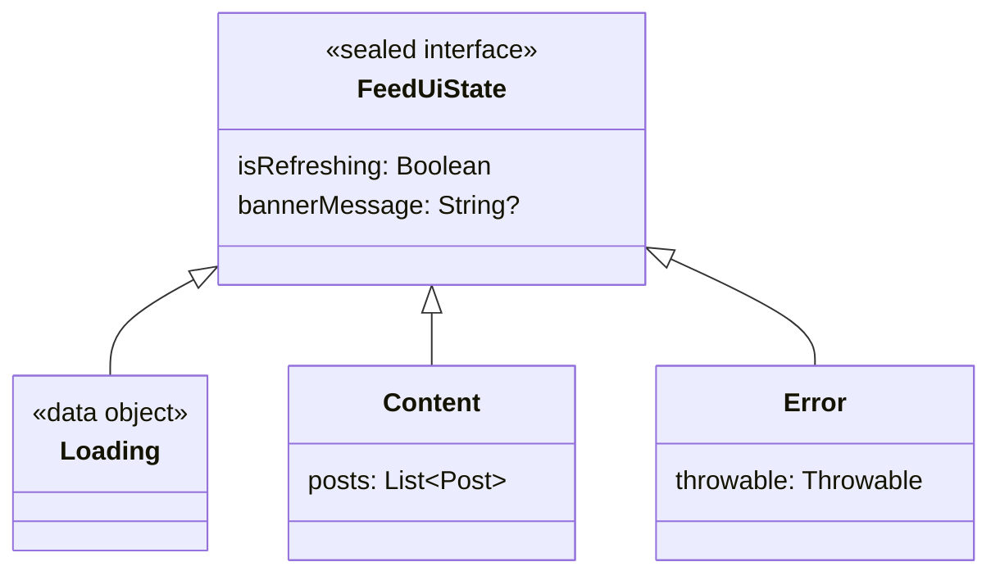

[← README](../../../README.ja.md) | [English](./02.md)

# sealed class を使った UI 状態の管理に cream.kt を利用する（第 2 回: データを保ったままの遷移とリフレッシュ・楽観的更新）

目次:

- [第 1 回: Loading / Success / Error と共通プロパティの保守](./01.ja.md)
- （第 2 回: データを保ったままの遷移とリフレッシュ・楽観的更新）
  - [例: フィード画面のリフレッシュ](#例-フィード画面のリフレッシュ)
  - [実装すべき機能が増えると途端に複雑になります](#実装すべき機能が増えると途端に複雑になります)
  - [cream.kt で自明なボイラープレートを解決する](#creamkt-で自明なボイラープレートを解決する)
  - [補足: copy 不可なサブタイプの扱い](#補足-copy-不可なサブタイプの扱い)
  - [Next steps](#next-steps)
- [第 3 回: ネストした sealed StateMachine を1つの注釈で網羅する](./03.ja.md)
- [第 4 回: MVI の reduce を宣言的に書く](./04.ja.md)
- [第 5 回: 状態管理ライブラリ Koma との併用](./05.ja.md)

> [!TIP]
> このドキュメントでは以下の機能に関するトピックを扱います。
> 
> - [Sealed copy — @SealedCopy](../../sealed-copy.ja.md)

UI の状態を `sealed interface` / `sealed class` で表現するのは、Kotlin を使ったアプリ開発では定番の手法です。`Loading` / `Content` / `Error` のように状態を型として区別すると、UI 側は `when` で網羅的に描き分けられ、あり得ない状態の組み合わせをコンパイル時に排除できます。

一方で、実際の画面ではもう一段こまやかな遷移が頻繁に登場します。プルリフレッシュのように「今表示しているデータはそのまま残しつつ、`isRefreshing` だけを true にしたい」、あるいは楽観的更新のように「サーバへの反映を待たずに先に見た目を変え、失敗したら元に戻したい」といった、**既存データを保ったまま一部のプロパティだけを差し替える遷移**です。

こうした「データを保ちつつ一部だけ更新したい」遷移の実装には、経験上いくつかの配慮が必要です。

- 手元にあるのが親型 `state: FeedUiState` の場合、data class の `copy` はサブタイプの中でしか使えないため、共通プロパティ 1 つを更新するだけでも全サブタイプを `when` で分岐する必要があります。
- この `when` 分岐は本質的にはボイラープレートですが、`Content` の `posts` や `Error` の `throwable` を「取りこぼさず引き継ぐ」責務を負っており、書き間違えるとデータが消えるバグにつながります。
- リフレッシュ開始 / 終了、バナー表示 / 消去、楽観的更新の適用 / ロールバックと、更新したい箇所が増えるほど同じ形の `when` が画面のあちこちに増殖します。
- サブタイプや共通プロパティが増えたときに、すべての `when` を漏れなく直す必要があり、修正漏れがそのままリグレッションになります。

なお、`Loading → Success` のように「別のサブタイプ型へ遷移したい（戻り値が子型になる）」ケースには `@CopyToChildren` や `@CopyTo` が適しています。本記事で扱うのは「**親型を保ったまま**共有プロパティだけを更新する」ケースで、こちらには `@SealedCopy` が向いています。

## 例: フィード画面のリフレッシュ

フィード / タイムライン画面の状態を次のように表現したとします。共通プロパティとして「リフレッシュ中かどうか」を表す `isRefreshing` と、画面上部に出す `bannerMessage` を親型に持たせています。

```kt
sealed interface FeedUiState {
    val isRefreshing: Boolean
    val bannerMessage: String?

    data object Loading : FeedUiState {
        override val isRefreshing: Boolean get() = false
        override val bannerMessage: String? get() = null
    }

    data class Content(
        override val isRefreshing: Boolean,
        override val bannerMessage: String?,
        val posts: List<Post>,
    ) : FeedUiState

    data class Error(
        override val isRefreshing: Boolean,
        override val bannerMessage: String?,
        val throwable: Throwable,
    ) : FeedUiState
}
```

サブタイプと共通プロパティの関係を図にすると次のとおりです。



プルリフレッシュが始まったら、`isRefreshing` だけを true にしたいとします。ただし ViewModel が保持しているのは親型 `state: FeedUiState` であり、今それが `Content` なのか `Error` なのかは分かりません。data class の `copy` はサブタイプの内側でしか使えないため、素朴に書くと次のように全サブタイプを `when` で分岐することになります。

```kt
fun FeedUiState.startRefreshing(): FeedUiState = when (this) {
    is FeedUiState.Loading -> this // object なので更新するものがない
    is FeedUiState.Content -> this.copy(isRefreshing = true) // posts はそのまま
    is FeedUiState.Error -> this.copy(isRefreshing = true)   // throwable はそのまま
}
```

やりたいことは「`isRefreshing` を true にする」だけなのに、`Content` の `posts` や `Error` の `throwable` を引き継ぐために、全サブタイプを列挙する `when` が避けられません。1 箇所だけなら許容できるかもしれません。

### 実装すべき機能が増えると途端に複雑になります

問題は、この形の `when` が 1 箇所では済まないことです。リフレッシュ完了、バナーの表示・消去、楽観的更新の適用・ロールバックと、共通プロパティを触るたびに同じ分岐が増えていきます。

```kt
// リフレッシュ完了
fun FeedUiState.finishRefreshing(): FeedUiState = when (this) {
    is FeedUiState.Loading -> this
    is FeedUiState.Content -> this.copy(isRefreshing = false)
    is FeedUiState.Error -> this.copy(isRefreshing = false)
}

// バナーを表示する
fun FeedUiState.showBanner(message: String): FeedUiState = when (this) {
    is FeedUiState.Loading -> this
    is FeedUiState.Content -> this.copy(bannerMessage = message)
    is FeedUiState.Error -> this.copy(bannerMessage = message)
}

// バナーを消す
fun FeedUiState.dismissBanner(): FeedUiState = when (this) {
    is FeedUiState.Loading -> this
    is FeedUiState.Content -> this.copy(bannerMessage = null)
    is FeedUiState.Error -> this.copy(bannerMessage = null)
}
```

どれも「共通プロパティを 1 つ差し替える」という同じ構造の繰り返しです。ここで `FeedUiState` に新しいサブタイプ（例: `Empty`）を追加すると、これらすべての `when` に分岐を足して回る必要があり、1 箇所でも忘れると `when` が網羅性を失ってコンパイルエラー、あるいは（`else` を書いていた場合は）データを取りこぼす静かなバグになります。本質的な違いは「どのプロパティを差し替えるか」の 1 行だけなのに、そこに至るまでの定型分岐がコードレビューの視界を奪ってしまいます。

### cream.kt で自明なボイラープレートを解決する

この「親型を保ったまま共有プロパティを更新する `when`」は、まさに cream.kt の `@SealedCopy` が自動生成してくれるコードです。親の sealed 型に `@SealedCopy` を付けるだけで済みます。`Loading` のような copy 不可なサブタイプの扱いだけ `nonCopyableStrategy` で指定します（[補足](#補足-copy-不可なサブタイプの扱い)を参照）。

```kt
import me.tbsten.cream.NonCopyableStrategy
import me.tbsten.cream.SealedCopy

// Loading は copy() を持たない data object のため、扱い方を nonCopyableStrategy で指定
@SealedCopy(nonCopyableStrategy = NonCopyableStrategy.RETURN_AS_IS)
sealed interface FeedUiState {
    val isRefreshing: Boolean
    val bannerMessage: String?

    data object Loading : FeedUiState {
        override val isRefreshing: Boolean get() = false
        override val bannerMessage: String? get() = null
    }

    data class Content(
        override val isRefreshing: Boolean,
        override val bannerMessage: String?,
        val posts: List<Post>,
    ) : FeedUiState

    data class Error(
        override val isRefreshing: Boolean,
        override val bannerMessage: String?,
        val throwable: Throwable,
    ) : FeedUiState
}
```

これで、共通プロパティを引数に取り、**サブタイプを保ったまま**それらを差し替える `copy()` 拡張関数が生成されます。生成されるコードは、私たちが手で書いていた `when` そのものです。

```kt
// 生成されるコード
fun FeedUiState.copy(
    isRefreshing: Boolean = this.isRefreshing,
    bannerMessage: String? = this.bannerMessage,
): FeedUiState = when (this) {
    is FeedUiState.Loading -> this // copy 不可: そのまま返す（RETURN_AS_IS）
    is FeedUiState.Content -> this.copy(isRefreshing = isRefreshing, bannerMessage = bannerMessage)
    is FeedUiState.Error -> this.copy(isRefreshing = isRefreshing, bannerMessage = bannerMessage)
}
```

呼び出し側は、今のサブタイプを気にせず 1 行で更新できます。`Content` は `posts` を、`Error` は `throwable` を保持したまま、指定したプロパティだけが差し替わります。

```kt
val state: FeedUiState = FeedUiState.Content(isRefreshing = false, bannerMessage = null, posts = posts)

val refreshing = state.copy(isRefreshing = true)
// -> FeedUiState.Content(isRefreshing = true, bannerMessage = null, posts = posts) 型・posts はそのまま
```

先ほど増殖していた `startRefreshing` / `showBanner` などの分岐は、すべて `state.copy(...)` の 1 行に置き換わります。

```kt
val startRefreshing = state.copy(isRefreshing = true)
val finishRefreshing = state.copy(isRefreshing = false)
val withBanner = state.copy(bannerMessage = "更新しました")
val withoutBanner = state.copy(bannerMessage = null)
```

楽観的更新も同じ道具で書けます。まずリフレッシュ中の見た目に切り替え、成功すればバナーを、失敗すれば元の `state` に戻してエラーバナーを出す、という一連の流れが `copy(...)` の連なりで表現できます。

```kt
suspend fun MutableStateFlow<FeedUiState>.refresh(repository: FeedRepository) {
    val previous = value
    value = value.copy(isRefreshing = true) // まず楽観的に「更新中」へ
    runCatching { repository.fetchPosts() }
        .onSuccess { posts ->
            value = FeedUiState.Content(isRefreshing = false, bannerMessage = "更新しました", posts = posts)
        }
        .onFailure {
            // 失敗したら直前の state に巻き戻し、バナーだけ添える（サブタイプは保たれる）
            value = previous.copy(isRefreshing = false, bannerMessage = "更新に失敗しました")
        }
}
```

ロールバック時に `previous.copy(...)` としているのがポイントです。`previous` が `Content` でも `Error` でも、その中身（`posts` や `throwable`）は保ったまま、`bannerMessage` だけを差し替えられます。手書きの `when` を一切増やさずに、サブタイプの取りこぼしも起きません。

### 補足: copy 不可なサブタイプの扱い

`Loading` は `data object` なので、そもそも `copy()` を持ちません。cream.kt はこうした「copy できないサブタイプ」の扱い方を `nonCopyableStrategy` で選べるようにしています。

既定は `NonCopyableStrategy.ERROR` で、copy 不可なサブタイプが含まれているとビルド時にエラーになり、どのサブタイプが問題かと選択肢を教えてくれます。

今回の `Loading` のように「更新するプロパティを持たないので、そのまま返せばよい」場合は、`RETURN_AS_IS` を指定します。冒頭の例で指定していたのはこのためです。

```kt
import me.tbsten.cream.NonCopyableStrategy

@SealedCopy(nonCopyableStrategy = NonCopyableStrategy.RETURN_AS_IS)
sealed interface FeedUiState {
    // ...
}

// 生成されるコード（Loading は -> this でそのまま返す）
fun FeedUiState.copy(
    // ...
): FeedUiState = when (this) {
    is FeedUiState.Loading -> this // copy 不可: そのまま返す
    // ...
}
```

「copy できない状態は更新失敗として扱いたい」場合は `RETURN_NULL` も選べます。この場合は戻り値が `FeedUiState?` に広がり、copy 不可なサブタイプは `-> null` になるため、呼び出し側で null を処理することになります。用途に応じて、no-op（`RETURN_AS_IS`）か、明示的な失敗（`RETURN_NULL`）かを選んでください。

このように `@SealedCopy` を使うと、「今どのサブタイプか分からない親型を、データを保ったまま部分更新する」という UI 状態管理の頻出パターンから、増殖しがちな `when` のボイラープレートを丸ごと取り除けます。

### Next steps

- [第 3 回: ネストした sealed StateMachine を1つの注釈で網羅する](./03.ja.md)
- `@SealedCopy` をより深く理解する
    - [Sealed copy — @SealedCopy](../../sealed-copy.ja.md) — nonCopyableStrategy や `.Map` / `.Exclude` の詳細
    - [Copy to children — @CopyToChildren](../../copy-to-children.ja.md) — 親型ではなく子 type へ遷移したい場合
