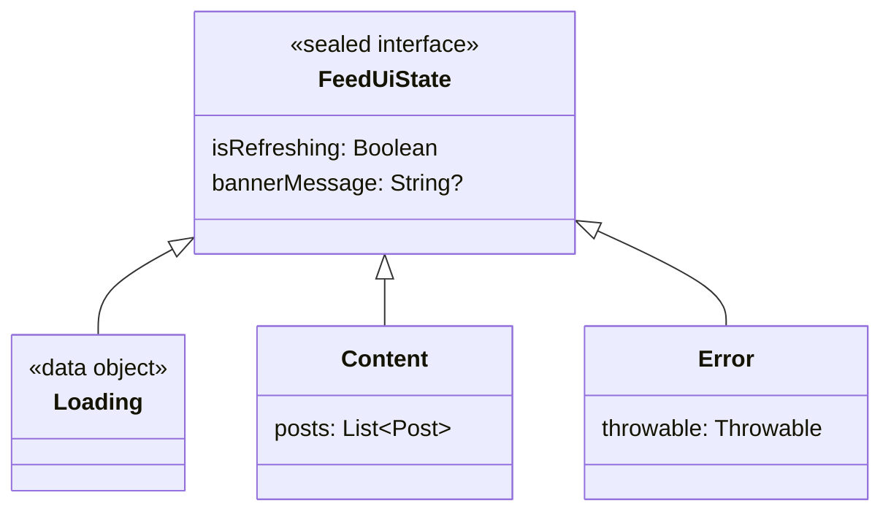

[← README](../../../README.md) | [日本語](./02.ja.md)

# Managing UI state with sealed classes and cream.kt (Part 2: Data-preserving transitions — refresh and optimistic updates)

Contents:

- [Part 1: Maintaining shared properties across Loading / Success / Error](./01.md)
- (Part 2: Data-preserving transitions — refresh and optimistic updates)
  - [Example: refreshing a feed screen](#example-refreshing-a-feed-screen)
  - [It suddenly gets complicated as the features you must implement grow](#it-suddenly-gets-complicated-as-the-features-you-must-implement-grow)
  - [Solving the obvious boilerplate with cream.kt](#solving-the-obvious-boilerplate-with-creamkt)
  - [Note: handling non-copyable subtypes](#note-handling-non-copyable-subtypes)
  - [Next steps](#next-steps)
- [Part 3: Covering a nested sealed state machine with one annotation](./03.md)
- [Part 4: Writing MVI reducers declaratively](./04.md)
- [Part 5: Using cream.kt with the Koma state-management library](./05.md)

> [!TIP]
> This article covers the following features.
>
> - [Sealed copy — @SealedCopy](../../sealed-copy.md)

Representing UI state with a `sealed interface` / `sealed class` is a staple technique in Kotlin app development. When states like `Loading` / `Content` / `Error` are distinguished as types, the UI side can render each of them exhaustively with `when`, and impossible state combinations are ruled out at compile time.

Real screens, however, frequently need a finer-grained kind of transition: pull-to-refresh, where you want to keep the currently displayed data and set only `isRefreshing` to true, or optimistic updates, where you change the appearance before the server confirms and roll back on failure — in other words, **transitions that replace only some properties while preserving the existing data**.

In our experience, implementing these "keep the data, update just a part" transitions calls for a few considerations.

- When what you have is the parent type `state: FeedUiState`, a data class's `copy` is only available inside a subtype, so updating even a single shared property requires branching over all subtypes with `when`.
- This `when` branching is essentially boilerplate, yet it bears the responsibility of carrying over `Content`'s `posts` and `Error`'s `throwable` without dropping anything — get it wrong and you have a bug that loses data.
- Start / finish refreshing, show / dismiss a banner, apply / roll back an optimistic update — the more places you need to update, the more copies of the same-shaped `when` multiply across the screen's code.
- Whenever a subtype or shared property is added, every one of those `when` expressions must be fixed without exception — any missed fix becomes a regression.

Note that for cases where you want to transition to a *different* subtype, as in `Loading → Success` (the return value becomes a child type), `@CopyToChildren` and `@CopyTo` are the better fit. This article covers the case of updating only shared properties **while keeping the parent type**, which is what `@SealedCopy` is for.

## Example: refreshing a feed screen

Suppose a feed / timeline screen models its state as follows. The parent type carries two shared properties: `isRefreshing`, which indicates whether a refresh is in progress, and `bannerMessage`, shown at the top of the screen.

```kt
sealed interface FeedUiState {
    val isRefreshing: Boolean
    val bannerMessage: String?

    data object Loading : FeedUiState {
        override val isRefreshing: Boolean get() = false
        override val bannerMessage: String? get() = null
    }

    data class Content(
        override val isRefreshing: Boolean,
        override val bannerMessage: String?,
        val posts: List<Post>,
    ) : FeedUiState

    data class Error(
        override val isRefreshing: Boolean,
        override val bannerMessage: String?,
        val throwable: Throwable,
    ) : FeedUiState
}
```

The relationship between the subtypes and the shared properties looks like this.



When a pull-to-refresh starts, you want to set only `isRefreshing` to true. But the ViewModel holds the parent type `state: FeedUiState`, and you don't know whether it is currently a `Content` or an `Error`. Since a data class's `copy` is only available inside a subtype, a naive implementation ends up branching over all subtypes with `when`, like this.

```kt
fun FeedUiState.startRefreshing(): FeedUiState = when (this) {
    is FeedUiState.Loading -> this // object: nothing to update
    is FeedUiState.Content -> this.copy(isRefreshing = true) // posts kept as-is
    is FeedUiState.Error -> this.copy(isRefreshing = true)   // throwable kept as-is
}
```

All you want to do is set `isRefreshing` to true, yet a `when` enumerating every subtype is unavoidable, just to carry over `Content`'s `posts` and `Error`'s `throwable`. If this appeared in only one place, it might be tolerable.

### It suddenly gets complicated as the features you must implement grow

The problem is that this shape of `when` never stops at one place. Finishing a refresh, showing and dismissing a banner, applying and rolling back an optimistic update — every time you touch a shared property, another copy of the same branching appears.

```kt
// finish refreshing
fun FeedUiState.finishRefreshing(): FeedUiState = when (this) {
    is FeedUiState.Loading -> this
    is FeedUiState.Content -> this.copy(isRefreshing = false)
    is FeedUiState.Error -> this.copy(isRefreshing = false)
}

// show a banner
fun FeedUiState.showBanner(message: String): FeedUiState = when (this) {
    is FeedUiState.Loading -> this
    is FeedUiState.Content -> this.copy(bannerMessage = message)
    is FeedUiState.Error -> this.copy(bannerMessage = message)
}

// dismiss the banner
fun FeedUiState.dismissBanner(): FeedUiState = when (this) {
    is FeedUiState.Loading -> this
    is FeedUiState.Content -> this.copy(bannerMessage = null)
    is FeedUiState.Error -> this.copy(bannerMessage = null)
}
```

Each of these repeats the same structure: "replace one shared property." Now add a new subtype to `FeedUiState` (say, `Empty`) and you must go around adding a branch to every one of these `when` expressions — miss even one and the `when` loses exhaustiveness and fails to compile, or (if you wrote an `else`) silently drops data. The only essential difference between these functions is the single line saying which property to replace, yet the boilerplate branching around it hogs the code reviewer's field of view.

### Solving the obvious boilerplate with cream.kt

This "update shared properties while keeping the parent type" `when` is exactly the code that cream.kt's `@SealedCopy` generates for you. All it takes is annotating the sealed parent with `@SealedCopy` — the only extra step is telling it how to handle non-copyable subtypes like `Loading` via `nonCopyableStrategy` (see [the note below](#note-handling-non-copyable-subtypes)).

```kt
import me.tbsten.cream.NonCopyableStrategy
import me.tbsten.cream.SealedCopy

// Loading is a data object with no copy() — how to handle it is specified via nonCopyableStrategy
@SealedCopy(nonCopyableStrategy = NonCopyableStrategy.RETURN_AS_IS)
sealed interface FeedUiState {
    val isRefreshing: Boolean
    val bannerMessage: String?

    data object Loading : FeedUiState {
        override val isRefreshing: Boolean get() = false
        override val bannerMessage: String? get() = null
    }

    data class Content(
        override val isRefreshing: Boolean,
        override val bannerMessage: String?,
        val posts: List<Post>,
    ) : FeedUiState

    data class Error(
        override val isRefreshing: Boolean,
        override val bannerMessage: String?,
        val throwable: Throwable,
    ) : FeedUiState
}
```

This generates a `copy()` extension function that takes the shared properties as arguments and replaces them **while preserving the subtype**. The generated code is exactly the `when` we had been writing by hand.

```kt
// generated code
fun FeedUiState.copy(
    isRefreshing: Boolean = this.isRefreshing,
    bannerMessage: String? = this.bannerMessage,
): FeedUiState = when (this) {
    is FeedUiState.Loading -> this // non-copyable: returned as-is (RETURN_AS_IS)
    is FeedUiState.Content -> this.copy(isRefreshing = isRefreshing, bannerMessage = bannerMessage)
    is FeedUiState.Error -> this.copy(isRefreshing = isRefreshing, bannerMessage = bannerMessage)
}
```

Callers update the state in one line, without knowing or caring which subtype is current. `Content` keeps its `posts` and `Error` keeps its `throwable`; only the properties you specify are replaced.

```kt
val state: FeedUiState = FeedUiState.Content(isRefreshing = false, bannerMessage = null, posts = posts)

val refreshing = state.copy(isRefreshing = true)
// -> FeedUiState.Content(isRefreshing = true, bannerMessage = null, posts = posts) — still Content, posts kept as-is
```

The `startRefreshing` / `showBanner` branches that were multiplying earlier are all replaced by a single line of `state.copy(...)`.

```kt
val startRefreshing = state.copy(isRefreshing = true)
val finishRefreshing = state.copy(isRefreshing = false)
val withBanner = state.copy(bannerMessage = "Updated!")
val withoutBanner = state.copy(bannerMessage = null)
```

Optimistic updates can be written with the same tool. Switch to the refreshing appearance first; on success show a banner; on failure roll back to the original `state` and show an error banner — the whole flow is expressed as a sequence of `copy(...)` calls.

```kt
suspend fun MutableStateFlow<FeedUiState>.refresh(repository: FeedRepository) {
    val previous = value
    value = value.copy(isRefreshing = true) // optimistically switch to "refreshing" first
    runCatching { repository.fetchPosts() }
        .onSuccess { posts ->
            value = FeedUiState.Content(isRefreshing = false, bannerMessage = "Updated!", posts = posts)
        }
        .onFailure {
            // on failure, roll back to the previous state and just attach a banner (the subtype is preserved)
            value = previous.copy(isRefreshing = false, bannerMessage = "Failed to update")
        }
}
```

The key is that the rollback uses `previous.copy(...)`. Whether `previous` is a `Content` or an `Error`, its contents (`posts` or `throwable`) are preserved and only `bannerMessage` is replaced. Not a single hand-written `when` is added, and no subtype can slip through the cracks.

### Note: handling non-copyable subtypes

`Loading` is a `data object`, so it has no `copy()` in the first place. cream.kt lets you choose how such non-copyable subtypes are handled with `nonCopyableStrategy`.

The default is `NonCopyableStrategy.ERROR`: if the hierarchy contains a non-copyable subtype, the build fails with an error telling you which subtype is the problem and what your options are.

When, as with `Loading` here, the subtype has no properties to update and returning it unchanged is fine, specify `RETURN_AS_IS` — which is why the first snippet did exactly that.

```kt
import me.tbsten.cream.NonCopyableStrategy

@SealedCopy(nonCopyableStrategy = NonCopyableStrategy.RETURN_AS_IS)
sealed interface FeedUiState {
    // ...
}

// generated code (Loading is returned as-is via -> this)
fun FeedUiState.copy(
    // ...
): FeedUiState = when (this) {
    is FeedUiState.Loading -> this // non-copyable: returned as-is
    // ...
}
```

If you would rather treat a non-copyable state as a failed update, `RETURN_NULL` is also available. In that case the return type widens to `FeedUiState?` and non-copyable subtypes become `-> null`, so the caller ends up handling the null. Choose between a no-op (`RETURN_AS_IS`) and an explicit failure (`RETURN_NULL`) depending on your use case.

In this way, `@SealedCopy` removes the whole proliferating `when` boilerplate from a very common UI-state-management pattern: partially updating a parent-typed state — whose current subtype you don't know — while preserving its data.

### Next steps

- [Part 3: Covering a nested sealed state machine with one annotation](./03.md)
- Understand `@SealedCopy` in more depth
    - [Sealed copy — @SealedCopy](../../sealed-copy.md) — details including nonCopyableStrategy and `.Map` / `.Exclude`
    - [Copy to children — @CopyToChildren](../../copy-to-children.md) — when you want to transition to a child type instead of keeping the parent type
