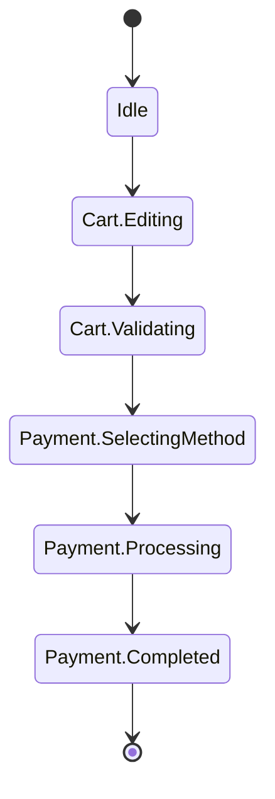

[← README](../../../README.ja.md) | [English](./03.md)

# sealed class を使った UI 状態の管理に cream.kt を利用する（第 3 回: ネストした sealed StateMachine を1つの注釈で網羅する）

目次:

- [第 1 回: Loading / Success / Error と共通プロパティの保守](./01.ja.md)
- [第 2 回: データを保ったままの遷移とリフレッシュ・楽観的更新](./02.ja.md)
- （第 3 回: ネストした sealed StateMachine を1つの注釈で網羅する）
  - [例: チェックアウトフローの StateMachine](#例-チェックアウトフローの-statemachine)
  - [実装すべき機能が増えると途端に複雑になります](#実装すべき機能が増えると途端に複雑になります)
  - [cream.kt で自明なボイラープレートを解決する](#creamkt-で自明なボイラープレートを解決する)
  - [補足](#補足)
  - [Next steps](#next-steps)
- [第 4 回: MVI の reduce を宣言的に書く](./04.ja.md)
- [第 5 回: 状態管理ライブラリ Koma との併用](./05.ja.md)

> [!TIP]
> このドキュメントでは以下の機能に関するトピックを扱います。
>
> - [Copy to children — @CopyToChildren](../../copy-to-children.ja.md)

チェックアウト（購入）フローや会員登録ウィザードのような多段の画面遷移は、`sealed interface` で StateMachine としてモデリングすると見通しがよくなります。
このとき状態が増えてくると、フェーズごとにまとめたくなり、自然と「中間 sealed を挟んだ入れ子の階層」に育っていきます。たとえば「カート編集フェーズ」「決済フェーズ」といったフェーズを中間 sealed で表現し、その下に具体的な状態（子クラス）をぶら下げる、という構造です。

たとえばチェックアウトフローなら、次のような状態遷移になります。



この構造は表現力が高い一方で、状態遷移の実装には次のような配慮が必要になります。

- 各状態（子クラス）ごとに「次の状態を組み立てる」遷移を書く必要があり、`sessionId` や `items` のような共通プロパティを毎回手で書き写すことになります。
- `@CopyTo` を使ってボイラープレートを減らそうとしても、`@CopyTo` は「ソース class ごとに個別に付ける」方式なので、結局子クラスの数だけ注釈を書くことになります。
- 中間 sealed（フェーズ）や子クラス（状態）が増えるたびに、注釈と手書き遷移が線形（あるいはそれ以上）に増えていきます。ネストが深くなるほど、この管理コストは無視できなくなります。

## 例: チェックアウトフローの StateMachine

チェックアウトフローを、中間 sealed を含む入れ子の sealed 階層で表現してみます。

```kt
sealed interface CheckoutUiState {
    val sessionId: String

    data object Idle : CheckoutUiState {
        override val sessionId: String get() = ""
    }

    sealed interface Cart : CheckoutUiState {
        val items: List<CartItem>
        data class Editing(override val sessionId: String, override val items: List<CartItem>) : Cart
        data class Validating(override val sessionId: String, override val items: List<CartItem>) : Cart
    }

    sealed interface Payment : CheckoutUiState {
        val items: List<CartItem>
        val address: Address
        data class SelectingMethod(override val sessionId: String, override val items: List<CartItem>, override val address: Address) : Payment
        data class Processing(override val sessionId: String, override val items: List<CartItem>, override val address: Address, val method: PaymentMethod) : Payment
        data class Completed(override val sessionId: String, override val items: List<CartItem>, override val address: Address, val orderId: String) : Payment
    }
}
```

具象状態（子クラス）は `Idle` を除くと `Cart.Editing` / `Cart.Validating` / `Payment.SelectingMethod` / `Payment.Processing` / `Payment.Completed` の 5 つです。
`sessionId` は全状態が共有し、`items` は `Cart` と `Payment` が、`address` は `Payment` 配下が共有しています。

素朴に遷移を実装すると、たとえば次のようになります。決済方法を選び終えて処理中に移る遷移と、処理が完了する遷移です。

```kt
fun CheckoutUiState.Payment.SelectingMethod.toProcessing(method: PaymentMethod): CheckoutUiState.Payment.Processing =
    CheckoutUiState.Payment.Processing(
        sessionId = this.sessionId, // 書き写し
        items = this.items,         // 書き写し
        address = this.address,     // 書き写し
        method = method,
    )

fun CheckoutUiState.Payment.Processing.toCompleted(orderId: String): CheckoutUiState.Payment.Completed =
    CheckoutUiState.Payment.Completed(
        sessionId = this.sessionId, // 書き写し
        items = this.items,         // 書き写し
        address = this.address,     // 書き写し
        orderId = orderId,
    )
```

シンプルで明白です。ですが `sessionId` / `items` / `address` を、遷移のたびに手で書き写している点に注目してください。本当に伝えたいのは「`method` が決まった」「`orderId` が確定した」ことだけなのに、共通プロパティの書き写しがそれを埋もれさせています。

### 実装すべき機能が増えると途端に複雑になります

StateMachine は要件とともに育ちます。「配送先を編集し直せるフェーズ」を足す、「クーポン適用中」という子クラスを足す、といった変更が入るたびに、新しい子クラスへの遷移をそのつど手書きし、共通プロパティを書き写すコードを増やしていくことになります。

`@CopyTo` でボイラープレートを減らそうとしても、状況は根本的には変わりません。`@CopyTo(Target::class)` は「ソース class に、行き先ごとに個別に付ける」方式だからです。子クラスが 5 つあれば 5 つ、遷移の組み合わせが増えればさらに、という具合に注釈を書き続けることになります。

```kt
//子クラスの数だけ注釈を書き続けることになる（@CopyTo 版）
@CopyTo(CheckoutUiState.Cart.Validating::class)
data class Editing(/* ... */) : Cart

@CopyTo(CheckoutUiState.Payment.Processing::class)
data class SelectingMethod(/* ... */) : Payment

@CopyTo(CheckoutUiState.Payment.Completed::class)
data class Processing(/* ... */) : Payment
// ...子クラス/ 遷移が増えるたびに、この注釈が線形に増えていく
```

中間 sealed（`Cart` / `Payment`）を1つ足すと、その配下の子クラスすべてについて同じ作業を繰り返すことになります。ネストが深くなるほど、どこに何の注釈を付けたのかを追うこと自体が負担になり、`@CopyTo` の管理は破綻気味になっていきます。

### cream.kt で自明なボイラープレートを解決する

cream.kt の `@CopyToChildren` は、この入れ子構造をそのまま扱えます。ルートの sealed 型に **1 回だけ** 付与すれば、その sealed の **すべての推移的（transitive）な子クラス** への copy 拡張関数が生成されます。生成は中間 sealed を **再帰** するので、`Cart` / `Payment` といった中間 sealed に個別の注釈を付ける必要はありません。

```kt
import me.tbsten.cream.CopyToChildren

@CopyToChildren
sealed interface CheckoutUiState {
    val sessionId: String

    data object Idle : CheckoutUiState {
        override val sessionId: String get() = ""
    }

    sealed interface Cart : CheckoutUiState {
        val items: List<CartItem>
        data class Editing(override val sessionId: String, override val items: List<CartItem>) : Cart
        data class Validating(override val sessionId: String, override val items: List<CartItem>) : Cart
    }

    sealed interface Payment : CheckoutUiState {
        val items: List<CartItem>
        val address: Address
        data class SelectingMethod(override val sessionId: String, override val items: List<CartItem>, override val address: Address) : Payment
        data class Processing(override val sessionId: String, override val items: List<CartItem>, override val address: Address, val method: PaymentMethod) : Payment
        data class Completed(override val sessionId: String, override val items: List<CartItem>, override val address: Address, val orderId: String) : Payment
    }
}
```

この 1 つの注釈から、以下の関数が自動生成されます（既定の命名: `copyTo` + `under-package` + `lower-camel-case`。ネストは型名を連結して表現されます）。

```kt
fun CheckoutUiState.copyToCheckoutUiStateCartEditing(
    sessionId: String = this.sessionId,
    items: List<CartItem>,
): CheckoutUiState.Cart.Editing = /* ... */

fun CheckoutUiState.copyToCheckoutUiStateCartValidating(
    sessionId: String = this.sessionId,
    items: List<CartItem>,
): CheckoutUiState.Cart.Validating = /* ... */

fun CheckoutUiState.copyToCheckoutUiStatePaymentSelectingMethod(
    sessionId: String = this.sessionId,
    items: List<CartItem>,
    address: Address,
): CheckoutUiState.Payment.SelectingMethod = /* ... */

fun CheckoutUiState.copyToCheckoutUiStatePaymentProcessing(
    sessionId: String = this.sessionId,
    items: List<CartItem>,
    address: Address,
    method: PaymentMethod,
): CheckoutUiState.Payment.Processing = /* ... */

fun CheckoutUiState.copyToCheckoutUiStatePaymentCompleted(
    sessionId: String = this.sessionId,
    items: List<CartItem>,
    address: Address,
    orderId: String,
): CheckoutUiState.Payment.Completed = /* ... */
```

receiver は注釈を付けた root 型（`CheckoutUiState`）なので、**root が宣言する共有プロパティ**（`sessionId`）は自動で `= this.xxx` の既定値になります。一方、中間 sealed が宣言する `items` / `address` は root 型からは参照できないため既定値にならず、呼び出し側で明示的に渡します。

```kt
// sessionId の書き写しは不要（既定値で引き継がれる）
val processing = selectingMethod.copyToCheckoutUiStatePaymentProcessing(
    items = selectingMethod.items,
    address = selectingMethod.address,
    method = chosenMethod,
)
val completed = processing.copyToCheckoutUiStatePaymentCompleted(
    items = processing.items,
    address = processing.address,
    orderId = confirmedOrderId,
)
```

子クラスを足しても中間 sealed を足しても、注釈を追加する必要はありません。`@CopyToChildren` は sealed 階層をたどって新しい子クラスへの関数を自動的に生成するので、StateMachine の成長に生成コードが追従します。これが `@CopyTo` を子クラスごとに書く方式との決定的な違いです。

### 補足

- **object 状態（`Idle`）の扱い**: 既定では `object` の子クラスに対しても copy 関数が生成されます（シングルトンをそのまま返すだけの関数になります）。不要であれば `cream.notCopyToObject=true`（KSP 引数）または `@CopyToChildren(notCopyToObject = true)` で、`object` への生成を抑制できます。
- **共通プロパティを必須にしたい場合**: sealed 親の抽象プロパティに `@CopyToChildren.Exclude` を付けると、全ての子クラスの copy 関数でそのプロパティの自動 default（`= this.xxx`）が外れ、呼び出し側が明示的に値を渡す必須引数になります。「セッションを再確立したので `sessionId` は必ず更新させたい」といったケースで使えます。
- **中間 sealed の共有プロパティも既定値にしたい場合**: `Payment` のような中間 sealed にも `@CopyToChildren` を付けると、その型を receiver とする copy 関数が追加で生成されます。プロパティの照合は継承プロパティを含むため、この関数では `items` / `address`（および `sessionId`）が `= this.xxx` の既定値になります。
- **`@CopyToChildren` と `@CopyTo` の使い分け**: sealed 階層をまとめて網羅したいなら `@CopyToChildren` を親に 1 回。特定の class から特定の行き先へだけ生成したい局所的なケースは `@CopyTo(Target::class)` を個別に、という使い分けになります。

### Next steps

- [第 4 回: MVI の reduce を宣言的に書く](./04.ja.md)
- `@CopyToChildren` をより深く理解する
    - [Copy to children — @CopyToChildren](../../copy-to-children.ja.md) — 推移的な生成や notCopyToObject の詳細
    - [Exclude (`.Exclude`)](../../customization/exclude.ja.md) — 自動コピーのデフォルト値を外して必須引数にする
