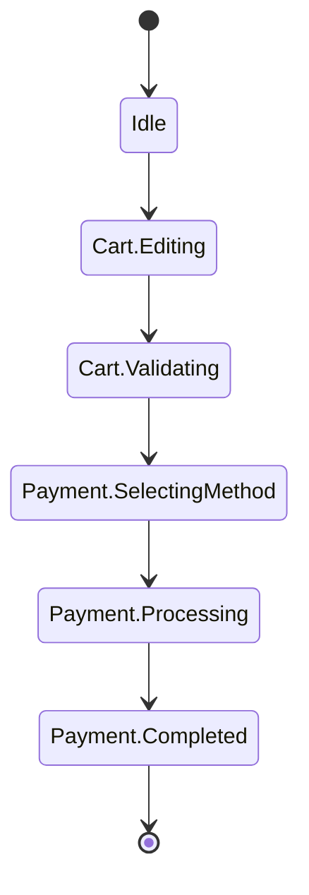

[← README](../../../README.md) | [日本語](./03.ja.md)

# Managing UI state with sealed classes and cream.kt (Part 3: Covering a nested sealed state machine with one annotation)

Contents:

- [Part 1: Maintaining shared properties across Loading / Success / Error](./01.md)
- [Part 2: Data-preserving transitions — refresh and optimistic updates](./02.md)
- (Part 3: Covering a nested sealed state machine with one annotation)
  - [Example: a checkout-flow state machine](#example-a-checkout-flow-state-machine)
  - [It suddenly gets complicated as the features you must implement grow](#it-suddenly-gets-complicated-as-the-features-you-must-implement-grow)
  - [Solving the obvious boilerplate with cream.kt](#solving-the-obvious-boilerplate-with-creamkt)
  - [Notes](#notes)
  - [Next steps](#next-steps)
- [Part 4: Writing MVI reducers declaratively](./04.md)
- [Part 5: Using cream.kt with the Koma state-management library](./05.md)

> [!TIP]
> This article covers the following features.
>
> - [Copy to children — @CopyToChildren](../../copy-to-children.md)

Multi-step screen flows such as a checkout (purchase) flow or a sign-up wizard become much easier to reason about when modeled as a state machine with a `sealed interface`.
As the number of states grows, you start wanting to group them by phase, and the model naturally evolves into a nested hierarchy with intermediate sealed types in between. For example, you represent phases such as a "cart-editing phase" and a "payment phase" as intermediate sealed types, and hang the concrete states (child classes) underneath them.

A checkout flow, for example, has state transitions like these.



This structure is highly expressive, but implementing the state transitions calls for the following considerations.

- For each state (child class) you have to write a transition that builds the next state, hand-copying shared properties like `sessionId` and `items` every single time.
- Even if you try to reduce the boilerplate with `@CopyTo`, `@CopyTo` is attached individually per source class, so you still end up writing one annotation per child class.
- Every time an intermediate sealed type (phase) or a child class (state) is added, the annotations and hand-written transitions grow linearly (or worse). The deeper the nesting, the harder this management cost is to ignore.

## Example: a checkout-flow state machine

Let's model the checkout flow as a nested sealed hierarchy that includes intermediate sealed types.

```kt
sealed interface CheckoutUiState {
    val sessionId: String

    data object Idle : CheckoutUiState {
        override val sessionId: String get() = ""
    }

    sealed interface Cart : CheckoutUiState {
        val items: List<CartItem>
        data class Editing(override val sessionId: String, override val items: List<CartItem>) : Cart
        data class Validating(override val sessionId: String, override val items: List<CartItem>) : Cart
    }

    sealed interface Payment : CheckoutUiState {
        val items: List<CartItem>
        val address: Address
        data class SelectingMethod(override val sessionId: String, override val items: List<CartItem>, override val address: Address) : Payment
        data class Processing(override val sessionId: String, override val items: List<CartItem>, override val address: Address, val method: PaymentMethod) : Payment
        data class Completed(override val sessionId: String, override val items: List<CartItem>, override val address: Address, val orderId: String) : Payment
    }
}
```

Excluding `Idle`, there are five concrete states (child classes): `Cart.Editing` / `Cart.Validating` / `Payment.SelectingMethod` / `Payment.Processing` / `Payment.Completed`.
`sessionId` is shared by every state, `items` by `Cart` and `Payment`, and `address` by everything under `Payment`.

A naive implementation of the transitions looks like this — the transition from having selected a payment method to processing, and the transition when processing completes.

```kt
fun CheckoutUiState.Payment.SelectingMethod.toProcessing(method: PaymentMethod): CheckoutUiState.Payment.Processing =
    CheckoutUiState.Payment.Processing(
        sessionId = this.sessionId, // hand-copied
        items = this.items,         // hand-copied
        address = this.address,     // hand-copied
        method = method,
    )

fun CheckoutUiState.Payment.Processing.toCompleted(orderId: String): CheckoutUiState.Payment.Completed =
    CheckoutUiState.Payment.Completed(
        sessionId = this.sessionId, // hand-copied
        items = this.items,         // hand-copied
        address = this.address,     // hand-copied
        orderId = orderId,
    )
```

Simple and obvious. But notice that `sessionId` / `items` / `address` are hand-copied on every transition. All these functions really want to say is that `method` was chosen, or that `orderId` was confirmed — yet the hand-copied carry-over of shared properties buries exactly that.

### It suddenly gets complicated as the features you must implement grow

State machines grow along with requirements. Every change — adding a "phase where the shipping address can be edited again", adding an "applying a coupon" child class — means hand-writing yet another transition to the new child class and piling up more code that hand-copies the shared properties.

Trying to reduce the boilerplate with `@CopyTo` does not fundamentally change the situation, because `@CopyTo(Target::class)` is attached to the source class individually, once per destination. Five child classes means five annotations, more transition combinations means even more — you just keep writing annotations.

```kt
// you keep writing one annotation per child class (the @CopyTo approach)
@CopyTo(CheckoutUiState.Cart.Validating::class)
data class Editing(/* ... */) : Cart

@CopyTo(CheckoutUiState.Payment.Processing::class)
data class SelectingMethod(/* ... */) : Payment

@CopyTo(CheckoutUiState.Payment.Completed::class)
data class Processing(/* ... */) : Payment
// ...every new child class / transition adds another one of these annotations, linearly
```

Add one more intermediate sealed type (`Cart` / `Payment`) and you repeat the same work for every child class under it. The deeper the nesting, the more of a burden it becomes just to track which annotation is attached where, and managing `@CopyTo` starts to break down.

### Solving the obvious boilerplate with cream.kt

cream.kt's `@CopyToChildren` handles this nested structure as-is. Annotate the root sealed type **just once**, and copy extension functions are generated to **all transitive child classes** of that sealed type. Generation **recurses** through any intermediate sealed types, so there is no need to annotate intermediates like `Cart` / `Payment` individually.

```kt
import me.tbsten.cream.CopyToChildren

@CopyToChildren
sealed interface CheckoutUiState {
    val sessionId: String

    data object Idle : CheckoutUiState {
        override val sessionId: String get() = ""
    }

    sealed interface Cart : CheckoutUiState {
        val items: List<CartItem>
        data class Editing(override val sessionId: String, override val items: List<CartItem>) : Cart
        data class Validating(override val sessionId: String, override val items: List<CartItem>) : Cart
    }

    sealed interface Payment : CheckoutUiState {
        val items: List<CartItem>
        val address: Address
        data class SelectingMethod(override val sessionId: String, override val items: List<CartItem>, override val address: Address) : Payment
        data class Processing(override val sessionId: String, override val items: List<CartItem>, override val address: Address, val method: PaymentMethod) : Payment
        data class Completed(override val sessionId: String, override val items: List<CartItem>, override val address: Address, val orderId: String) : Payment
    }
}
```

From this single annotation, the following functions are generated automatically (default naming: `copyTo` + `under-package` + `lower-camel-case`; nesting is expressed by concatenating the type names).

```kt
fun CheckoutUiState.copyToCheckoutUiStateCartEditing(
    sessionId: String = this.sessionId,
    items: List<CartItem>,
): CheckoutUiState.Cart.Editing = /* ... */

fun CheckoutUiState.copyToCheckoutUiStateCartValidating(
    sessionId: String = this.sessionId,
    items: List<CartItem>,
): CheckoutUiState.Cart.Validating = /* ... */

fun CheckoutUiState.copyToCheckoutUiStatePaymentSelectingMethod(
    sessionId: String = this.sessionId,
    items: List<CartItem>,
    address: Address,
): CheckoutUiState.Payment.SelectingMethod = /* ... */

fun CheckoutUiState.copyToCheckoutUiStatePaymentProcessing(
    sessionId: String = this.sessionId,
    items: List<CartItem>,
    address: Address,
    method: PaymentMethod,
): CheckoutUiState.Payment.Processing = /* ... */

fun CheckoutUiState.copyToCheckoutUiStatePaymentCompleted(
    sessionId: String = this.sessionId,
    items: List<CartItem>,
    address: Address,
    orderId: String,
): CheckoutUiState.Payment.Completed = /* ... */
```

The receiver is the annotated root type (`CheckoutUiState`), so the shared properties **declared on the root** (`sessionId`) automatically get `= this.xxx` defaults. The `items` / `address` properties declared on the intermediate sealed types, on the other hand, are not reachable from the root type, so they get no defaults and must be passed explicitly.

```kt
// no hand-copying of sessionId — it is carried over via the default
val processing = selectingMethod.copyToCheckoutUiStatePaymentProcessing(
    items = selectingMethod.items,
    address = selectingMethod.address,
    method = chosenMethod,
)
val completed = processing.copyToCheckoutUiStatePaymentCompleted(
    items = processing.items,
    address = processing.address,
    orderId = confirmedOrderId,
)
```

Whether you add a child class or an intermediate sealed type, no new annotation is needed. `@CopyToChildren` walks the sealed hierarchy and automatically generates functions to the new child classes, so the generated code keeps up as the state machine grows. This is the decisive difference from writing `@CopyTo` per child class.

### Notes

- **Handling `object` states (`Idle`)**: By default, copy functions are generated for `object` child classes too (they just return the singleton as-is). If you don't want them, suppress generation to `object`s with `cream.notCopyToObject=true` (a KSP argument) or `@CopyToChildren(notCopyToObject = true)`.
- **Making a shared property required**: Annotating an abstract property on the sealed parent with `@CopyToChildren.Exclude` removes its auto-copy default (`= this.xxx`) from every child class's copy function, turning it into a required argument the caller must pass explicitly. This is useful for cases like "the session was re-established, so `sessionId` must always be updated".
- **Getting defaults for the intermediate shared properties too**: Annotating an intermediate sealed type such as `Payment` with `@CopyToChildren` as well generates additional copy functions with that type as the receiver. Property matching includes inherited properties, so those functions give `items` / `address` (and `sessionId`) `= this.xxx` defaults.
- **Choosing between `@CopyToChildren` and `@CopyTo`**: To cover an entire sealed hierarchy at once, put `@CopyToChildren` on the parent once. For the local case of generating from one specific class to one specific destination, attach an individual `@CopyTo(Target::class)`.

### Next steps

- [Part 4: Writing MVI reducers declaratively](./04.md)
- Understand `@CopyToChildren` in more depth
    - [Copy to children — @CopyToChildren](../../copy-to-children.md) — details on transitive generation and notCopyToObject
    - [Exclude (`.Exclude`)](../../customization/exclude.md) — remove the auto-copy default and make the argument required
