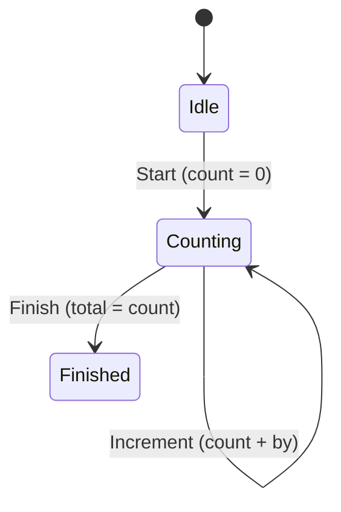

[← README](../../../README.ja.md) | [English](./04.md)

# sealed class を使った UI 状態の管理に cream.kt を利用する（第 4 回: MVI の reduce を宣言的に書く）

目次:

- [第 1 回: Loading / Success / Error と共通プロパティの保守](./01.ja.md)
- [第 2 回: データを保ったままの遷移とリフレッシュ・楽観的更新](./02.ja.md)
- [第 3 回: ネストした sealed StateMachine を1つの注釈で網羅する](./03.ja.md)
- （第 4 回: MVI の reduce を宣言的に書く）
  - [例: カウンタ画面の reducer](#例-カウンタ画面の-reducer)
  - [実装すべき機能が増えると途端に複雑になります](#実装すべき機能が増えると途端に複雑になります)
  - [cream.kt で自明なボイラープレートを解決する](#creamkt-で自明なボイラープレートを解決する)
  - [補足](#補足)
  - [Next steps](#next-steps)
- [第 5 回: 状態管理ライブラリ Koma との併用](./05.ja.md)

> [!TIP]
> このドキュメントでは以下の機能に関するトピックを扱います。
>
> - [Copy to children — @CopyToChildren](../../copy-to-children.ja.md)
> - [Sealed copy — @SealedCopy](../../sealed-copy.ja.md)

MVI / UDF (Unidirectional Data Flow) アーキテクチャの中心には reducer があります。reducer は「(現在の状態, 発生したイベント) → 次の状態」を返す純粋関数で、しばしば `fun UiState.reduce(event: Event): UiState` のような形で表現されます。

状態を `sealed interface` で表現している場合、reducer は sealed なノード間の遷移を `when (event)` で記述することになります。この関数はアプリの状態遷移の仕様そのものであり、**「どのイベントで、どの状態が、どう変わるのか」が一目で読めること**が何よりも大切です。

しかし素朴に実装すると、reducer の各分岐は次のような配慮が必要になりがちです。

- 各 `when (event)` 分岐でターゲット状態を再構築するとき、共通コンテキスト（`userId`、`sessionStartedAt` など）を書き写すコードが増え、**イベント固有の変化を覆い隠して**しまいます。
- 状態の種類・共通プロパティ・イベントの種類が増えるほど、各分岐の書き写しコードが増殖し、reducer が「差分の見えない」コードになります。
- 本来注目すべき「イベント固有の変化」がボイラープレートに埋もれ、コードレビューで見落とされます。

## 例: カウンタ画面の reducer

セッション情報を保持しながらカウントを進める、次のようなカウンタ画面を考えます。状態とイベントを sealed で表現します。

```kt
sealed interface CounterUiState {
    val userId: String
    val sessionStartedAt: Long

    data class Idle(override val userId: String, override val sessionStartedAt: Long) : CounterUiState
    data class Counting(override val userId: String, override val sessionStartedAt: Long, val count: Int) : CounterUiState
    data class Finished(override val userId: String, override val sessionStartedAt: Long, val total: Int) : CounterUiState
}

sealed interface CounterEvent {
    data object Start : CounterEvent
    data class Increment(val by: Int) : CounterEvent
    data object Finish : CounterEvent
}
```

`userId` と `sessionStartedAt` はどの状態でも共通に引き継ぐコンテキストで、`count` や `total` がその状態固有のデータです。

イベントによる状態遷移を図にすると次のとおりです。



これを素朴な reducer として実装すると、次のようになります。

```kt
fun CounterUiState.reduce(event: CounterEvent): CounterUiState = when (event) {
    CounterEvent.Start -> CounterUiState.Counting(
        userId = userId,
        sessionStartedAt = sessionStartedAt,
        count = 0,
    )
    is CounterEvent.Increment ->
        if (this is CounterUiState.Counting) {
            CounterUiState.Counting(
                userId = userId,
                sessionStartedAt = sessionStartedAt,
                count = count + event.by,
            )
        } else {
            this
        }
    CounterEvent.Finish ->
        if (this is CounterUiState.Counting) {
            CounterUiState.Finished(
                userId = userId,
                sessionStartedAt = sessionStartedAt,
                total = count,
            )
        } else {
            this
        }
}
```

動作はしますが、各分岐で本当に伝えたいのは `count = 0`・`count + event.by`・`total = count` の 3 行だけです。それ以外の `userId = userId, sessionStartedAt = sessionStartedAt` はすべての分岐に現れる書き写しで、**イベント固有の差分がノイズに埋もれて**しまっています。

### 実装すべき機能が増えると途端に複雑になります

この書き写しのコストは、要件が増えるほど非線形に膨らみます。

- 共通プロパティが増える（例: `experimentGroup: String`、`locale: String` を追加）と、**すべての分岐のすべての状態生成**に 1 行ずつ書き写しが追加されます。
- 状態の種類が増える（例: `Paused`、`Error`）と、遷移先ごとに同じ書き写しを書き足す必要があります。
- イベントの種類が増えると、そのたびに「書き写し + 少しの差分」というブロックが縦に積み上がっていきます。

```kt
CounterEvent.Start -> CounterUiState.Counting(
    userId = userId,
    sessionStartedAt = sessionStartedAt,
    experimentGroup = experimentGroup, // 追加
    locale = locale,                   // 追加
    count = 0,                         // ← 本当に伝えたいのはここだけ
)
```

こうして reducer は、状態遷移の仕様を読み取るためのコードだったはずが、共通コンテキストの写経で埋め尽くされた「差分の見えない」コードへと退化していきます。

### cream.kt で自明なボイラープレートを解決する

cream.kt を使うと、この書き写しを消し去り、各分岐を「何が変わるかだけ」に絞れます。使うのは 2 つのアノテーションの併用です。

- **状態種別を跨ぐ遷移**（`Idle → Counting`、`Counting → Finished`）には `@CopyToChildren`。
- **同じ状態のまま共有プロパティだけ更新する**ケースには `@SealedCopy`。

sealed 親に両方を付けます。両者は干渉せず、別々の関数を生成します。

```kt
@CopyToChildren
@SealedCopy
sealed interface CounterUiState {
    val userId: String
    val sessionStartedAt: Long

    data class Idle(override val userId: String, override val sessionStartedAt: Long) : CounterUiState
    data class Counting(override val userId: String, override val sessionStartedAt: Long, val count: Int) : CounterUiState
    data class Finished(override val userId: String, override val sessionStartedAt: Long, val total: Int) : CounterUiState
}
```

`@CopyToChildren` は、全ての推移的な子クラスへの copy 拡張関数を生成します。共通プロパティは `= this.xxx` が既定値になるため、呼び出し側では**イベント固有の引数だけ**を渡せます（生成名は既定設定 `copyTo` + `under-package` + `lower-camel-case` に従います）。

```kt
// @CopyToChildren が生成する関数（抜粋）
fun CounterUiState.copyToCounterUiStateCounting(
    userId: String = this.userId,
    sessionStartedAt: Long = this.sessionStartedAt,
    count: Int,
): CounterUiState.Counting = /* ... */

fun CounterUiState.copyToCounterUiStateFinished(
    userId: String = this.userId,
    sessionStartedAt: Long = this.sessionStartedAt,
    total: Int,
): CounterUiState.Finished = /* ... */
```

これで reducer は、各分岐がイベント固有の差分だけを表す形になります。

```kt
fun CounterUiState.reduce(event: CounterEvent): CounterUiState = when (event) {
    CounterEvent.Start        -> copyToCounterUiStateCounting(count = 0)
    is CounterEvent.Increment -> if (this is CounterUiState.Counting) copy(count = count + event.by) else this
    CounterEvent.Finish       -> if (this is CounterUiState.Counting) copyToCounterUiStateFinished(total = count) else this
}
```

`userId` と `sessionStartedAt` の書き写しが完全に消え、それぞれの分岐が `count = 0`・`count + event.by`・`total = count` という**状態遷移の本質だけ**を語るようになりました。共通プロパティがいくつ増えても、この reducer は 1 行も変わりません。

もう一方の `@SealedCopy` は、「サブタイプを保持したまま共有プロパティだけ更新する」ケースで効きます。例えば「ログインユーザーが切り替わった」「セッションを再計測する」といった、**現在の状態の種類を問わず共通コンテキストだけを差し替えたい**イベントを追加したとします。

```kt
data class UserChanged(val userId: String) : CounterEvent
```

`@SealedCopy` は親型を保つ `copy` を生成するため、`when (this)` で状態種別を分岐することなく 1 行で書けます。

```kt
// @SealedCopy が生成する関数
fun CounterUiState.copy(
    userId: String = this.userId,
    sessionStartedAt: Long = this.sessionStartedAt,
): CounterUiState = when (this) {
    is CounterUiState.Idle     -> this.copy(userId = userId, sessionStartedAt = sessionStartedAt)
    is CounterUiState.Counting -> this.copy(userId = userId, sessionStartedAt = sessionStartedAt)
    is CounterUiState.Finished -> this.copy(userId = userId, sessionStartedAt = sessionStartedAt)
}

// reducer の分岐
is CounterEvent.UserChanged -> copy(userId = event.userId) // 現在の状態種別はそのまま
```

このように `@CopyToChildren`（状態間の遷移）と `@SealedCopy`（状態内の共有プロパティ更新）を併用することで、reducer 全体が「イベントごとの差分の宣言」に収束します。MVI ライブラリ（例: [Koma](https://github.com/komakt/koma) のような UDF フレームワーク）と組み合わせると、状態遷移の仕様がそのままコードとして読める形になり、相性が良いです。Koma との併用は[第 5 回](./05.ja.md)で詳しく扱います。

### 補足

reducer で「状態をどう変えるか」に応じて、次のように使い分けると見通しが良くなります。

- **同じ状態のまま固有プロパティを更新**（例: `Counting` のまま `count` を増やす）: data class 標準の `copy` を使います。ただしこれはスマートキャストでサブタイプが確定している範囲でのみ使えます。
- **同じ状態のまま共有プロパティを更新**（状態種別を問わない）: `@SealedCopy` が生成する `copy(...)` を使います。内部の `when` 展開はライブラリが受け持つので、呼び出し側は 1 行です。
- **状態種別を跨ぐ遷移**（例: `Idle → Counting`、`Counting → Finished`）: data class の標準 `copy` は別の型を作れないため使えません。ここが `@CopyToChildren` の生成する `copyTo*` の出番で、共通プロパティを書き写さずに遷移できます。

`object` などの copy できない subtype が sealed 階層に含まれる場合、`@SealedCopy` の挙動は `nonCopyableStrategy`（`ERROR` / `RETURN_AS_IS` / `RETURN_NULL`）で制御できます。

### Next steps

- [第 5 回: 状態管理ライブラリ Koma との併用](./05.ja.md)
- `@CopyToChildren` / `@SealedCopy` をより深く理解する
    - [Copy to children — @CopyToChildren](../../copy-to-children.ja.md)
    - [Sealed copy — @SealedCopy](../../sealed-copy.ja.md)
