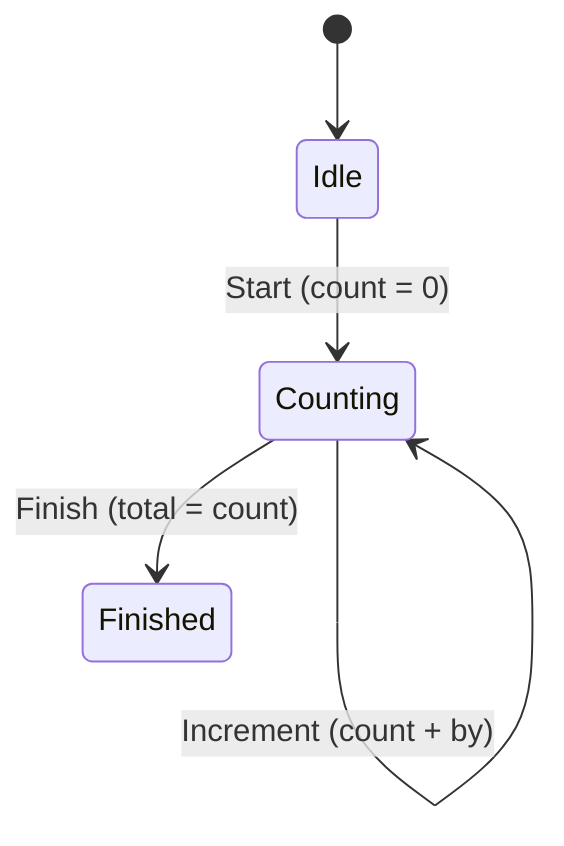

[← README](../../../README.md) | [日本語](./04.ja.md)

# Managing UI state with sealed classes and cream.kt (Part 4: Writing MVI reducers declaratively)

Contents:

- [Part 1: Maintaining shared properties across Loading / Success / Error](./01.md)
- [Part 2: Data-preserving transitions — refresh and optimistic updates](./02.md)
- [Part 3: Covering a nested sealed state machine with one annotation](./03.md)
- (Part 4: Writing MVI reducers declaratively)
  - [Example: a counter screen's reducer](#example-a-counter-screens-reducer)
  - [It suddenly gets complicated as the features you must implement grow](#it-suddenly-gets-complicated-as-the-features-you-must-implement-grow)
  - [Solving the obvious boilerplate with cream.kt](#solving-the-obvious-boilerplate-with-creamkt)
  - [Notes](#notes)
  - [Next steps](#next-steps)
- [Part 5: Using cream.kt with the Koma state-management library](./05.md)

> [!TIP]
> This article covers the following features.
>
> - [Copy to children — @CopyToChildren](../../copy-to-children.md)
> - [Sealed copy — @SealedCopy](../../sealed-copy.md)

At the heart of MVI / UDF (Unidirectional Data Flow) architectures sits the reducer. A reducer is a pure function that maps `(current state, incoming event) → next state`, often expressed as something like `fun UiState.reduce(event: Event): UiState`.

When state is modeled as a `sealed interface`, the reducer describes transitions between the sealed nodes with a `when (event)`. This function is the very specification of your app's state transitions, and **being able to read at a glance which event changes which state, and how** matters more than anything else.

Implemented naively, however, each branch of the reducer tends to demand the following kind of busywork.

- Every time a `when (event)` branch rebuilds the target state, more code hand-copies the shared context (`userId`, `sessionStartedAt`, and so on), **obscuring the event-specific change**.
- The more state subtypes, shared properties, and event kinds you have, the more hand-copied carry-over code multiplies in each branch, turning the reducer into code where you can no longer see the diff.
- The event-specific change — the part that actually deserves attention — gets buried in boilerplate and overlooked in code review.

## Example: a counter screen's reducer

Consider a counter screen like the following, which advances a count while holding on to session information. State and events are both modeled as sealed types.

```kt
sealed interface CounterUiState {
    val userId: String
    val sessionStartedAt: Long

    data class Idle(override val userId: String, override val sessionStartedAt: Long) : CounterUiState
    data class Counting(override val userId: String, override val sessionStartedAt: Long, val count: Int) : CounterUiState
    data class Finished(override val userId: String, override val sessionStartedAt: Long, val total: Int) : CounterUiState
}

sealed interface CounterEvent {
    data object Start : CounterEvent
    data class Increment(val by: Int) : CounterEvent
    data object Finish : CounterEvent
}
```

`userId` and `sessionStartedAt` are the shared context carried over across every state, while `count` and `total` are data specific to each state.

The event-driven state transitions look like this as a diagram.



Implementing this as a naive reducer looks like the following.

```kt
fun CounterUiState.reduce(event: CounterEvent): CounterUiState = when (event) {
    CounterEvent.Start -> CounterUiState.Counting(
        userId = userId,
        sessionStartedAt = sessionStartedAt,
        count = 0,
    )
    is CounterEvent.Increment ->
        if (this is CounterUiState.Counting) {
            CounterUiState.Counting(
                userId = userId,
                sessionStartedAt = sessionStartedAt,
                count = count + event.by,
            )
        } else {
            this
        }
    CounterEvent.Finish ->
        if (this is CounterUiState.Counting) {
            CounterUiState.Finished(
                userId = userId,
                sessionStartedAt = sessionStartedAt,
                total = count,
            )
        } else {
            this
        }
}
```

It works, but the only three lines each branch actually wants to communicate are `count = 0`, `count + event.by`, and `total = count`. Everything else — `userId = userId, sessionStartedAt = sessionStartedAt` — is hand-copied carry-over that appears in every branch, **burying the event-specific diff in noise**.

### It suddenly gets complicated as the features you must implement grow

The cost of this hand-copying grows non-linearly as requirements pile up.

- Add a shared property (say, `experimentGroup: String` or `locale: String`) and one more hand-copied line lands in **every state construction in every branch**.
- Add a state subtype (say, `Paused` or `Error`) and the same carry-over must be written out again for each new transition target.
- Add an event kind, and yet another block of "carry-over plus a small diff" stacks up vertically.

```kt
CounterEvent.Start -> CounterUiState.Counting(
    userId = userId,
    sessionStartedAt = sessionStartedAt,
    experimentGroup = experimentGroup, // added
    locale = locale,                   // added
    count = 0,                         // ← this is the only line that actually matters
)
```

And so the reducer — code that was supposed to let you read the specification of your state transitions — degenerates into code where you can no longer see the diff, drowned in rote copying of the shared context.

### Solving the obvious boilerplate with cream.kt

With cream.kt you can erase this hand-copying and reduce each branch to nothing but *what changes*. The trick is combining two annotations.

- `@CopyToChildren` for **transitions across state subtypes** (`Idle → Counting`, `Counting → Finished`).
- `@SealedCopy` for the case of **updating only shared properties while staying in the same state**.

Put both on the sealed parent. They do not interfere with each other — they generate separate functions.

```kt
@CopyToChildren
@SealedCopy
sealed interface CounterUiState {
    val userId: String
    val sessionStartedAt: Long

    data class Idle(override val userId: String, override val sessionStartedAt: Long) : CounterUiState
    data class Counting(override val userId: String, override val sessionStartedAt: Long, val count: Int) : CounterUiState
    data class Finished(override val userId: String, override val sessionStartedAt: Long, val total: Int) : CounterUiState
}
```

`@CopyToChildren` generates copy extension functions to every transitive concrete leaf. Shared properties get `= this.xxx` defaults, so call sites pass **only the event-specific arguments** (the generated names follow the default settings `copyTo` + `under-package` + `lower-camel-case`).

```kt
// functions generated by @CopyToChildren (excerpt)
fun CounterUiState.copyToCounterUiStateCounting(
    userId: String = this.userId,
    sessionStartedAt: Long = this.sessionStartedAt,
    count: Int,
): CounterUiState.Counting = /* ... */

fun CounterUiState.copyToCounterUiStateFinished(
    userId: String = this.userId,
    sessionStartedAt: Long = this.sessionStartedAt,
    total: Int,
): CounterUiState.Finished = /* ... */
```

The reducer now takes a shape where each branch expresses only the event-specific diff.

```kt
fun CounterUiState.reduce(event: CounterEvent): CounterUiState = when (event) {
    CounterEvent.Start        -> copyToCounterUiStateCounting(count = 0)
    is CounterEvent.Increment -> if (this is CounterUiState.Counting) copy(count = count + event.by) else this
    CounterEvent.Finish       -> if (this is CounterUiState.Counting) copyToCounterUiStateFinished(total = count) else this
}
```

The hand-copying of `userId` and `sessionStartedAt` is completely gone: each branch states only `count = 0`, `count + event.by`, or `total = count` — **the essence of the state transition**. However many shared properties are added later, this reducer does not change by a single line.

The other annotation, `@SealedCopy`, shines in the "update only shared properties while keeping the subtype" case. Suppose you add events like "the logged-in user switched" or "restart session measurement" — events that want to **swap out only the shared context, regardless of the current kind of state**.

```kt
data class UserChanged(val userId: String) : CounterEvent
```

`@SealedCopy` generates a `copy` that preserves the parent type, so this can be written in one line, without branching over the state subtype with `when (this)`.

```kt
// function generated by @SealedCopy
fun CounterUiState.copy(
    userId: String = this.userId,
    sessionStartedAt: Long = this.sessionStartedAt,
): CounterUiState = when (this) {
    is CounterUiState.Idle     -> this.copy(userId = userId, sessionStartedAt = sessionStartedAt)
    is CounterUiState.Counting -> this.copy(userId = userId, sessionStartedAt = sessionStartedAt)
    is CounterUiState.Finished -> this.copy(userId = userId, sessionStartedAt = sessionStartedAt)
}

// the reducer branch
is CounterEvent.UserChanged -> copy(userId = event.userId) // the current state subtype is preserved
```

By combining `@CopyToChildren` (transitions between states) and `@SealedCopy` (shared-property updates within a state) this way, the whole reducer converges into a declaration of per-event diffs. Combined with an MVI library (for example, a UDF framework like [Koma](https://github.com/komakt/koma)), the state-transition specification becomes readable directly as code — the two pair very well. [Part 5](./05.md) covers using cream.kt with Koma in detail.

### Notes

In a reducer, picking the right tool for *how* the state changes keeps things easy to follow.

- **Updating a subtype-specific property while staying in the same state** (e.g. incrementing `count` while remaining `Counting`): use the standard `data class` `copy`. Note that this is only available where a smart cast has pinned down the subtype.
- **Updating a shared property while staying in the same state** (regardless of the state subtype): use the `copy(...)` generated by `@SealedCopy`. The library takes care of the internal `when` expansion, so the call site is a single line.
- **Transitions across state subtypes** (e.g. `Idle → Counting`, `Counting → Finished`): the standard `data class` `copy` cannot produce a different type, so it is no help here. This is where the `copyTo*` functions generated by `@CopyToChildren` come in, letting you transition without hand-copying the shared properties.

If the sealed hierarchy contains non-copyable subtypes such as `object`s, the behavior of `@SealedCopy` can be controlled with `nonCopyableStrategy` (`ERROR` / `RETURN_AS_IS` / `RETURN_NULL`).

### Next steps

- [Part 5: Using cream.kt with the Koma state-management library](./05.md)
- Understand `@CopyToChildren` / `@SealedCopy` in more depth
    - [Copy to children — @CopyToChildren](../../copy-to-children.md)
    - [Sealed copy — @SealedCopy](../../sealed-copy.md)
