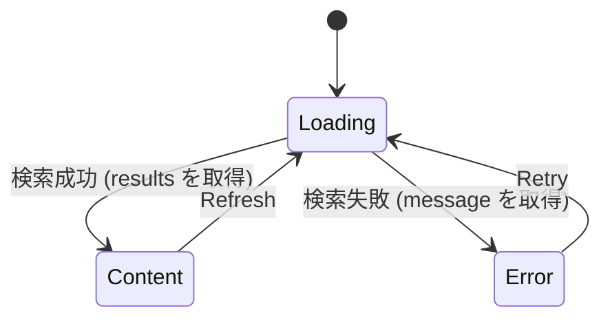

[← README](../../../README.ja.md) | [English](./05.md)

# sealed class を使った UI 状態の管理に cream.kt を利用する（第 5 回: 状態管理ライブラリ Koma との併用）

目次:

- [第 1 回: Loading / Success / Error と共通プロパティの保守](./01.ja.md)
- [第 2 回: データを保ったままの遷移とリフレッシュ・楽観的更新](./02.ja.md)
- [第 3 回: ネストした sealed StateMachine を1つの注釈で網羅する](./03.ja.md)
- [第 4 回: MVI の reduce を宣言的に書く](./04.ja.md)
- （第 5 回: 状態管理ライブラリ Koma との併用）
  - [例: 検索画面の Store](#例-検索画面の-store)
  - [実装すべき機能が増えると途端に複雑になります](#実装すべき機能が増えると途端に複雑になります)
  - [cream.kt で自明なボイラープレートを解決する](#creamkt-で自明なボイラープレートを解決する)
  - [補足](#補足)
  - [Next steps](#next-steps)

> [!TIP]
> このドキュメントでは以下の機能に関するトピックを扱います。
>
> - [Copy to children — @CopyToChildren](../../copy-to-children.ja.md)

これまでの回では、素の ViewModel + `StateFlow` を題材にしてきました。とはいえ実際のプロジェクトでは、状態管理ライブラリの上で UI 状態を扱うことも多いはずです。この回では [Koma](https://github.com/komakt/koma) を例に、状態管理ライブラリと cream.kt を併用する方法を紹介します。

Koma は Flux / MVI の単方向データフローに基づく Kotlin Multiplatform 向けの状態管理フレームワークです。`Store<State, Action, Event>` に対して、「どの状態で・どのアクションを受け取ったら・どう遷移するか」をStateMachine DSL（`state<T> { ... }` / `enter { ... }` / `action<T> { ... }` / `recover<T> { ... }`）で宣言的に記述します。状態は immutable な値として扱われるため、sealed interface で表現した UI 状態との相性は抜群です。

ただし、DSL の中で「次の状態」を組み立てる `nextState { ... }` の中身は普通の Kotlin コードです。sealed 状態が共通プロパティを持っていると、これまでの回で見てきた問題がそのまま現れます。

- Koma の DSL は「どの状態で何が起きるか」を宣言的にしてくれますが、`nextState` 内での次の状態の組み立ては手書きで、共通プロパティの書き写しが必要です。
- 遷移（`enter` / `action` / `recover`）が増えるたびに、同じ形の書き写しが Store のあちこちに増殖します。
- 共通プロパティを 1 つ追加すると、すべての `nextState` を漏れなく直して回る必要があります。

## 例: 検索画面の Store

検索クエリ `query` を全状態で保持する検索画面を、Koma の Store でモデリングしてみます。

```kt
sealed interface SearchState : State {
    val query: String

    data class Loading(override val query: String) : SearchState
    data class Content(override val query: String, val results: List<Item>) : SearchState
    data class Error(override val query: String, val message: String) : SearchState
}

sealed interface SearchAction : Action {
    data object Retry : SearchAction
    data object Refresh : SearchAction
}
```



素朴に Store を書くと、`nextState` のたびに `query` を手で書き写すことになります。

```kt
fun SearchStore(repository: SearchRepository): Store<SearchState, SearchAction, Nothing> =
    Store(SearchState.Loading(query = "")) {

        state<SearchState.Loading> {
            enter {
                val results = repository.search(state.query)
                nextState {
                    SearchState.Content(
                        query = state.query, // 書き写し
                        results = results,
                    )
                }
            }
            recover<Exception> {
                nextState {
                    SearchState.Error(
                        query = state.query, // 書き写し
                        message = error.message ?: "unknown error",
                    )
                }
            }
        }

        state<SearchState.Content> {
            action<SearchAction.Refresh> {
                nextState { SearchState.Loading(query = state.query) } // 書き写し
            }
        }

        state<SearchState.Error> {
            action<SearchAction.Retry> {
                nextState { SearchState.Loading(query = state.query) } // 書き写し
            }
        }
    }
```

各遷移で本当に伝えたいのは「`results` が得られた」「エラーになった」「Loading からやり直す」ことだけですが、そのすべてに `query = state.query` が付いて回ります。

### 実装すべき機能が増えると途端に複雑になります

ここに「並び順を保持したい」「最後に検索した時刻を出したい」という要件が加わり、共通プロパティが増えたとします。

```kt
sealed interface SearchState : State {
    val query: String
    val sortOrder: SortOrder    // 追加
    val searchedAt: Instant?    // 追加
    // ...
}
```

すると、Store 内の **すべての `nextState`** に書き写しが 2 行ずつ増えます。

```kt
nextState {
    SearchState.Content(
        query = state.query,         // 書き写し
        sortOrder = state.sortOrder, // ← 遷移のたびにこの行が増える
        searchedAt = state.searchedAt, // ← 遷移のたびにこの行が増える
        results = results,
    )
}
```

Koma が DSL で宣言的にしてくれた「どの状態で何が起きるか」の見通しの良さが、`nextState` 内の書き写しで埋もれていきます。書き写しを忘れて固定値を書いてもコンパイルは通るため、レビューでも見逃されがちです。

### cream.kt で自明なボイラープレートを解決する

この書き写しは cream.kt にそのまま任せられます。sealed の親に `@CopyToChildren` を付けるだけです。

```kt
import me.tbsten.cream.CopyToChildren

@CopyToChildren
sealed interface SearchState : State {
    val query: String
    val sortOrder: SortOrder
    val searchedAt: Instant?
    // ... 子クラスの宣言は同じ
}
```

生成されるのは通常の拡張関数（`copyToSearchStateLoading` など）なので、Koma の DSL 内でもそのまま呼べます。`nextState` の中身が「その遷移で本質的に変化したもの」だけになります。

```kt
state<SearchState.Loading> {
    enter {
        val results = repository.search(state.query)
        nextState { state.copyToSearchStateContent(results = results) }
    }
    recover<Exception> {
        nextState { state.copyToSearchStateError(message = error.message ?: "unknown error") }
    }
}

state<SearchState.Content> {
    action<SearchAction.Refresh> {
        nextState { state.copyToSearchStateLoading() }
    }
}

state<SearchState.Error> {
    action<SearchAction.Retry> {
        nextState { state.copyToSearchStateLoading() }
    }
}
```

`query` / `sortOrder` / `searchedAt` は既定値で自動的に引き継がれるため、共通プロパティがいくつ増えてもこの Store は 1 行も変わりません。Koma が「どの状態で何が起きるか」を、cream.kt が「共通プロパティの引き継ぎ」を受け持つ、という役割分担です。

### 補足

- cream.kt は Koma に依存していません。KSP で通常の拡張関数を生成するだけなので、他の MVI / UDF ライブラリでも同じように併用できます（reducer との組み合わせは[第 4 回](./04.ja.md)を参照）。
- サブタイプを保ったまま共有プロパティだけを更新する遷移（[第 2 回](./02.ja.md)）も、`@SealedCopy` が生成する `copy()` を `nextState { state.copy(...) }` と書くことで同様に併用できます。
- Store をトップレベル関数として切り出す Koma の推奨構成でも、生成関数はアノテーションを付けた宣言と同じパッケージのトップレベル拡張関数なので、import するだけで使えます。

### Next steps

- [シリーズの記事一覧に戻る](./README.ja.md)
- `@CopyToChildren` / `@SealedCopy` をより深く理解する
    - [Copy to children — @CopyToChildren](../../copy-to-children.ja.md)
    - [Sealed copy — @SealedCopy](../../sealed-copy.ja.md)
