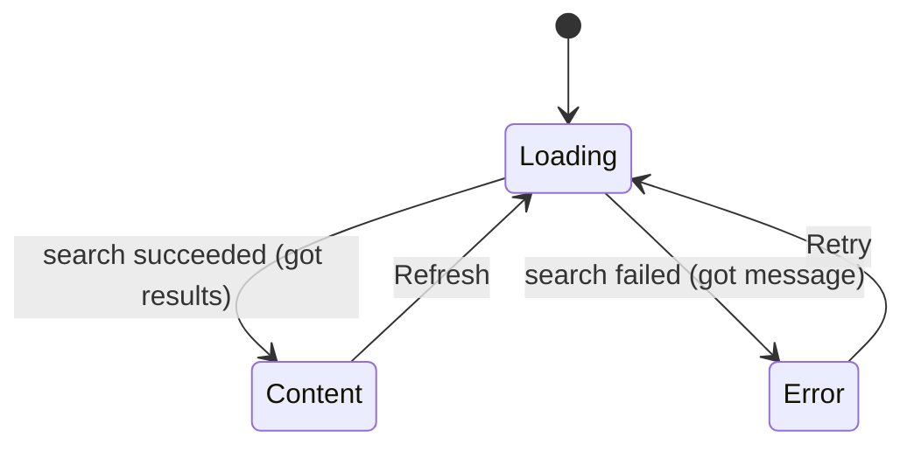

[← README](../../../README.md) | [日本語](./05.ja.md)

# Managing UI state with sealed classes and cream.kt (Part 5: Using cream.kt with the Koma state-management library)

Contents:

- [Part 1: Maintaining shared properties across Loading / Success / Error](./01.md)
- [Part 2: Data-preserving transitions — refresh and optimistic updates](./02.md)
- [Part 3: Covering a nested sealed state machine with one annotation](./03.md)
- [Part 4: Writing MVI reducers declaratively](./04.md)
- (Part 5: Using cream.kt with the Koma state-management library)
  - [Example: a search screen's store](#example-a-search-screens-store)
  - [It suddenly gets complicated as the features you must implement grow](#it-suddenly-gets-complicated-as-the-features-you-must-implement-grow)
  - [Solving the obvious boilerplate with cream.kt](#solving-the-obvious-boilerplate-with-creamkt)
  - [Notes](#notes)
  - [Next steps](#next-steps)

> [!TIP]
> This article covers the following features.
>
> - [Copy to children — @CopyToChildren](../../copy-to-children.md)

The previous parts used a plain ViewModel + `StateFlow` as their subject. In real projects, however, UI state is often managed on top of a state-management library. This part uses [Koma](https://github.com/komakt/koma) as an example of combining such a library with cream.kt.

Koma is a state-management framework for Kotlin Multiplatform based on the Flux / MVI unidirectional data flow. Against a `Store<State, Action, Event>`, you declaratively describe "in which state, upon which action, what transition happens" with a state-machine DSL (`state<T> { ... }` / `enter { ... }` / `action<T> { ... }` / `recover<T> { ... }`). States are treated as immutable values, so UI states expressed as sealed interfaces are a perfect fit.

However, the body of `nextState { ... }` — where the DSL builds the next state — is plain Kotlin code. When the sealed states carry shared properties, the exact problems we saw in the previous parts reappear.

- Koma's DSL makes "what happens in which state" declarative, but building the next state inside `nextState` is written by hand, requiring hand-copied shared properties.
- Every new transition (`enter` / `action` / `recover`) multiplies the same-shaped hand-copying across the store.
- Adding one shared property means fixing every `nextState`, without missing any.

## Example: a search screen's store

Let's model a search screen that keeps the search query `query` across all states, as a Koma store.

```kt
sealed interface SearchState : State {
    val query: String

    data class Loading(override val query: String) : SearchState
    data class Content(override val query: String, val results: List<Item>) : SearchState
    data class Error(override val query: String, val message: String) : SearchState
}

sealed interface SearchAction : Action {
    data object Retry : SearchAction
    data object Refresh : SearchAction
}
```



Written naively, the store hand-copies `query` in every `nextState`.

```kt
fun SearchStore(repository: SearchRepository): Store<SearchState, SearchAction, Nothing> =
    Store(SearchState.Loading(query = "")) {

        state<SearchState.Loading> {
            enter {
                val results = repository.search(state.query)
                nextState {
                    SearchState.Content(
                        query = state.query, // hand-copied
                        results = results,
                    )
                }
            }
            recover<Exception> {
                nextState {
                    SearchState.Error(
                        query = state.query, // hand-copied
                        message = error.message ?: "unknown error",
                    )
                }
            }
        }

        state<SearchState.Content> {
            action<SearchAction.Refresh> {
                nextState { SearchState.Loading(query = state.query) } // hand-copied
            }
        }

        state<SearchState.Error> {
            action<SearchAction.Retry> {
                nextState { SearchState.Loading(query = state.query) } // hand-copied
            }
        }
    }
```

All each transition really wants to say is "we got `results`", "it failed", or "start over from Loading" — yet `query = state.query` tags along with every single one of them.

### It suddenly gets complicated as the features you must implement grow

Now suppose requirements arrive to "keep the sort order" and "show when the last search ran", adding more shared properties.

```kt
sealed interface SearchState : State {
    val query: String
    val sortOrder: SortOrder    // added
    val searchedAt: Instant?    // added
    // ...
}
```

Every **`nextState` in the store** gains two more hand-copied lines.

```kt
nextState {
    SearchState.Content(
        query = state.query,           // hand-copied
        sortOrder = state.sortOrder,   // ← this line multiplies with every transition
        searchedAt = state.searchedAt, // ← this line multiplies with every transition
        results = results,
    )
}
```

The clarity Koma's DSL gave us — "what happens in which state" at a glance — gets buried under the hand-copying inside `nextState`. And if you forget a copy and write a fixed value instead, it still compiles, so it slips through review easily.

### Solving the obvious boilerplate with cream.kt

This hand-copying can be handed straight to cream.kt. Just annotate the sealed parent with `@CopyToChildren`.

```kt
import me.tbsten.cream.CopyToChildren

@CopyToChildren
sealed interface SearchState : State {
    val query: String
    val sortOrder: SortOrder
    val searchedAt: Instant?
    // ... child class declarations unchanged
}
```

The generated functions (`copyToSearchStateLoading` and friends) are ordinary extension functions, so they can be called directly inside Koma's DSL. The body of each `nextState` is reduced to what actually changed in that transition.

```kt
state<SearchState.Loading> {
    enter {
        val results = repository.search(state.query)
        nextState { state.copyToSearchStateContent(results = results) }
    }
    recover<Exception> {
        nextState { state.copyToSearchStateError(message = error.message ?: "unknown error") }
    }
}

state<SearchState.Content> {
    action<SearchAction.Refresh> {
        nextState { state.copyToSearchStateLoading() }
    }
}

state<SearchState.Error> {
    action<SearchAction.Retry> {
        nextState { state.copyToSearchStateLoading() }
    }
}
```

`query` / `sortOrder` / `searchedAt` are carried over automatically via the defaults, so however many shared properties are added, this store does not change by a single line. It's a division of labor: Koma owns "what happens in which state", and cream.kt owns "carrying over the shared properties".

### Notes

- cream.kt does not depend on Koma. It only generates ordinary extension functions via KSP, so it combines the same way with other MVI / UDF libraries (see also [Part 4](./04.md) for the reducer pattern).
- Transitions that update only shared properties while keeping the subtype ([Part 2](./02.md)) combine just as well: write the `copy()` generated by `@SealedCopy` as `nextState { state.copy(...) }`.
- Koma's recommended setup extracts the store into a top-level function; the generated functions are top-level extension functions in the same package as the annotated declaration, so a single import is all you need there.

### Next steps

- [Back to the series overview](./README.md)
- Understand `@CopyToChildren` / `@SealedCopy` in more depth
    - [Copy to children — @CopyToChildren](../../copy-to-children.md)
    - [Sealed copy — @SealedCopy](../../sealed-copy.md)
